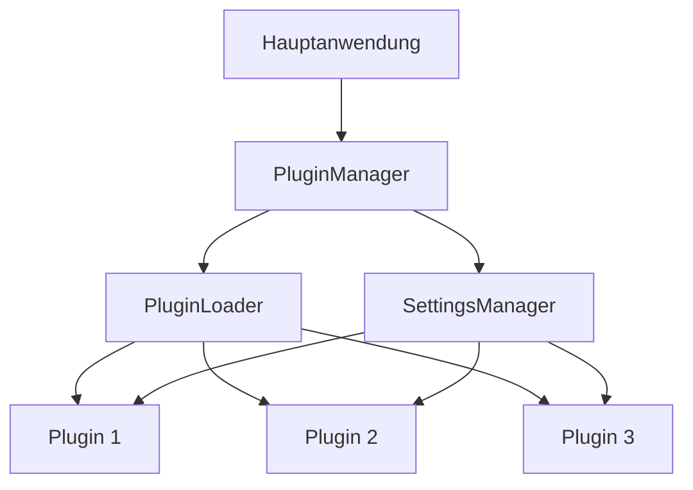

# Wortweber Plugin-System Dokumentation

## Inhaltsverzeichnis

1. [Einführung](#1-einführung)
  1.1 Ziele des Plugin-Systems
  1.2 Quick Start Guide
  1.3 Kernfunktionen des Plugin-Systems
  1.4 Unterstützte Plugin-Typen

2. [Architektur des Plugin-Systems](#2-architektur-des-plugin-systems)
  2.1 Schlüsselkonzepte
  2.2 Datenfluss

3. [Plugin-Typen und Anwendungsfälle](#3-plugin-typen-und-anwendungsfälle)
  3.1 Textverarbeitungs-Plugins
  3.2 UI-Erweiterungs-Plugins
  3.3 Audio-Input-Plugins
  3.4 Audio-Output-Plugins

4. [Entwicklung von Plugins](#4-entwicklung-von-plugins)
  4.1 Grundlegende Schritte zur Plugin-Entwicklung
  4.2 Best Practices für die Plugin-Entwicklung
  4.3 Fortgeschrittene Entwicklungstechniken

5. [Plugin-Schnittstelle](#5-plugin-schnittstelle)
  5.1 AbstractPlugin-Klasse
  5.2 Kernmethoden
  5.3 Einstellungsverwaltung
  5.4 UI-Integration
  5.5 Ereignisbehandlung

6. [Plugin-Lebenszyklus](#6-plugin-lebenszyklus)
  6.1 Überblick über den Plugin-Lebenszyklus
  6.2 Detaillierte Beschreibung der Lebenszyklus-Stadien
  6.3 Persistenz über Lebenszyklen hinweg
  6.4 Fehlerbehandlung im Lebenszyklus

7. [Einstellungsverwaltung für Plugins](#7-einstellungsverwaltung-für-plugins)
  7.1 Grundlagen der Plugin-Einstellungen
  7.2 Definition von Plugin-Einstellungen
  7.3 Zugriff auf Einstellungen
  7.4 Persistente Speicherung
  7.5 Validierung von Einstellungen
  7.6 Verschlüsselung sensibler Daten
  7.7 Dynamische Einstellungen-UI
  7.8 Behandlung von Einstellungsänderungen
  7.9 Versionierung von Einstellungen

8. [Plugin-Verwaltung in der Benutzeroberfläche](#8-plugin-verwaltung-in-der-benutzeroberfläche)
  8.1 Plugin-Manager-Fenster
  8.2 Anzeige verfügbarer Plugins
  8.3 Aktivierung und Deaktivierung von Plugins
  8.4 Plugin-Konfiguration
  8.5 Plugin-Informationsanzeige
  8.6 Installation neuer Plugins
  8.7 Plugin-Updates
  8.8 Fehlerbehandlung und Benachrichtigungen

9. [Sicherheitsüberlegungen](#9-sicherheitsüberlegungen)
  9.1 Sandbox-Umgebung
  9.2 Codeüberprüfung
  9.3 Ressourcenbeschränkungen
  9.4 Zugriffskontrolle
  9.5 Datenvalidierung
  9.6 Verschlüsselung sensibler Daten
  9.7 Regelmäßige Sicherheitsaudits
  9.8 Sicheres Update-System

10. [Best Practices](#10-best-practices)
  10.1 Codequalität und -stil
  10.2 Dokumentation
  10.3 Fehlerbehandlung
  10.4 Ressourcenmanagement
  10.5 Konfigurierbarkeit
  10.6 Leistungsoptimierung
  10.7 Testbarkeit
  10.8 Versionierung
  10.9 Kontinuierliche Integration und Bereitstellung

11. [Fehlerbehebung](#11-fehlerbehebung)
  11.1 Häufige Probleme und Lösungen
  11.2 Debugging-Techniken
  11.3 Fehlerberichterstattung
  11.4 Problemlösungsstrategien
  11.5 Erstellung einer Fehlerbehebungs-Checkliste

12. [API-Referenz](#12-api-referenz)
  12.1 AbstractPlugin
  12.2 PluginManager
  12.3 SettingsManager
  12.4 PluginLoader
  12.5 Hilfsfunktionen

13. [Fortgeschrittene Konzepte](#13-fortgeschrittene-konzepte)
  13.1 Plugin-Abhängigkeiten
  13.2 Plugin-Hooks und Event-System
  13.3 Asynchrone Plugin-Operationen
  13.4 Plugin-spezifische Benutzeroberflächen
  13.5 Dynamische Plugin-Aktualisierung
  13.6 Plugin-Sicherheit und Sandboxing
  13.7 Leistungsoptimierung für Plugins

14. [Zukünftige Entwicklungen](#14-zukünftige-entwicklungen)
  14.1 Erweitertes LLM-Plugin-Framework
  14.2 Audio-Plugin-Schnittstelle
  14.3 Datei-Interaktions-Plugin-Framework
  14.4 Erweiterte Plugin-Interoperabilität
  14.5 KI-gestützte Plugin-Entwicklung
  14.6 Plugin-basierte Erweiterung der Kernfunktionalität

15. [Beispiele](#15-beispiele)
  15.1 Grundlegendes Textverarbeitungs-Plugin
  15.2 LLM-Integrationsbeispiel
  15.3 Audio-Verarbeitungs-Plugin
  15.4 Datei-Interaktions-Plugin
  15.5 Interoperables Plugin
  15.6 KI-Assistiertes Entwicklungs-Plugin

16. [Glossar](#16-glossar)

   ## 1. Einführung

   Das Wortweber Plugin-System ermöglicht es Entwicklern, die Funktionalität der Anwendung durch benutzerdefinierte Plugins zu erweitern. Diese Dokumentation bietet einen umfassenden Überblick über die Architektur, Entwicklung und Verwaltung von Plugins innerhalb des Wortweber-Ökosystems.

   ### 1.1 Ziele des Plugin-Systems

   - Erweiterbarkeit: Ermöglichen einer flexiblen Erweiterung der Kernfunktionalität
   - Modularität: Förderung einer sauberen Trennung von Kernfunktionen und Erweiterungen
   - Benutzerfreundlichkeit: Einfache Installation und Verwaltung von Plugins
   - Sicherheit: Gewährleistung eines sicheren Betriebs der Hauptanwendung

   ### 1.2 Quick Start Guide

   Für Entwickler, die schnell mit der Plugin-Entwicklung beginnen möchten, hier eine Kurzanleitung:

   1. Erstellen Sie eine neue Python-Datei im `plugins`-Verzeichnis von Wortweber.
   2. Importieren Sie die notwendige Basisklasse:
      ```python
      from src.plugin_system.plugin_interface import AbstractPlugin
      ```
   3. Definieren Sie Ihre Plugin-Klasse:
      ```python
      class MyFirstPlugin(AbstractPlugin):
          def __init__(self):
              super().__init__()
              self.name = "Mein erstes Plugin"
              self.version = "1.0.0"
              self.description = "Ein einfaches Beispiel-Plugin"
              self.author = "Ihr Name"

          def process_text(self, text: str) -> str:
              return text.upper()
      ```
   4. Implementieren Sie die erforderlichen Methoden wie `activate`, `deactivate`, und `process_text`.
   5. Speichern Sie die Datei und starten Sie Wortweber neu.
   6. Ihr Plugin sollte nun in der Plugin-Verwaltung erscheinen und kann aktiviert werden.

   Für detailliertere Informationen zur Plugin-Entwicklung, lesen Sie bitte die folgenden Kapitel dieser Dokumentation.

   ### 1.3 Kernfunktionen des Plugin-Systems

   - Dynamisches Laden und Entladen von Plugins
   - Verwaltung von Plugin-Einstellungen
   - Sicheres Sandbox-System für Plugin-Ausführung
   - Erweiterbare Schnittstellen für verschiedene Plugin-Typen (Text, Audio, UI, etc.)
   - Interoperabilität zwischen Plugins

   ### 1.4 Unterstützte Plugin-Typen

   Wortweber unterstützt eine Vielzahl von Plugin-Typen, darunter:

   1. Textverarbeitungs-Plugins
   2. Audio-Input und -Output-Plugins
   3. UI-Erweiterungs-Plugins
   4. LLM-Integrations-Plugins
   5. Datei-Interaktions-Plugins

   Jeder Plugin-Typ bietet spezifische Schnittstellen und Funktionen, die in den folgenden Kapiteln detailliert beschrieben werden.

## 2. Architektur des Plugin-Systems

Das Plugin-System von Wortweber basiert auf einer modularen Architektur, die aus folgenden Hauptkomponenten besteht:

- `PluginManager`: Zentrale Klasse zur Verwaltung von Plugins
- `PluginLoader`: Verantwortlich für das dynamische Laden von Plugin-Modulen
- `AbstractPlugin`: Basisklasse, die von allen Plugins implementiert werden muss
- `SettingsManager`: Verwaltet plugin-spezifische Einstellungen

### 2.1 Schlüsselkonzepte

- **Dynamisches Laden**: Plugins werden zur Laufzeit geladen, ohne dass die Hauptanwendung neu kompiliert werden muss.
- **Statusverwaltung**: Unterscheidung zwischen aktiven Plugins (in der laufenden Sitzung) und für den Start aktivierten Plugins (beim nächsten Anwendungsstart).
- **Einstellungspersistenz**: Plugin-spezifische Einstellungen werden über Sitzungen hinweg gespeichert.
- **Ereignisbasierte Kommunikation**: Plugins können auf spezifische Ereignisse in der Hauptanwendung reagieren.

### 2.2 Datenfluss



## 3. Plugin-Typen und Anwendungsfälle

Das Wortweber Plugin-System ist flexibel gestaltet, um eine Vielzahl von Anwendungsfällen zu unterstützen. Hier sind einige Hauptkategorien von Plugins und Beispiele für ihre Implementierung:

### 3.1 Textverarbeitungs-Plugins

Diese Plugins modifizieren oder analysieren den transkribierten Text.

Beispiel: Sentiment-Analyse-Plugin
```python
from src.plugin_system.plugin_interface import AbstractPlugin
from textblob import TextBlob

class SentimentAnalysisPlugin(AbstractPlugin):
    def __init__(self):
        super().__init__()
        self.name = "Sentiment Analysis Plugin"
        self.version = "1.0.0"
        self.description = "Analysiert die Stimmung des transkribierten Textes"

    def process_text(self, text: str) -> str:
        analysis = TextBlob(text)
        sentiment = analysis.sentiment.polarity
        if sentiment > 0:
            mood = "positiv"
        elif sentiment < 0:
            mood = "negativ"
        else:
            mood = "neutral"
        return f"{text}\n\nStimmung: {mood} (Wert: {sentiment:.2f})"
```

### 3.2 UI-Erweiterungs-Plugins

Diese Plugins fügen neue Benutzeroberflächen-Elemente zur Hauptanwendung hinzu.

Beispiel: LLM-Chat-Plugin
```python
from src.plugin_system.plugin_interface import AbstractPlugin
import tkinter as tk
from tkinter import ttk

class LLMChatPlugin(AbstractPlugin):
    def __init__(self):
        super().__init__()
        self.name = "LLM Chat Plugin"
        self.version = "1.0.0"
        self.description = "Fügt ein Chat-Fenster für LLM-Interaktionen hinzu"
        self.chat_window = None

    def activate(self, settings: Dict[str, Any]) -> None:
        self.create_chat_window()

    def create_chat_window(self):
        self.chat_window = tk.Toplevel()
        self.chat_window.title("LLM Chat")
        self.chat_area = tk.Text(self.chat_window, state='disabled')
        self.chat_area.pack(expand=True, fill='both')
        self.input_field = ttk.Entry(self.chat_window)
        self.input_field.pack(fill='x')
        self.send_button = ttk.Button(self.chat_window, text="Senden", command=self.send_message)
        self.send_button.pack()

    def send_message(self):
        # Hier würde die Logik für die Interaktion mit dem LLM implementiert werden
        pass

    def process_text(self, text: str) -> str:
        # Optional: Verarbeite den transkribierten Text im Chat-Kontext
        return text

    def get_ui_elements(self) -> Dict[str, Any]:
        return {
            "menu_items": [
                {
                    "label": "LLM Chat öffnen",
                    "command": self.create_chat_window
                }
            ]
        }
```

### 3.3 Audio-Input-Plugins

Diese Plugins erweitern die Möglichkeiten der Audioeingabe.

Beispiel: Mikrofonpegel-Trigger-Plugin
```python
from src.plugin_system.plugin_interface import AbstractPlugin
import pyaudio
import numpy as np

class MicLevelTriggerPlugin(AbstractPlugin):
    def __init__(self):
        super().__init__()
        self.name = "Mic Level Trigger Plugin"
        self.version = "1.0.0"
        self.description = "Startet die Transkription basierend auf dem Mikrofonpegel"
        self.threshold = 0.1
        self.is_listening = False

    def activate(self, settings: Dict[str, Any]) -> None:
        self.threshold = settings.get('threshold', 0.1)
        self.start_listening()

    def start_listening(self):
        self.is_listening = True
        p = pyaudio.PyAudio()
        stream = p.open(format=pyaudio.paFloat32,
                        channels=1,
                        rate=44100,
                        input=True,
                        frames_per_buffer=1024)

        while self.is_listening:
            data = np.frombuffer(stream.read(1024), dtype=np.float32)
            if np.max(np.abs(data)) > self.threshold:
                self.trigger_transcription()

        stream.stop_stream()
        stream.close()
        p.terminate()

    def trigger_transcription(self):
        # Hier würde die Logik implementiert werden, um die Transkription zu starten
        pass

    def deactivate(self) -> Optional[Dict[str, Any]]:
        self.is_listening = False
        return {"threshold": self.threshold}

    def get_ui_elements(self) -> Dict[str, Any]:
        return {
            "settings_fields": [
                {
                    "name": "threshold",
                    "type": "float",
                    "label": "Auslöseschwelle",
                    "default": 0.1
                }
            ]
        }
```

### 3.4 Audio-Output-Plugins

Diese Plugins ermöglichen die Ausgabe von Text als Sprache.

Beispiel: Text-to-Speech-Plugin
```python
from src.plugin_system.plugin_interface import AbstractPlugin
import pyttsx3

class TextToSpeechPlugin(AbstractPlugin):
    def __init__(self):
        super().__init__()
        self.name = "Text-to-Speech Plugin"
        self.version = "1.0.0"
        self.description = "Wandelt transkribierten Text in Sprache um"
        self.engine = pyttsx3.init()

    def process_text(self, text: str) -> str:
        self.engine.say(text)
        self.engine.runAndWait()
        return text  # Original text wird unverändert zurückgegeben

    def get_ui_elements(self) -> Dict[str, Any]:
        return {
            "toolbar_buttons": [
                {
                    "icon": "speaker_icon.png",
                    "tooltip": "Text vorlesen",
                    "command": lambda: self.engine.say(self.get_current_text())
                }
            ]
        }

    def get_current_text(self):
        # Diese Methode würde den aktuellen Text aus dem Hauptfenster abrufen
        pass
```

## 4. Entwicklung von Plugins

Um ein Plugin für Wortweber zu entwickeln, folgen Sie diesen Schritten:

1. Erstellen Sie eine neue Python-Datei im `plugins`-Verzeichnis.
2. Importieren Sie die erforderlichen Module:
   ```python
   from src.plugin_system.plugin_interface import AbstractPlugin
   ```
3. Definieren Sie eine Klasse, die von `AbstractPlugin` erbt:
   ```python
   class MyPlugin(AbstractPlugin):
       def __init__(self):
           super().__init__()
           self.name = "Mein Plugin"
           self.version = "1.0.0"
           self.description = "Beschreibung meines Plugins"
           self.author = "Ihr Name"
   ```
4. Implementieren Sie die erforderlichen Methoden (siehe [Plugin-Schnittstelle](#4-plugin-schnittstelle)).

### 3.1 Plugin-Struktur

Ein typisches Plugin sollte folgende Struktur haben:

```
mein_plugin/
├── __init__.py
├── main.py
├── config.py
└── resources/
    └── icon.png
```

- `__init__.py`: Initialisiert das Plugin und importiert die Hauptklasse
- `main.py`: Enthält die Hauptlogik des Plugins
- `config.py`: Definiert Konfigurationsoptionen und Standardwerte
- `resources/`: Verzeichnis für zusätzliche Ressourcen wie Icons

## 4. Entwicklung von Plugins

Die Entwicklung von Plugins für Wortweber folgt einem strukturierten Prozess, der es Entwicklern ermöglicht, die Funktionalität der Anwendung effektiv zu erweitern. Dieses Kapitel führt Sie durch die Schritte der Plugin-Entwicklung und bietet Best Practices für die Erstellung robuster und effizienter Plugins.

### 4.1 Grundlegende Schritte zur Plugin-Entwicklung

1. **Planung**:
   - Definieren Sie den Zweck und die Funktionalität Ihres Plugins.
   - Identifizieren Sie den Plugin-Typ basierend auf den in Kapitel 3 beschriebenen Kategorien.
   - Überlegen Sie, welche Einstellungen und Benutzerinteraktionen Ihr Plugin benötigen wird.

2. **Einrichtung**:
   - Erstellen Sie eine neue Python-Datei im `plugins`-Verzeichnis von Wortweber.
   - Benennen Sie die Datei entsprechend der Funktionalität Ihres Plugins, z.B. `my_awesome_plugin.py`.

3. **Basisstruktur implementieren**:
   - Importieren Sie die erforderlichen Module:
     ```python
     from src.plugin_system.plugin_interface import AbstractPlugin
     from typing import Dict, Any, Optional
     ```
   - Definieren Sie Ihre Plugin-Klasse, die von `AbstractPlugin` erbt:
     ```python
     class MyAwesomePlugin(AbstractPlugin):
         def __init__(self):
             super().__init__()
             self.name = "My Awesome Plugin"
             self.version = "1.0.0"
             self.description = "Dies ist ein fantastisches Plugin für Wortweber"
             self.author = "Ihr Name"
     ```

4. **Kernfunktionalität implementieren**:
   - Überschreiben Sie die notwendigen Methoden der `AbstractPlugin`-Klasse:
     ```python
     def activate(self, settings: Dict[str, Any]) -> None:
         # Initialisierungslogik hier
         pass

     def deactivate(self) -> Optional[Dict[str, Any]]:
         # Aufräumlogik hier
         return None

     def process_text(self, text: str) -> str:
         # Hauptlogik zur Textverarbeitung hier
         return modified_text
     ```

5. **Einstellungen und UI-Elemente hinzufügen** (optional):
   - Implementieren Sie Methoden zur Verwaltung von Plugin-Einstellungen:
     ```python
     def get_default_settings(self) -> Dict[str, Any]:
         return {"option1": True, "option2": "default"}

     def get_ui_elements(self) -> Dict[str, Any]:
         return {
             "settings_fields": [
                 {
                     "name": "option1",
                     "type": "boolean",
                     "label": "Option 1 aktivieren"
                 },
                 {
                     "name": "option2",
                     "type": "string",
                     "label": "Option 2 Wert"
                 }
             ]
         }
     ```

6. **Testen**:
   - Entwickeln Sie Unit-Tests für Ihr Plugin, um die Funktionalität zu überprüfen.
   - Testen Sie Ihr Plugin in der Wortweber-Umgebung, um die Integration sicherzustellen.

7. **Dokumentation**:
   - Fügen Sie Docstrings zu Ihren Methoden hinzu.
   - Erstellen Sie eine README-Datei für Ihr Plugin mit Beschreibung, Installationsanweisungen und Nutzungshinweisen.

### 4.2 Best Practices für die Plugin-Entwicklung

- **Modularer Aufbau**: Strukturieren Sie Ihren Code in logische Einheiten für bessere Wartbarkeit.
- **Fehlerbehandlung**: Implementieren Sie robuste Fehlerbehandlung, um die Stabilität der Hauptanwendung nicht zu beeinträchtigen.
- **Ressourcenmanagement**: Achten Sie auf effiziente Ressourcennutzung, besonders bei rechenintensiven Operationen.
- **Konfigurierbarkeit**: Machen Sie Ihr Plugin flexibel durch konfigurierbare Optionen.
- **Kompatibilität**: Stellen Sie sicher, dass Ihr Plugin mit verschiedenen Versionen von Wortweber kompatibel ist.
- **Sicherheit**: Vermeiden Sie die Ausführung von unsicherem Code und validieren Sie alle Eingaben.

### 4.3 Fortgeschrittene Entwicklungstechniken

- **Asynchrone Verarbeitung**: Nutzen Sie `asyncio` für ressourcenintensive Operationen, um die Benutzeroberfläche reaktiv zu halten.
- **Ereignisbasierte Programmierung**: Implementieren Sie Ereignis-Listener, um auf spezifische Aktionen in Wortweber zu reagieren.
- **Internationalisierung**: Bereiten Sie Ihr Plugin für mehrere Sprachen vor, indem Sie Texte externalisieren.
- **Persistenz**: Implementieren Sie Methoden zum Speichern und Laden von Plugin-spezifischen Daten zwischen Sitzungen.

Durch Befolgen dieser Richtlinien und Best Practices können Sie hochwertige Plugins entwickeln, die nahtlos in die Wortweber-Umgebung integrieren und die Funktionalität der Anwendung erheblich erweitern.


## 5. Plugin-Schnittstelle

Die Plugin-Schnittstelle definiert die Struktur und die Methoden, die jedes Wortweber-Plugin implementieren muss. Sie stellt sicher, dass alle Plugins konsistent mit der Hauptanwendung interagieren können.

### 5.1 AbstractPlugin-Klasse

Alle Plugins müssen von der `AbstractPlugin`-Klasse erben. Diese Klasse definiert die grundlegende Struktur und die erforderlichen Methoden für jedes Plugin.

```python
from abc import ABC, abstractmethod
from typing import Dict, Any, Optional

class AbstractPlugin(ABC):
    @property
    @abstractmethod
    def name(self) -> str:
        """Gibt den Namen des Plugins zurück."""
        pass

    @property
    @abstractmethod
    def version(self) -> str:
        """Gibt die Version des Plugins zurück."""
        pass

    @property
    @abstractmethod
    def description(self) -> str:
        """Gibt eine kurze Beschreibung des Plugins zurück."""
        pass

    @property
    @abstractmethod
    def author(self) -> str:
        """Gibt den Namen des Plugin-Autors zurück."""
        pass

    @abstractmethod
    def activate(self, settings: Dict[str, Any]) -> None:
        """Wird aufgerufen, wenn das Plugin aktiviert wird."""
        pass

    @abstractmethod
    def deactivate(self) -> Optional[Dict[str, Any]]:
        """Wird aufgerufen, wenn das Plugin deaktiviert wird."""
        pass

    @abstractmethod
    def process_text(self, text: str) -> str:
        """Verarbeitet den transkribierten Text."""
        pass

    def get_default_settings(self) -> Dict[str, Any]:
        """Gibt die Standardeinstellungen des Plugins zurück."""
        return {}

    def get_settings(self) -> Dict[str, Any]:
        """Gibt die aktuellen Einstellungen des Plugins zurück."""
        return self.get_default_settings()

    def set_settings(self, settings: Dict[str, Any]) -> None:
        """Setzt die Einstellungen des Plugins."""
        pass

    def get_ui_elements(self) -> Dict[str, Any]:
        """Gibt UI-Elemente zurück, die in die Hauptanwendung integriert werden sollen."""
        return {}

    def on_event(self, event_type: str, data: Any) -> None:
        """Wird aufgerufen, wenn bestimmte Ereignisse in der Hauptanwendung auftreten."""
        pass
```

### 5.2 Kernmethoden

#### 5.2.1 activate(settings: Dict[str, Any]) -> None
Diese Methode wird aufgerufen, wenn das Plugin aktiviert wird. Sie sollte alle notwendigen Initialisierungen durchführen.

```python
def activate(self, settings: Dict[str, Any]) -> None:
    self.my_setting = settings.get('my_setting', 'default_value')
    # Weitere Initialisierungen hier
```

#### 5.2.2 deactivate() -> Optional[Dict[str, Any]]
Diese Methode wird aufgerufen, wenn das Plugin deaktiviert wird. Sie sollte Ressourcen freigeben und optional aktuelle Einstellungen zurückgeben.

```python
def deactivate(self) -> Optional[Dict[str, Any]]:
    # Ressourcen freigeben
    return {"my_setting": self.my_setting}
```

#### 5.2.3 process_text(text: str) -> str
Diese Methode ist das Herzstück der Textverarbeitungs-Plugins. Sie erhält den transkribierten Text und gibt den verarbeiteten Text zurück.

```python
def process_text(self, text: str) -> str:
    # Textverarbeitungslogik hier
    return modified_text
```

### 5.3 Einstellungsverwaltung

#### 5.3.1 get_default_settings() -> Dict[str, Any]
Definiert die Standardeinstellungen des Plugins.

```python
def get_default_settings(self) -> Dict[str, Any]:
    return {
        "option1": True,
        "option2": "default"
    }
```

#### 5.3.2 get_settings() und set_settings(settings: Dict[str, Any])
Diese Methoden ermöglichen es, die aktuellen Einstellungen abzurufen und zu aktualisieren.

### 5.4 UI-Integration

#### 5.4.1 get_ui_elements() -> Dict[str, Any]
Ermöglicht es Plugins, eigene UI-Elemente zur Hauptanwendung hinzuzufügen.

```python
def get_ui_elements(self) -> Dict[str, Any]:
    return {
        "menu_items": [
            {
                "label": "Mein Plugin-Menü",
                "command": self.my_plugin_action
            }
        ],
        "toolbar_buttons": [
            {
                "icon": "path/to/icon.png",
                "tooltip": "Meine Plugin-Aktion",
                "command": self.my_plugin_action
            }
        ]
    }
```

### 5.5 Ereignisbehandlung

#### 5.5.1 on_event(event_type: str, data: Any) -> None
Ermöglicht es Plugins, auf spezifische Ereignisse in der Hauptanwendung zu reagieren.

```python
def on_event(self, event_type: str, data: Any) -> None:
    if event_type == "transcription_complete":
        # Reagiere auf abgeschlossene Transkription
        pass
    elif event_type == "application_closing":
        # Führe Aufräumarbeiten durch
        pass
```

Diese erweiterte Plugin-Schnittstelle bietet Entwicklern die Flexibilität, verschiedene Arten von Plugins zu erstellen, von einfachen Textverarbeitungs-Tools bis hin zu komplexen UI-Erweiterungen und ereignisgesteuerten Funktionen.

## 6. Plugin-Lebenszyklus

Der Lebenszyklus eines Wortweber-Plugins umfasst mehrere Stadien, von der Entdeckung bis zur Deaktivierung. Dieses Kapitel beschreibt diese Stadien im Detail und erklärt, wie Plugins in jedem Stadium mit der Hauptanwendung interagieren.

### 6.1 Überblick über den Plugin-Lebenszyklus

1. Entdeckung
2. Laden
3. Initialisierung
4. Aktivierung
5. Ausführung
6. Deaktivierung
7. Entladen

### 6.2 Detaillierte Beschreibung der Lebenszyklus-Stadien

#### 6.2.1 Entdeckung

In dieser Phase durchsucht der `PluginManager` das festgelegte Plugin-Verzeichnis nach verfügbaren Plugins.

- Der `PluginManager` scannt das `plugins`-Verzeichnis.
- Jede Python-Datei im Verzeichnis wird als potenzielles Plugin betrachtet.
- Metadaten wie Name, Version und Beschreibung werden aus den Plugin-Klassen extrahiert.

```python
def discover_plugins(self):
    for file in os.listdir(self.plugin_dir):
        if file.endswith(".py"):
            self.potential_plugins.append(file[:-3])  # Entferne '.py'
```

#### 6.2.2 Laden

Der `PluginLoader` lädt die entdeckten Plugin-Module dynamisch.

- Jedes Plugin-Modul wird importiert.
- Die Plugin-Klasse wird identifiziert und instanziiert.
- Fehler beim Laden werden protokolliert, ohne die Hauptanwendung zu beeinträchtigen.

```python
def load_plugin(self, plugin_name: str) -> Optional[AbstractPlugin]:
    try:
        module = importlib.import_module(f"plugins.{plugin_name}")
        plugin_class = next(
            obj for name, obj in inspect.getmembers(module)
            if inspect.isclass(obj) and issubclass(obj, AbstractPlugin) and obj is not AbstractPlugin
        )
        return plugin_class()
    except Exception as e:
        logger.error(f"Fehler beim Laden des Plugins {plugin_name}: {e}")
        return None
```

#### 6.2.3 Initialisierung

Nach dem Laden wird jedes Plugin initialisiert.

- Die `__init__`-Methode der Plugin-Klasse wird aufgerufen.
- Grundlegende Eigenschaften wie Name, Version und Beschreibung werden festgelegt.
- Standardeinstellungen werden geladen.

#### 6.2.4 Aktivierung

Plugins werden aktiviert, wenn sie vom Benutzer ausgewählt oder automatisch beim Start geladen werden.

- Die `activate`-Methode des Plugins wird aufgerufen.
- Gespeicherte Einstellungen werden an das Plugin übergeben.
- Das Plugin führt notwendige Setup-Operationen durch (z.B. Ressourcen laden, Verbindungen herstellen).

```python
def activate_plugin(self, plugin_name: str) -> bool:
    if plugin_name in self.plugins:
        plugin = self.plugins[plugin_name]
        settings = self.settings_manager.get_plugin_settings(plugin_name)
        try:
            plugin.activate(settings)
            self.active_plugins.append(plugin_name)
            logger.info(f"Plugin {plugin_name} aktiviert")
            return True
        except Exception as e:
            logger.error(f"Fehler beim Aktivieren des Plugins {plugin_name}: {e}")
    return False
```

#### 6.2.5 Ausführung

Während der Ausführungsphase interagiert das Plugin aktiv mit der Hauptanwendung.

- Die `process_text`-Methode wird für Textverarbeitungs-Plugins aufgerufen.
- UI-Elemente des Plugins werden in die Hauptanwendung integriert.
- Das Plugin reagiert auf Ereignisse über die `on_event`-Methode.

#### 6.2.6 Deaktivierung

Plugins können vom Benutzer deaktiviert oder beim Beenden der Anwendung automatisch deaktiviert werden.

- Die `deactivate`-Methode des Plugins wird aufgerufen.
- Das Plugin gibt Ressourcen frei und speichert ggf. seinen Zustand.
- Rückgabewerte der `deactivate`-Methode werden für zukünftige Aktivierungen gespeichert.

```python
def deactivate_plugin(self, plugin_name: str) -> bool:
    if plugin_name in self.active_plugins:
        plugin = self.plugins[plugin_name]
        try:
            settings = plugin.deactivate()
            if settings:
                self.settings_manager.set_plugin_settings(plugin_name, settings)
            self.active_plugins.remove(plugin_name)
            logger.info(f"Plugin {plugin_name} deaktiviert")
            return True
        except Exception as e:
            logger.error(f"Fehler beim Deaktivieren des Plugins {plugin_name}: {e}")
    return False
```

#### 6.2.7 Entladen

Beim Beenden der Anwendung oder bei manueller Entfernung werden Plugins entladen.

- Referenzen zum Plugin werden aus dem `PluginManager` entfernt.
- Python's Garbage Collector kümmert sich um die Ressourcenfreigabe.

### 6.3 Persistenz über Lebenszyklen hinweg

- Plugin-Einstellungen werden vom `SettingsManager` zwischen Sitzungen gespeichert.
- Der Aktivierungsstatus von Plugins wird ebenfalls persistiert, sodass Plugins beim nächsten Start automatisch aktiviert werden können.

### 6.4 Fehlerbehandlung im Lebenszyklus

- Fehler während der Aktivierung oder Deaktivierung werden protokolliert und verhindern nicht den Betrieb anderer Plugins.
- Die Hauptanwendung bleibt stabil, selbst wenn einzelne Plugins fehlschlagen.

```python
def safe_plugin_operation(self, plugin_name: str, operation: Callable) -> bool:
    try:
        return operation(plugin_name)
    except Exception as e:
        logger.error(f"Fehler bei Plugin-Operation für {plugin_name}: {e}")
        return False
```


## 7. Einstellungsverwaltung für Plugins

Die effektive Verwaltung von Plugin-Einstellungen ist entscheidend für die Flexibilität und Benutzerfreundlichkeit von Wortweber-Plugins. Dieses Kapitel erklärt, wie Plugin-Einstellungen definiert, gespeichert und verwaltet werden.

### 7.1 Grundlagen der Plugin-Einstellungen

Plugin-Einstellungen ermöglichen es Benutzern, das Verhalten von Plugins anzupassen, ohne den Code zu ändern. Sie werden vom `SettingsManager` verwaltet und persistent gespeichert.

### 7.2 Definition von Plugin-Einstellungen

Plugins definieren ihre Einstellungen durch Überschreiben der `get_default_settings` Methode:

```python
class MyPlugin(AbstractPlugin):
    def get_default_settings(self) -> Dict[str, Any]:
        return {
            "option1": True,
            "option2": "default_value",
            "option3": 42
        }
```

### 7.3 Zugriff auf Einstellungen

Plugins können auf ihre Einstellungen über die `get_settings` und `set_settings` Methoden zugreifen:

```python
class MyPlugin(AbstractPlugin):
    def activate(self, settings: Dict[str, Any]) -> None:
        self.my_option = settings.get("option1", True)

    def process_text(self, text: str) -> str:
        if self.get_settings()["option1"]:
            # Verarbeitung basierend auf Einstellung
            pass
        return text

    def update_my_setting(self, new_value: bool) -> None:
        settings = self.get_settings()
        settings["option1"] = new_value
        self.set_settings(settings)
```

### 7.4 Persistente Speicherung

Der `SettingsManager` sorgt für die persistente Speicherung von Plugin-Einstellungen:

```python
class SettingsManager:
    def get_plugin_settings(self, plugin_name: str) -> Dict[str, Any]:
        # Lade gespeicherte Einstellungen oder Standardeinstellungen
        pass

    def set_plugin_settings(self, plugin_name: str, settings: Dict[str, Any]) -> None:
        # Speichere Einstellungen persistent
        pass
```

### 7.5 Validierung von Einstellungen

Plugins sollten eingehende Einstellungen validieren, um Fehler zu vermeiden:

```python
class MyPlugin(AbstractPlugin):
    def validate_settings(self, settings: Dict[str, Any]) -> Dict[str, Any]:
        validated = {}
        validated["option1"] = bool(settings.get("option1", True))
        validated["option2"] = str(settings.get("option2", "default_value"))
        validated["option3"] = int(settings.get("option3", 42))
        return validated

    def set_settings(self, settings: Dict[str, Any]) -> None:
        validated_settings = self.validate_settings(settings)
        super().set_settings(validated_settings)
```

### 7.6 Verschlüsselung sensibler Daten

Für sensible Einstellungen wie API-Schlüssel bietet der `SettingsManager` Verschlüsselungsmethoden:

```python
class SettingsManager:
    def encrypt_setting(self, value: str) -> str:
        # Implementiere Verschlüsselung
        pass

    def decrypt_setting(self, encrypted_value: str) -> str:
        # Implementiere Entschlüsselung
        pass

class MyPlugin(AbstractPlugin):
    def set_api_key(self, api_key: str) -> None:
        encrypted_key = self.settings_manager.encrypt_setting(api_key)
        self.set_settings({"api_key": encrypted_key})

    def get_api_key(self) -> str:
        encrypted_key = self.get_settings().get("api_key")
        return self.settings_manager.decrypt_setting(encrypted_key)
```

### 7.7 Dynamische Einstellungen-UI

Plugins können eine dynamische Benutzeroberfläche für ihre Einstellungen definieren:

```python
class MyPlugin(AbstractPlugin):
    def get_ui_elements(self) -> Dict[str, Any]:
        return {
            "settings_fields": [
                {
                    "name": "option1",
                    "type": "boolean",
                    "label": "Aktiviere Option 1"
                },
                {
                    "name": "option2",
                    "type": "string",
                    "label": "Wert für Option 2"
                },
                {
                    "name": "option3",
                    "type": "integer",
                    "label": "Zahl für Option 3",
                    "min": 0,
                    "max": 100
                }
            ]
        }
```

### 7.8 Behandlung von Einstellungsänderungen

Plugins können auf Änderungen ihrer Einstellungen reagieren:

```python
class MyPlugin(AbstractPlugin):
    def on_settings_changed(self, new_settings: Dict[str, Any]) -> None:
        if "option1" in new_settings:
            self.update_behavior_based_on_option1(new_settings["option1"])
        # Weitere Reaktionen auf Einstellungsänderungen
```

### 7.9 Versionierung von Einstellungen

Bei Änderungen der Plugin-Struktur kann eine Versionierung der Einstellungen hilfreich sein:

```python
class MyPlugin(AbstractPlugin):
    def get_default_settings(self) -> Dict[str, Any]:
        return {
            "settings_version": 2,
            "option1": True,
            # Neue Optionen in Version 2
            "new_option": "value"
        }

    def migrate_settings(self, old_settings: Dict[str, Any]) -> Dict[str, Any]:
        if old_settings.get("settings_version", 1) < 2:
            # Migriere von Version 1 zu Version 2
            old_settings["new_option"] = "default_value"
            old_settings["settings_version"] = 2
        return old_settings

    def set_settings(self, settings: Dict[str, Any]) -> None:
        migrated_settings = self.migrate_settings(settings)
        super().set_settings(migrated_settings)
```

## 8. Plugin-Verwaltung in der Benutzeroberfläche

Die Benutzeroberfläche für die Plugin-Verwaltung ist ein wesentlicher Bestandteil des Wortweber Plugin-Systems. Sie ermöglicht Benutzern, Plugins einfach zu verwalten, zu konfigurieren und zu überwachen.

### 8.1 Plugin-Manager-Fenster

Der zentrale Punkt für die Plugin-Verwaltung ist das Plugin-Manager-Fenster.

```python
class PluginManagementWindow(tk.Toplevel):
    def __init__(self, parent, plugin_manager):
        super().__init__(parent)
        self.plugin_manager = plugin_manager
        self.title("Plugin-Verwaltung")
        self.setup_ui()

    def setup_ui(self):
        self.create_plugin_list()
        self.create_control_buttons()
```

### 8.2 Anzeige verfügbarer Plugins

Eine Liste aller verfügbaren Plugins wird angezeigt, einschließlich ihres Aktivierungsstatus.

```python
def create_plugin_list(self):
    columns = ("Name", "Version", "Status", "Beschreibung")
    self.plugin_tree = ttk.Treeview(self, columns=columns, show="headings")
    for col in columns:
        self.plugin_tree.heading(col, text=col)
    self.plugin_tree.pack(expand=True, fill="both")

    for plugin in self.plugin_manager.get_plugin_info():
        self.plugin_tree.insert("", "end", values=(
            plugin["name"],
            plugin["version"],
            "Aktiv" if plugin["active"] else "Inaktiv",
            plugin["description"]
        ))
```

### 8.3 Aktivierung und Deaktivierung von Plugins

Benutzer können Plugins direkt über die Benutzeroberfläche aktivieren und deaktivieren.

```python
def toggle_plugin(self):
    selected = self.plugin_tree.selection()
    if selected:
        plugin_name = self.plugin_tree.item(selected)['values'][0]
        if self.plugin_manager.is_plugin_active(plugin_name):
            self.plugin_manager.deactivate_plugin(plugin_name)
        else:
            self.plugin_manager.activate_plugin(plugin_name)
        self.update_plugin_list()
```

### 8.4 Plugin-Konfiguration

Ein Einstellungsdialog ermöglicht die Konfiguration einzelner Plugins.

```python
def open_plugin_settings(self):
    selected = self.plugin_tree.selection()
    if selected:
        plugin_name = self.plugin_tree.item(selected)['values'][0]
        plugin = self.plugin_manager.get_plugin(plugin_name)
        PluginSettingsDialog(self, plugin)

class PluginSettingsDialog(tk.Toplevel):
    def __init__(self, parent, plugin):
        super().__init__(parent)
        self.plugin = plugin
        self.title(f"Einstellungen: {plugin.name}")
        self.create_settings_ui()

    def create_settings_ui(self):
        settings = self.plugin.get_settings()
        for key, value in settings.items():
            ttk.Label(self, text=key).pack()
            ttk.Entry(self, textvariable=tk.StringVar(value=str(value))).pack()
        ttk.Button(self, text="Speichern", command=self.save_settings).pack()
```

### 8.5 Plugin-Informationsanzeige

Detaillierte Informationen zu jedem Plugin können angezeigt werden.

```python
def show_plugin_info(self):
    selected = self.plugin_tree.selection()
    if selected:
        plugin_name = self.plugin_tree.item(selected)['values'][0]
        plugin = self.plugin_manager.get_plugin(plugin_name)
        info = f"Name: {plugin.name}\n"
        info += f"Version: {plugin.version}\n"
        info += f"Autor: {plugin.author}\n"
        info += f"Beschreibung: {plugin.description}\n"
        messagebox.showinfo("Plugin-Information", info)
```

### 8.6 Installation neuer Plugins

Eine Schnittstelle zur Installation neuer Plugins kann implementiert werden.

```python
def install_new_plugin(self):
    file_path = filedialog.askopenfilename(
        filetypes=[("Python Files", "*.py")]
    )
    if file_path:
        success = self.plugin_manager.install_plugin(file_path)
        if success:
            messagebox.showinfo("Installation erfolgreich", "Das Plugin wurde erfolgreich installiert.")
            self.update_plugin_list()
        else:
            messagebox.showerror("Installationsfehler", "Das Plugin konnte nicht installiert werden.")
```

### 8.7 Plugin-Updates

Eine Funktion zum Überprüfen und Durchführen von Plugin-Updates kann integriert werden.

```python
def check_for_updates(self):
    updates = self.plugin_manager.check_for_plugin_updates()
    if updates:
        message = "Folgende Plugin-Updates sind verfügbar:\n\n"
        for plugin, version in updates.items():
            message += f"{plugin}: Version {version}\n"
        if messagebox.askyesno("Updates verfügbar", message + "\nMöchten Sie die Updates jetzt installieren?"):
            self.plugin_manager.update_plugins(updates.keys())
            self.update_plugin_list()
    else:
        messagebox.showinfo("Keine Updates", "Alle Plugins sind auf dem neuesten Stand.")
```

### 8.8 Fehlerbehandlung und Benachrichtigungen

Implementieren Sie ein System zur Anzeige von Plugin-bezogenen Fehlern und Benachrichtigungen.

```python
def show_plugin_notifications(self):
    notifications = self.plugin_manager.get_plugin_notifications()
    if notifications:
        NotificationWindow(self, notifications)
    else:
        messagebox.showinfo("Keine Benachrichtigungen", "Es liegen keine Plugin-Benachrichtigungen vor.")

class NotificationWindow(tk.Toplevel):
    def __init__(self, parent, notifications):
        super().__init__(parent)
        self.title("Plugin-Benachrichtigungen")
        for plugin, message in notifications.items():
            ttk.Label(self, text=f"{plugin}: {message}").pack()
```

## 9. Sicherheitsüberlegungen

Bei der Implementierung eines Plugin-Systems ist die Sicherheit von größter Bedeutung. Dieses Kapitel behandelt wichtige Sicherheitsaspekte und Best Practices für das Wortweber Plugin-System.

### 9.1 Sandbox-Umgebung

Plugins sollten in einer kontrollierten Umgebung ausgeführt werden, um die Hauptanwendung und das Betriebssystem zu schützen.

```python
import importlib.util
import sys
from types import ModuleType

def create_sandbox():
    class RestrictedImport(ModuleType):
        @staticmethod
        def __getattr__(name):
            if name in allowed_modules:
                return importlib.import_module(name)
            raise ImportError(f"Import of {name} is not allowed")

    allowed_modules = {'re', 'math'}  # Beispiel für erlaubte Module
    return {'__builtins__': {'__import__': RestrictedImport('restricted_import')}}

def load_plugin_in_sandbox(plugin_path):
    spec = importlib.util.spec_from_file_location("plugin_module", plugin_path)
    module = importlib.util.module_from_spec(spec)
    sandbox = create_sandbox()
    sys.modules["plugin_module"] = module
    exec(spec.loader.get_code(spec.loader.name), sandbox)
    return sandbox
```

### 9.2 Codeüberprüfung

Implementieren Sie eine statische Codeanalyse für Plugins, um potenziell schädlichen Code zu identifizieren.

```python
import ast

def analyze_plugin_code(code):
    tree = ast.parse(code)
    for node in ast.walk(tree):
        if isinstance(node, ast.Import) or isinstance(node, ast.ImportFrom):
            for alias in node.names:
                if alias.name not in allowed_imports:
                    raise SecurityError(f"Unerlaubter Import: {alias.name}")
        elif isinstance(node, ast.Call) and isinstance(node.func, ast.Attribute):
            if node.func.attr in restricted_functions:
                raise SecurityError(f"Unerlaubter Funktionsaufruf: {node.func.attr}")
    return True
```

### 9.3 Ressourcenbeschränkungen

Begrenzen Sie die Ressourcen, die ein Plugin nutzen kann, um Denial-of-Service-Angriffe zu verhindern.

```python
import resource

def set_resource_limits():
    resource.setrlimit(resource.RLIMIT_CPU, (1, 1))  # CPU-Zeit in Sekunden
    resource.setrlimit(resource.RLIMIT_DATA, (50 * 1024 * 1024, 50 * 1024 * 1024))  # Speichernutzung in Bytes

def run_plugin_with_limits(plugin_function, *args, **kwargs):
    set_resource_limits()
    return plugin_function(*args, **kwargs)
```

### 9.4 Zugriffskontrolle

Implementieren Sie ein Berechtigungssystem für Plugins, um den Zugriff auf sensible Funktionen zu kontrollieren.

```python
class PluginPermissions:
    def __init__(self):
        self.permissions = {
            "file_access": False,
            "network_access": False,
            "ui_modification": False
        }

    def grant_permission(self, permission):
        if permission in self.permissions:
            self.permissions[permission] = True

    def check_permission(self, permission):
        return self.permissions.get(permission, False)

class SecurePlugin(AbstractPlugin):
    def __init__(self):
        super().__init__()
        self.permissions = PluginPermissions()

    def access_file(self, filename):
        if self.permissions.check_permission("file_access"):
            # Datei-Zugriff erlauben
            pass
        else:
            raise PermissionError("Kein Zugriff auf Dateisystem erlaubt")
```

### 9.5 Datenvalidierung

Validieren Sie alle Eingaben und Ausgaben von Plugins, um Injection-Angriffe zu verhindern.

```python
import re

def validate_plugin_input(input_data):
    if not isinstance(input_data, str):
        raise ValueError("Eingabe muss ein String sein")
    if len(input_data) > 1000:
        raise ValueError("Eingabe zu lang")
    if re.search(r"[<>&']", input_data):
        raise ValueError("Unerlaubte Zeichen in der Eingabe")
    return input_data

def process_plugin_output(output_data):
    return html.escape(output_data)
```

### 9.6 Verschlüsselung sensibler Daten

Stellen Sie sicher, dass sensible Daten, die von Plugins verwendet werden, sicher verschlüsselt sind.

```python
from cryptography.fernet import Fernet

class SecureStorage:
    def __init__(self):
        self.key = Fernet.generate_key()
        self.cipher_suite = Fernet(self.key)

    def encrypt_data(self, data):
        return self.cipher_suite.encrypt(data.encode())

    def decrypt_data(self, encrypted_data):
        return self.cipher_suite.decrypt(encrypted_data).decode()

def store_plugin_data(plugin_name, data):
    storage = SecureStorage()
    encrypted_data = storage.encrypt_data(data)
    # Speichern der verschlüsselten Daten
```

### 9.7 Regelmäßige Sicherheitsaudits

Führen Sie regelmäßige Sicherheitsüberprüfungen des Plugin-Systems und der installierten Plugins durch.

```python
def audit_plugin_system():
    for plugin in installed_plugins:
        check_plugin_permissions(plugin)
        analyze_plugin_code(plugin.source_code)
        verify_plugin_integrity(plugin)
    check_system_vulnerabilities()
    update_security_policies()
```

### 9.8 Sicheres Update-System

Implementieren Sie ein sicheres System für Plugin-Updates, einschließlich Signaturverifizierung.

```python
import hashlib
from cryptography.hazmat.primitives import hashes
from cryptography.hazmat.primitives.asymmetric import padding, rsa

def verify_plugin_signature(plugin_data, signature, public_key):
    try:
        public_key.verify(
            signature,
            plugin_data,
            padding.PSS(
                mgf=padding.MGF1(hashes.SHA256()),
                salt_length=padding.PSS.MAX_LENGTH
            ),
            hashes.SHA256()
        )
        return True
    except:
        return False

def update_plugin(plugin_name, update_data, signature):
    public_key = get_plugin_public_key(plugin_name)
    if verify_plugin_signature(update_data, signature, public_key):
        apply_plugin_update(plugin_name, update_data)
    else:
        raise SecurityError("Ungültige Plugin-Signatur")
```

## 10. Best Practices

Die Einhaltung von Best Practices ist entscheidend für die Entwicklung robuster, effizienter und benutzerfreundlicher Plugins. Dieses Kapitel bietet Richtlinien für Plugin-Entwickler und -Verwalter.

### 10.1 Codequalität und -stil

Befolgen Sie etablierte Coding-Standards, um die Lesbarkeit und Wartbarkeit zu verbessern.

```python
# PEP 8 Konventionen befolgen
import math

class ExamplePlugin(AbstractPlugin):
    """Ein Beispiel-Plugin, das Best Practices demonstriert."""

    def __init__(self):
        super().__init__()
        self.name = "Beispiel Plugin"
        self.version = "1.0.0"

    def process_text(self, text: str) -> str:
        """
        Verarbeitet den eingegebenen Text.

        Args:
            text (str): Der zu verarbeitende Text.

        Returns:
            str: Der verarbeitete Text.
        """
        return text.upper()
```

### 10.2 Dokumentation

Stellen Sie eine umfassende Dokumentation für Ihr Plugin bereit.

```python
class WellDocumentedPlugin(AbstractPlugin):
    """
    Ein gut dokumentiertes Plugin für Wortweber.

    Dieses Plugin demonstriert die Best Practices für Dokumentation,
    einschließlich einer klaren Beschreibung der Funktionalität,
    Nutzungshinweise und Beispiele.

    Attributes:
        name (str): Der Name des Plugins.
        version (str): Die aktuelle Version des Plugins.
    """

    def __init__(self):
        super().__init__()
        self.name = "Gut Dokumentiertes Plugin"
        self.version = "1.0.0"

    def process_text(self, text: str) -> str:
        """
        Verarbeitet den eingegebenen Text durch Umkehrung.

        Args:
            text (str): Der zu verarbeitende Eingabetext.

        Returns:
            str: Der umgekehrte Text.

        Example:
            >>> plugin = WellDocumentedPlugin()
            >>> plugin.process_text("Hallo Welt")
            'tleW ollaH'
        """
        return text[::-1]
```

### 10.3 Fehlerbehandlung

Implementieren Sie eine robuste Fehlerbehandlung, um die Stabilität zu gewährleisten.

```python
import logging

class RobustPlugin(AbstractPlugin):
    def __init__(self):
        super().__init__()
        self.logger = logging.getLogger(__name__)

    def process_text(self, text: str) -> str:
        try:
            # Komplexe Verarbeitung hier
            result = self.complex_processing(text)
            return result
        except ValueError as e:
            self.logger.error(f"Ungültige Eingabe: {e}")
            return text  # Originaler Text wird zurückgegeben
        except Exception as e:
            self.logger.exception(f"Unerwarteter Fehler: {e}")
            raise  # Weitergabe des Fehlers an die Hauptanwendung

    def complex_processing(self, text: str) -> str:
        # Komplexe Verarbeitungslogik hier
        pass
```

### 10.4 Ressourcenmanagement

Verwenden Sie Ressourcen effizient und geben Sie sie ordnungsgemäß frei.

```python
class ResourceEfficientPlugin(AbstractPlugin):
    def __init__(self):
        super().__init__()
        self.resource = None

    def activate(self, settings: Dict[str, Any]) -> None:
        self.resource = self.acquire_resource()

    def deactivate(self) -> Optional[Dict[str, Any]]:
        if self.resource:
            self.release_resource(self.resource)
            self.resource = None

    def acquire_resource(self):
        # Ressource akquirieren
        pass

    def release_resource(self, resource):
        # Ressource freigeben
        pass
```

### 10.5 Konfigurierbarkeit

Machen Sie Ihr Plugin flexibel und konfigurierbar.

```python
class ConfigurablePlugin(AbstractPlugin):
    def __init__(self):
        super().__init__()
        self.config = self.get_default_settings()

    def get_default_settings(self) -> Dict[str, Any]:
        return {
            "option1": True,
            "option2": "default",
            "threshold": 0.5
        }

    def set_settings(self, settings: Dict[str, Any]) -> None:
        self.config.update(settings)

    def process_text(self, text: str) -> str:
        if self.config["option1"]:
            # Verarbeitung basierend auf option1
            pass
        # Weitere Verarbeitung basierend auf Konfiguration
```

### 10.6 Leistungsoptimierung

Optimieren Sie Ihr Plugin für Effizienz, besonders bei ressourcenintensiven Operationen.

```python
import cProfile
import pstats
import io

class OptimizedPlugin(AbstractPlugin):
    def __init__(self):
        super().__init__()
        self.cache = {}

    def process_text(self, text: str) -> str:
        if text in self.cache:
            return self.cache[text]

        result = self.expensive_operation(text)
        self.cache[text] = result
        return result

    def expensive_operation(self, text: str) -> str:
        # Komplexe, zeitaufwändige Operation hier
        pass

    def profile_performance(self, text: str) -> None:
        pr = cProfile.Profile()
        pr.enable()
        self.process_text(text)
        pr.disable()
        s = io.StringIO()
        ps = pstats.Stats(pr, stream=s).sort_stats('cumulative')
        ps.print_stats()
        print(s.getvalue())
```

### 10.7 Testbarkeit

Schreiben Sie testbaren Code und implementieren Sie umfassende Tests.

```python
import unittest

class TestablePlugin(AbstractPlugin):
    def process_text(self, text: str) -> str:
        return text.replace('a', '@')

class TestTestablePlugin(unittest.TestCase):
    def setUp(self):
        self.plugin = TestablePlugin()

    def test_process_text(self):
        input_text = "abc"
        expected_output = "@bc"
        self.assertEqual(self.plugin.process_text(input_text), expected_output)

    def test_empty_input(self):
        self.assertEqual(self.plugin.process_text(""), "")

if __name__ == '__main__':
    unittest.main()
```

### 10.8 Versionierung

Verwenden Sie semantische Versionierung für Ihr Plugin.

```python
class VersionedPlugin(AbstractPlugin):
    def __init__(self):
        super().__init__()
        self.name = "Versioniertes Plugin"
        self.version = "1.2.3"  # Major.Minor.Patch

    def get_version_info(self) -> Dict[str, Any]:
        return {
            "version": self.version,
            "compatibility": "Wortweber 2.0+",
            "release_notes": "Verbesserte Leistung und Fehlerbehebungen"
        }
```

### 10.9 Kontinuierliche Integration und Bereitstellung

Nutzen Sie CI/CD-Pipelines für die Qualitätssicherung und einfache Bereitstellung.

```yaml
# Beispiel .gitlab-ci.yml
stages:
  - test
  - build
  - deploy

test:
  stage: test
  script:
    - python -m unittest discover tests

build:
  stage: build
  script:
    - python setup.py sdist bdist_wheel

deploy:
  stage: deploy
  script:
    - pip install twine
    - twine upload dist/*
  only:
    - tags
```


### 11.1 Häufige Probleme und Lösungen

#### 11.1.1 Plugin wird nicht erkannt

Problem: Das Plugin erscheint nicht in der Plugin-Liste von Wortweber.

Lösungsansätze:
1. Überprüfen Sie den Dateinamen und die Verzeichnisstruktur.
2. Stellen Sie sicher, dass die Plugin-Klasse korrekt von `AbstractPlugin` erbt.

```python
# Korrekte Plugin-Struktur
from src.plugin_system.plugin_interface import AbstractPlugin

class MyPlugin(AbstractPlugin):
    def __init__(self):
        super().__init__()
        self.name = "Mein Plugin"
        self.version = "1.0.0"
```

#### 11.1.2 Plugin lässt sich nicht aktivieren

Problem: Das Plugin kann nicht aktiviert werden oder stürzt beim Aktivieren ab.

Lösungsansätze:
1. Überprüfen Sie die `activate` Methode auf Fehler.
2. Stellen Sie sicher, dass alle erforderlichen Abhängigkeiten installiert sind.

```python
def activate(self, settings: Dict[str, Any]) -> None:
    try:
        # Initialisierungslogik
        self.load_dependencies()
        self.initialize_resources(settings)
    except Exception as e:
        logger.error(f"Fehler beim Aktivieren des Plugins: {e}")
        raise PluginActivationError(str(e))

def load_dependencies(self):
    try:
        import required_library
    except ImportError:
        raise PluginActivationError("Erforderliche Bibliothek 'required_library' nicht gefunden")
```

#### 11.1.3 Inkompatibilität mit Wortweber-Version

Problem: Das Plugin funktioniert nicht mit der aktuellen Wortweber-Version.

Lösungsansätze:
1. Implementieren Sie eine Versionsprüfung in Ihrem Plugin.
2. Aktualisieren Sie das Plugin für die neueste Wortweber-API.

```python
from src.config import WORTWEBER_VERSION

class VersionAwarePlugin(AbstractPlugin):
    def __init__(self):
        super().__init__()
        self.min_supported_version = "2.0.0"

    def activate(self, settings: Dict[str, Any]) -> None:
        if not self.check_compatibility():
            raise PluginActivationError(f"Plugin benötigt Wortweber Version {self.min_supported_version} oder höher")
        # Weitere Aktivierungslogik

    def check_compatibility(self) -> bool:
        return version.parse(WORTWEBER_VERSION) >= version.parse(self.min_supported_version)
```

### 11.2 Debugging-Techniken

#### 11.2.1 Logging

Implementieren Sie ausführliches Logging in Ihrem Plugin für bessere Fehlerverfolgung.

```python
import logging

class DebuggablePlugin(AbstractPlugin):
    def __init__(self):
        super().__init__()
        self.logger = logging.getLogger(__name__)
        self.logger.setLevel(logging.DEBUG)

    def process_text(self, text: str) -> str:
        self.logger.debug(f"Eingabetext: {text[:50]}...")
        result = self.complex_processing(text)
        self.logger.debug(f"Verarbeiteter Text: {result[:50]}...")
        return result

    def complex_processing(self, text: str) -> str:
        self.logger.info("Starte komplexe Verarbeitung")
        # Verarbeitungslogik hier
        self.logger.info("Komplexe Verarbeitung abgeschlossen")
        return processed_text
```

#### 11.2.2 Ausnahmebehandlung

Fangen Sie spezifische Ausnahmen ab und protokollieren Sie detaillierte Informationen.

```python
def risky_operation(self, data):
    try:
        result = self.process_data(data)
        return result
    except ValueError as ve:
        self.logger.error(f"Ungültige Daten: {ve}")
        raise PluginProcessingError("Datenverarbeitungsfehler") from ve
    except IOError as ioe:
        self.logger.error(f"I/O-Fehler: {ioe}")
        raise PluginProcessingError("Ressourcenzugriffsfehler") from ioe
    except Exception as e:
        self.logger.exception("Unerwarteter Fehler aufgetreten")
        raise PluginProcessingError("Unbekannter Fehler") from e
```

#### 11.2.3 Profiling

Nutzen Sie Profiling-Tools, um Leistungsengpässe zu identifizieren.

```python
import cProfile
import pstats
import io

def profile_plugin(plugin, input_text):
    pr = cProfile.Profile()
    pr.enable()

    plugin.process_text(input_text)

    pr.disable()
    s = io.StringIO()
    ps = pstats.Stats(pr, stream=s).sort_stats('cumulative')
    ps.print_stats()

    print(s.getvalue())
```

### 11.3 Fehlerberichterstattung

Implementieren Sie ein System zur automatischen Fehlerberichterstattung.

```python
import traceback
import requests

class ErrorReportingPlugin(AbstractPlugin):
    def __init__(self):
        super().__init__()
        self.error_reporting_url = "https://api.wortweber.com/plugin-error-report"

    def report_error(self, error: Exception):
        error_info = {
            "plugin_name": self.name,
            "plugin_version": self.version,
            "error_type": type(error).__name__,
            "error_message": str(error),
            "traceback": traceback.format_exc()
        }
        try:
            response = requests.post(self.error_reporting_url, json=error_info)
            if response.status_code == 200:
                self.logger.info("Fehlerbericht erfolgreich gesendet")
            else:
                self.logger.warning("Fehler beim Senden des Fehlerberichts")
        except Exception as e:
            self.logger.error(f"Konnte Fehlerbericht nicht senden: {e}")
```

### 11.4 Problemlösungsstrategien

1. **Isolieren Sie das Problem**: Testen Sie das Plugin außerhalb von Wortweber, um zu überprüfen, ob das Problem Plugin-spezifisch ist.

2. **Schrittweise Fehlersuche**: Verwenden Sie Breakpoints und Debug-Ausgaben, um den genauen Ort des Fehlers zu lokalisieren.

3. **Überprüfen Sie die Umgebung**: Stellen Sie sicher, dass alle erforderlichen Abhängigkeiten und Ressourcen verfügbar sind.

4. **Konsultieren Sie die Dokumentation**: Überprüfen Sie, ob Sie die Wortweber-API korrekt verwenden.

5. **Community-Unterstützung**: Nutzen Sie Foren oder Issue-Tracker, um Hilfe von anderen Entwicklern zu erhalten.

### 11.5 Erstellung einer Fehlerbehebungs-Checkliste

Entwickeln Sie eine standardisierte Checkliste für die Fehlerbehebung:

1. Überprüfen Sie die Plugin-Struktur und Namenskonventionen.
2. Validieren Sie die Plugin-Metadaten (Name, Version, Beschreibung).
3. Testen Sie das Plugin mit verschiedenen Eingabedaten.
4. Überprüfen Sie die Kompatibilität mit der aktuellen Wortweber-Version.
5. Analysieren Sie die Log-Dateien auf relevante Fehlermeldungen.
6. Führen Sie Unit-Tests durch, um spezifische Funktionen zu überprüfen.
7. Profilen Sie das Plugin, um Leistungsprobleme zu identifizieren.
8. Überprüfen Sie externe Abhängigkeiten und deren Versionen.
9. Testen Sie das Plugin in einer sauberen Umgebung.
10. Sammeln Sie Feedback von Benutzern zur Reproduzierbarkeit des Problems.


## 12. API-Referenz

Diese API-Referenz bietet eine umfassende Dokumentation der Kernkomponenten des Wortweber Plugin-Systems. Sie dient als Nachschlagewerk für Plugin-Entwickler und enthält detaillierte Informationen zu Klassen, Methoden und deren Verwendung.

### 12.1 AbstractPlugin

Die Basisklasse für alle Wortweber-Plugins.

```python
from abc import ABC, abstractmethod
from typing import Dict, Any, Optional

class AbstractPlugin(ABC):
    @property
    @abstractmethod
    def name(self) -> str:
        """Gibt den Namen des Plugins zurück."""
        pass

    @property
    @abstractmethod
    def version(self) -> str:
        """Gibt die Version des Plugins zurück."""
        pass

    @property
    @abstractmethod
    def description(self) -> str:
        """Gibt eine kurze Beschreibung des Plugins zurück."""
        pass

    @property
    @abstractmethod
    def author(self) -> str:
        """Gibt den Namen des Plugin-Autors zurück."""
        pass

    @abstractmethod
    def activate(self, settings: Dict[str, Any]) -> None:
        """
        Wird aufgerufen, wenn das Plugin aktiviert wird.

        Args:
            settings (Dict[str, Any]): Die aktuellen Einstellungen des Plugins.
        """
        pass

    @abstractmethod
    def deactivate(self) -> Optional[Dict[str, Any]]:
        """
        Wird aufgerufen, wenn das Plugin deaktiviert wird.

        Returns:
            Optional[Dict[str, Any]]: Optionale Einstellungen, die gespeichert werden sollen.
        """
        pass

    @abstractmethod
    def process_text(self, text: str) -> str:
        """
        Verarbeitet den eingegebenen Text.

        Args:
            text (str): Der zu verarbeitende Text.

        Returns:
            str: Der verarbeitete Text.
        """
        pass

    def get_default_settings(self) -> Dict[str, Any]:
        """
        Gibt die Standardeinstellungen des Plugins zurück.

        Returns:
            Dict[str, Any]: Die Standardeinstellungen.
        """
        return {}

    def get_settings(self) -> Dict[str, Any]:
        """
        Gibt die aktuellen Einstellungen des Plugins zurück.

        Returns:
            Dict[str, Any]: Die aktuellen Einstellungen.
        """
        return self.get_default_settings()

    def set_settings(self, settings: Dict[str, Any]) -> None:
        """
        Setzt die Einstellungen des Plugins.

        Args:
            settings (Dict[str, Any]): Die neuen Einstellungen.
        """
        pass

    def get_ui_elements(self) -> Dict[str, Any]:
        """
        Gibt UI-Elemente zurück, die in die Hauptanwendung integriert werden sollen.

        Returns:
            Dict[str, Any]: UI-Elemente des Plugins.
        """
        return {}

    def on_event(self, event_type: str, data: Any) -> None:
        """
        Wird aufgerufen, wenn bestimmte Ereignisse in der Hauptanwendung auftreten.

        Args:
            event_type (str): Der Typ des Ereignisses.
            data (Any): Zusätzliche Daten zum Ereignis.
        """
        pass
```

### 12.2 PluginManager

Die Hauptklasse zur Verwaltung von Plugins.

```python
class PluginManager:
    def __init__(self, plugin_dir: str, settings_manager: SettingsManager):
        """
        Initialisiert den PluginManager.

        Args:
            plugin_dir (str): Das Verzeichnis, in dem Plugins gespeichert sind.
            settings_manager (SettingsManager): Eine Instanz des SettingsManager.
        """
        self.plugin_dir = plugin_dir
        self.settings_manager = settings_manager
        self.plugins = {}
        self.active_plugins = []

    def discover_plugins(self) -> None:
        """Durchsucht das Plugin-Verzeichnis nach verfügbaren Plugins."""
        pass

    def load_plugin(self, plugin_name: str) -> Optional[AbstractPlugin]:
        """
        Lädt ein einzelnes Plugin.

        Args:
            plugin_name (str): Der Name des zu ladenden Plugins.

        Returns:
            Optional[AbstractPlugin]: Die geladene Plugin-Instanz oder None bei Fehler.
        """
        pass

    def activate_plugin(self, plugin_name: str) -> bool:
        """
        Aktiviert ein spezifisches Plugin.

        Args:
            plugin_name (str): Der Name des zu aktivierenden Plugins.

        Returns:
            bool: True, wenn die Aktivierung erfolgreich war, sonst False.
        """
        pass

    def deactivate_plugin(self, plugin_name: str) -> bool:
        """
        Deaktiviert ein spezifisches Plugin.

        Args:
            plugin_name (str): Der Name des zu deaktivierenden Plugins.

        Returns:
            bool: True, wenn die Deaktivierung erfolgreich war, sonst False.
        """
        pass

    def get_plugin_info(self) -> List[Dict[str, Any]]:
        """
        Gibt Informationen über alle verfügbaren Plugins zurück.

        Returns:
            List[Dict[str, Any]]: Eine Liste von Dictionaries mit Plugin-Informationen.
        """
        pass

    def process_text_with_plugins(self, text: str) -> str:
        """
        Verarbeitet Text mit allen aktiven Plugins.

        Args:
            text (str): Der zu verarbeitende Text.

        Returns:
            str: Der von allen aktiven Plugins verarbeitete Text.
        """
        pass
```

### 12.3 SettingsManager

Verwaltet die Einstellungen für Plugins und die Hauptanwendung.

```python
class SettingsManager:
    def __init__(self, settings_file: str):
        """
        Initialisiert den SettingsManager.

        Args:
            settings_file (str): Der Pfad zur Einstellungsdatei.
        """
        self.settings_file = settings_file
        self.settings = self.load_settings()

    def load_settings(self) -> Dict[str, Any]:
        """
        Lädt die Einstellungen aus der Datei.

        Returns:
            Dict[str, Any]: Die geladenen Einstellungen.
        """
        pass

    def save_settings(self) -> None:
        """Speichert die aktuellen Einstellungen in der Datei."""
        pass

    def get_setting(self, key: str, default: Any = None) -> Any:
        """
        Ruft den Wert einer bestimmten Einstellung ab.

        Args:
            key (str): Der Schlüssel der gewünschten Einstellung.
            default (Any, optional): Ein optionaler Standardwert.

        Returns:
            Any: Der Wert der Einstellung oder der Standardwert.
        """
        pass

    def set_setting(self, key: str, value: Any) -> None:
        """
        Setzt den Wert einer bestimmten Einstellung.

        Args:
            key (str): Der Schlüssel der zu setzenden Einstellung.
            value (Any): Der neue Wert der Einstellung.
        """
        pass

    def get_plugin_settings(self, plugin_name: str) -> Dict[str, Any]:
        """
        Ruft die Einstellungen für ein spezifisches Plugin ab.

        Args:
            plugin_name (str): Der Name des Plugins.

        Returns:
            Dict[str, Any]: Die Einstellungen des Plugins.
        """
        pass

    def set_plugin_settings(self, plugin_name: str, settings: Dict[str, Any]) -> None:
        """
        Setzt die Einstellungen für ein spezifisches Plugin.

        Args:
            plugin_name (str): Der Name des Plugins.
            settings (Dict[str, Any]): Die neuen Einstellungen für das Plugin.
        """
        pass
```

### 12.4 PluginLoader

Verantwortlich für das dynamische Laden von Plugin-Modulen.

```python
class PluginLoader:
    def __init__(self, plugin_dir: str):
        """
        Initialisiert den PluginLoader.

        Args:
            plugin_dir (str): Das Verzeichnis, in dem Plugins gespeichert sind.
        """
        self.plugin_dir = plugin_dir

    def load_plugin(self, plugin_name: str) -> Optional[AbstractPlugin]:
        """
        Lädt ein einzelnes Plugin dynamisch.

        Args:
            plugin_name (str): Der Name des zu ladenden Plugins.

        Returns:
            Optional[AbstractPlugin]: Die geladene Plugin-Instanz oder None bei Fehler.
        """
        pass

    def validate_plugin(self, plugin: Any) -> bool:
        """
        Überprüft, ob ein geladenes Plugin alle erforderlichen Methoden implementiert.

        Args:
            plugin (Any): Das zu überprüfende Plugin-Objekt.

        Returns:
            bool: True, wenn das Plugin gültig ist, sonst False.
        """
        pass
```

### 12.5 Hilfsfunktionen

```python
def safe_import(module_name: str) -> Optional[ModuleType]:
    """
    Importiert ein Modul sicher, ohne die Hauptanwendung zu beeinträchtigen.

    Args:
        module_name (str): Der Name des zu importierenden Moduls.

    Returns:
        Optional[ModuleType]: Das importierte Modul oder None bei Fehler.
    """
    pass

def validate_plugin_metadata(plugin: AbstractPlugin) -> bool:
    """
    Überprüft die Metadaten eines Plugins auf Vollständigkeit und Gültigkeit.

    Args:
        plugin (AbstractPlugin): Das zu überprüfende Plugin.

    Returns:
        bool: True, wenn die Metadaten gültig sind, sonst False.
    """
    pass

def create_plugin_sandbox() -> Dict[str, Any]:
    """
    Erstellt eine Sandbox-Umgebung für die sichere Ausführung von Plugins.

    Returns:
        Dict[str, Any]: Ein Dictionary mit der Sandbox-Konfiguration.
    """
    pass
```

## 13. Fortgeschrittene Konzepte

Dieses Kapitel behandelt fortgeschrittene Konzepte und Techniken für die Entwicklung und Integration von Plugins in das Wortweber-System.

### 13.1 Plugin-Abhängigkeiten

Plugins können Abhängigkeiten zu anderen Plugins oder externen Bibliotheken haben. Ein System zur Verwaltung dieser Abhängigkeiten ist wichtig für komplexe Plugin-Ökosysteme.

```python
class DependencyAwarePlugin(AbstractPlugin):
    def __init__(self):
        super().__init__()
        self.dependencies = [
            {"type": "plugin", "name": "base_plugin", "version": ">=1.0.0"},
            {"type": "library", "name": "requests", "version": ">=2.25.0"}
        ]

    def check_dependencies(self) -> bool:
        for dep in self.dependencies:
            if dep["type"] == "plugin":
                if not self.check_plugin_dependency(dep["name"], dep["version"]):
                    return False
            elif dep["type"] == "library":
                if not self.check_library_dependency(dep["name"], dep["version"]):
                    return False
        return True

    def check_plugin_dependency(self, name: str, version: str) -> bool:
        # Implementierung der Plugin-Abhängigkeitsprüfung
        pass

    def check_library_dependency(self, name: str, version: str) -> bool:
        # Implementierung der Bibliotheks-Abhängigkeitsprüfung
        pass
```

### 13.2 Plugin-Hooks und Event-System

Ein erweitertes Hook- und Event-System ermöglicht Plugins, auf verschiedene Ereignisse in der Hauptanwendung zu reagieren und ihre Funktionalität an bestimmten Punkten einzuhängen.

```python
class AdvancedPluginManager:
    def __init__(self):
        self.hooks = defaultdict(list)

    def register_hook(self, hook_name: str, plugin: AbstractPlugin, method: Callable):
        self.hooks[hook_name].append((plugin, method))

    def execute_hook(self, hook_name: str, *args, **kwargs):
        for plugin, method in self.hooks[hook_name]:
            method(*args, **kwargs)

class EventAwarePlugin(AbstractPlugin):
    def activate(self, settings: Dict[str, Any]) -> None:
        self.plugin_manager.register_hook("before_transcription", self, self.pre_process)
        self.plugin_manager.register_hook("after_transcription", self, self.post_process)

    def pre_process(self, text: str) -> str:
        # Vorverarbeitung hier
        return modified_text

    def post_process(self, text: str) -> str:
        # Nachverarbeitung hier
        return modified_text
```

### 13.3 Asynchrone Plugin-Operationen

Für ressourcenintensive oder I/O-gebundene Operationen können asynchrone Funktionen verwendet werden, um die Leistung und Reaktionsfähigkeit der Anwendung zu verbessern.

```python
import asyncio

class AsyncPlugin(AbstractPlugin):
    async def process_text_async(self, text: str) -> str:
        # Asynchrone Verarbeitung hier
        await asyncio.sleep(1)  # Simuliere eine I/O-Operation
        return modified_text

    def process_text(self, text: str) -> str:
        loop = asyncio.get_event_loop()
        return loop.run_until_complete(self.process_text_async(text))
```

### 13.4 Plugin-spezifische Benutzeroberflächen

Plugins können eigene komplexe Benutzeroberflächen definieren, die in die Hauptanwendung integriert werden.

```python
class UIPlugin(AbstractPlugin):
    def get_ui_elements(self) -> Dict[str, Any]:
        return {
            "main_window": {
                "type": "frame",
                "children": [
                    {
                        "type": "button",
                        "text": "Plugin Aktion",
                        "command": self.plugin_action
                    },
                    {
                        "type": "entry",
                        "variable": "plugin_input"
                    }
                ]
            },
            "menu_items": [
                {
                    "label": "Plugin Menü",
                    "command": self.show_plugin_menu
                }
            ]
        }

    def plugin_action(self):
        # Plugin-spezifische Aktion hier
        pass

    def show_plugin_menu(self):
        # Zeige ein Plugin-spezifisches Menü
        pass
```

### 13.5 Dynamische Plugin-Aktualisierung

Implementierung eines Systems zur dynamischen Aktualisierung von Plugins ohne Neustart der Hauptanwendung.

```python
class UpdatablePluginManager(PluginManager):
    def update_plugin(self, plugin_name: str, new_version: str) -> bool:
        if plugin_name in self.active_plugins:
            self.deactivate_plugin(plugin_name)

        success = self.download_and_install_update(plugin_name, new_version)
        if success:
            updated_plugin = self.load_plugin(plugin_name)
            if updated_plugin:
                self.plugins[plugin_name] = updated_plugin
                if plugin_name in self.active_plugins:
                    self.activate_plugin(plugin_name)
                return True
        return False

    def download_and_install_update(self, plugin_name: str, version: str) -> bool:
        # Implementierung des Download- und Installationsprozesses
        pass
```

### 13.6 Plugin-Sicherheit und Sandboxing

Erweiterte Sicherheitsmaßnahmen für die sichere Ausführung von Plugins.

```python
import importlib.util
import sys
from types import ModuleType

def create_secure_plugin_environment():
    class RestrictedImport(ModuleType):
        @staticmethod
        def __getattr__(name):
            if name in allowed_modules:
                return importlib.import_module(name)
            raise ImportError(f"Import of {name} is not allowed")

    allowed_modules = {'re', 'math'}  # Beispiel für erlaubte Module
    return {'__builtins__': {'__import__': RestrictedImport('restricted_import')}}

def load_plugin_securely(plugin_path: str):
    secure_env = create_secure_plugin_environment()
    spec = importlib.util.spec_from_file_location("secure_plugin", plugin_path)
    module = importlib.util.module_from_spec(spec)
    sys.modules["secure_plugin"] = module
    exec(spec.loader.get_code(spec.loader.name), secure_env)
    return secure_env.get('Plugin')  # Annahme: Das Plugin definiert eine 'Plugin' Klasse
```

### 13.7 Leistungsoptimierung für Plugins

Techniken zur Verbesserung der Leistung von Plugins, insbesondere für rechenintensive Operationen.

```python
import cProfile
import pstats
import io

class OptimizedPlugin(AbstractPlugin):
    def __init__(self):
        super().__init__()
        self.cache = {}

    def process_text(self, text: str) -> str:
        if text in self.cache:
            return self.cache[text]

        result = self.expensive_operation(text)
        self.cache[text] = result
        return result

    def expensive_operation(self, text: str) -> str:
        # Komplexe, zeitaufwändige Operation hier
        pass

    def profile_performance(self, text: str) -> None:
        pr = cProfile.Profile()
        pr.enable()
        self.process_text(text)
        pr.disable()
        s = io.StringIO()
        ps = pstats.Stats(pr, stream=s).sort_stats('cumulative')
        ps.print_stats()
        print(s.getvalue())
```

## 14. Zukünftige Entwicklungen

Dieses Kapitel skizziert zukünftige Erweiterungen und Verbesserungen des Wortweber Plugin-Systems, die auf den ursprünglichen Visionen und fortschrittlichen Konzepten basieren. Die hier vorgestellten Ideen und Code-Beispiele zeigen potenzielle Richtungen für die Weiterentwicklung des Systems.

### 14.1 Erweitertes LLM-Plugin-Framework

Das erweiterte LLM-Plugin-Framework ermöglicht eine nahtlose Integration verschiedener Sprachmodelle und KI-Funktionen in Wortweber. Es bietet Unterstützung für multiple Modelle und erweiterte Analysefunktionen.

```python
from src.plugin_system.plugin_interface import AbstractPlugin, LLMPlugin
from typing import Dict, Any, List, Optional

class AdvancedLLMPlugin(AbstractPlugin, LLMPlugin):
    def __init__(self):
        super().__init__()
        self.name = "Advanced LLM Plugin"
        self.version = "1.1.0"
        self.description = "Erweiterte LLM-Integration mit Multi-Modell-Unterstützung"
        self.author = "KI Enthusiast"
        self.models: Dict[str, Any] = {}

    async def generate_response(self, prompt: str, context: Dict[str, Any]) -> str:
        model_name = context.get('model', 'default')
        if model_name not in self.models:
            raise ValueError(f"Modell {model_name} nicht gefunden")

        model = self.models[model_name]
        return await model.generate(prompt, **context)

    async def analyze_text(self, text: str) -> Dict[str, Any]:
        model = self.models.get('default')
        if not model:
            raise ValueError("Kein Standard-Modell konfiguriert")

        analysis = await model.analyze(text)
        return {
            "sentiment": analysis.sentiment,
            "entities": analysis.entities,
            "summary": analysis.summary
        }

    def register_model(self, name: str, model: Any):
        self.models[name] = model

    def get_available_models(self) -> List[str]:
        return list(self.models.keys())

    def get_ui_elements(self) -> Dict[str, Any]:
        return {
            "settings_fields": [
                {
                    "name": "default_model",
                    "type": "dropdown",
                    "label": "Standard LLM-Modell",
                    "options": self.get_available_models()
                }
            ],
            "toolbar_buttons": [
                {
                    "icon": "llm_icon.png",
                    "tooltip": "LLM-Analyse durchführen",
                    "command": self.perform_llm_analysis
                }
            ]
        }

    def perform_llm_analysis(self):
        # Implementierung der LLM-Analyse-Funktion
        pass
```

### 14.2 Audio-Plugin-Schnittstelle

Eine erweiterte Audio-Plugin-Schnittstelle unterstützt verschiedene Eingabe- und Ausgabemöglichkeiten, einschließlich Echtzeit-Streaming-Funktionalität.

```python
import numpy as np
from src.plugin_system.plugin_interface import AbstractPlugin, AudioPlugin
from typing import Generator

class AdvancedAudioPlugin(AbstractPlugin, AudioPlugin):
    def __init__(self):
        super().__init__()
        self.name = "Advanced Audio Plugin"
        self.version = "1.1.0"
        self.description = "Erweitertes Audio-Plugin mit Echtzeit-Streaming"
        self.author = "Audio Experte"

    def process_audio(self, audio_data: np.ndarray, sample_rate: int) -> np.ndarray:
        # Einfache Rauschunterdrückung als Beispiel
        noise_reduced = audio_data - np.mean(audio_data)
        return noise_reduced

    def process_audio_stream(self, audio_stream: Generator[np.ndarray, None, None], sample_rate: int) -> Generator[np.ndarray, None, None]:
        for chunk in audio_stream:
            processed_chunk = self.process_audio(chunk, sample_rate)
            yield processed_chunk

    def get_required_sample_rate(self) -> int:
        return 44100  # 44.1 kHz Abtastrate

    def get_ui_elements(self) -> Dict[str, Any]:
        return {
            "settings_fields": [
                {
                    "name": "reduction_strength",
                    "type": "float",
                    "label": "Stärke der Geräuschreduzierung",
                    "default": 0.5,
                    "min": 0.0,
                    "max": 1.0
                },
                {
                    "name": "streaming_mode",
                    "type": "boolean",
                    "label": "Echtzeit-Streaming aktivieren",
                    "default": False
                }
            ]
        }

    def activate(self, settings: Dict[str, Any]) -> None:
        self.reduction_strength = settings.get('reduction_strength', 0.5)
        self.streaming_mode = settings.get('streaming_mode', False)

    def get_default_settings(self) -> Dict[str, Any]:
        return {
            "reduction_strength": 0.5,
            "streaming_mode": False
        }
```

### 14.3 Datei-Interaktions-Plugin-Framework

Ein erweitertes Framework für Datei-Interaktions-Plugins ermöglicht es Plugins, sicher mit dem Dateisystem zu interagieren und LLMs Zugriff auf Dateien zu gewähren.

```python
from src.plugin_system.plugin_interface import AbstractPlugin, FileInteractionPlugin, LLMPlugin
from pathlib import Path
from typing import BinaryIO, List, Dict, Any, Optional
import PyPDF2

class AdvancedPDFExtractorPlugin(AbstractPlugin, FileInteractionPlugin, LLMPlugin):
    def __init__(self):
        super().__init__()
        self.name = "Advanced PDF Extractor Plugin"
        self.version = "1.1.0"
        self.description = "Extrahiert und analysiert Text aus PDF-Dateien mit LLM-Unterstützung"
        self.author = "Dokument Analyst"
        self.llm_plugin: Optional[LLMPlugin] = None

    def get_allowed_extensions(self) -> List[str]:
        return [".pdf"]

    def process_file(self, file: BinaryIO, file_path: Path) -> str:
        try:
            pdf_reader = PyPDF2.PdfFileReader(file)
            text = ""
            for page in range(pdf_reader.numPages):
                text += pdf_reader.getPage(page).extractText()

            if self.llm_plugin and self.use_llm_analysis:
                analysis = self.llm_plugin.analyze_text(text)
                text += f"\n\nLLM-Analyse:\n{analysis}"

            return text
        except Exception as e:
            logger.error(f"Fehler beim Verarbeiten der PDF-Datei: {e}")
            return f"Fehler: Konnte PDF nicht verarbeiten - {str(e)}"

    def set_llm_plugin(self, llm_plugin: LLMPlugin):
        self.llm_plugin = llm_plugin

    def get_ui_elements(self) -> Dict[str, Any]:
        return {
            "menu_items": [
                {
                    "label": "PDF Text extrahieren und analysieren",
                    "command": self.extract_and_analyze_pdf
                }
            ],
            "settings_fields": [
                {
                    "name": "use_llm_analysis",
                    "type": "boolean",
                    "label": "LLM-Analyse aktivieren",
                    "default": True
                }
            ]
        }

    def extract_and_analyze_pdf(self):
        # Implementierung der PDF-Extraktions- und Analysefunktion
        pass

    def activate(self, settings: Dict[str, Any]) -> None:
        self.use_llm_analysis = settings.get('use_llm_analysis', True)
```

### 14.4 Erweiterte Plugin-Interoperabilität

Ein System zur verbesserten Kommunikation und Datenaustausch zwischen Plugins wird implementiert.

```python
from typing import Any, Dict, List

class PluginMessage:
    def __init__(self, sender: str, message_type: str, data: Any):
        self.sender = sender
        self.message_type = message_type
        self.data = data

class InteroperablePlugin(AbstractPlugin):
    def __init__(self):
        super().__init__()
        self.subscribed_messages: List[str] = []

    def subscribe_to_message(self, message_type: str):
        self.subscribed_messages.append(message_type)

    @abstractmethod
    def handle_message(self, message: PluginMessage):
        pass

class PluginCommunicationBus:
    def __init__(self):
        self.plugins: Dict[str, InteroperablePlugin] = {}

    def register_plugin(self, plugin: InteroperablePlugin):
        self.plugins[plugin.name] = plugin

    def send_message(self, message: PluginMessage):
        for plugin in self.plugins.values():
            if message.message_type in plugin.subscribed_messages:
                plugin.handle_message(message)

class DataSharingPlugin(InteroperablePlugin):
    def __init__(self):
        super().__init__()
        self.subscribe_to_message("request_data")

    def handle_message(self, message: PluginMessage):
        if message.message_type == "request_data":
            response_data = self.process_data_request(message.data)
            response_message = PluginMessage(self.name, "data_response", response_data)
            PluginCommunicationBus().send_message(response_message)

    def process_data_request(self, request: Any) -> Any:
        # Verarbeitung der Datenanfrage
        pass
```

### 14.5 KI-gestützte Plugin-Entwicklung

Werkzeuge und Frameworks zur Unterstützung der Plugin-Entwicklung durch KI werden implementiert.

```python
import openai
from src.plugin_system.plugin_interface import AbstractPlugin

class AIDevAssistantPlugin(AbstractPlugin):
    def __init__(self):
        super().__init__()
        self.name = "AI Dev Assistant Plugin"
        self.version = "1.1.0"
        self.description = "Bietet KI-Unterstützung für Plugin-Entwicklung"
        self.author = "KI Entwickler"
        self.api_key = None

    def activate(self, settings: Dict[str, Any]) -> None:
        self.api_key = settings.get('api_key')
        if not self.api_key:
            raise ValueError("API-Schlüssel für OpenAI fehlt")
        openai.api_key = self.api_key

    async def generate_plugin_skeleton(self, description: str) -> str:
        prompt = f"Erstelle ein Python-Skelett für ein Wortweber-Plugin mit folgender Beschreibung: {description}"
        response = await openai.Completion.create(engine="text-davinci-002", prompt=prompt, max_tokens=500)
        return response.choices[0].text.strip()

    async def optimize_plugin_code(self, plugin_code: str) -> str:
        prompt = f"Optimiere den folgenden Plugin-Code für Wortweber und erkläre die Änderungen:\n\n{plugin_code}"
        response = await openai.Completion.create(engine="text-davinci-002", prompt=prompt, max_tokens=1000)
        return response.choices[0].text.strip()

    def get_ui_elements(self) -> Dict[str, Any]:
        return {
            "menu_items": [
                {
                    "label": "Neues Plugin generieren",
                    "command": self.open_plugin_generator
                },
                {
                    "label": "Plugin-Code optimieren",
                    "command": self.open_code_optimizer
                }
            ]
        }

    def open_plugin_generator(self):
        # Öffnet ein Fenster zur Eingabe der Plugin-Beschreibung und generiert dann das Skelett
        pass

    def open_code_optimizer(self):
        # Öffnet ein Fenster zur Eingabe des Plugin-Codes und optimiert diesen
        pass

    def get_default_settings(self) -> Dict[str, Any]:
        return {"api_key": ""}
```

### 14.6 Plugin-basierte Erweiterung der Kernfunktionalität

Ein Framework zur dynamischen Erweiterung der Kernfunktionalität von Wortweber durch Plugins wird implementiert.

```python
from abc import ABC, abstractmethod
from typing import Dict, Any, List, Callable

class CoreFunctionalityPlugin(AbstractPlugin, ABC):
    @abstractmethod
    def extend_core_functionality(self, core_app: 'WordweberCore'):
        """Erweitert die Kernfunktionalität der Wortweber-Anwendung."""
        pass

class WordweberCore:
    def __init__(self):
        self.extended_functions: Dict[str, Callable] = {}

    def register_extended_function(self, name: str, func: Callable):
        self.extended_functions[name] = func

    def call_extended_function(self, name: str, *args, **kwargs):
        if name in self.extended_functions:
            return self.extended_functions[name](*args, **kwargs)
        raise ValueError(f"Erweiterte Funktion {name} nicht gefunden")

class CustomTranscriptionPlugin(CoreFunctionalityPlugin):
    def extend_core_functionality(self, core_app: 'WordweberCore'):
        def custom_transcribe(audio_data: bytes) -> str:
            # Implementierung der benutzerdefinierten Transkriptionsmethode
            pass

        core_app.register_extended_function("custom_transcribe", custom_transcribe)

class PluginBasedCoreExtension:
    def __init__(self, core_app: WordweberCore):
        self.core_app = core_app
        self.core_plugins: List[CoreFunctionalityPlugin] = []

    def add_core_plugin(self, plugin: CoreFunctionalityPlugin):
        self.core_plugins.append(plugin)
        plugin.extend_core_functionality(self.core_app)

    def initialize_core_extensions(self):
        for plugin in self.core_plugins:
            plugin.extend_core_functionality(self.core_app)
```

Diese zukünftigen Entwicklungen zielen darauf ab, das Wortweber Plugin-System noch leistungsfähiger, flexibler und benutzerfreundlicher zu gestalten. Sie ermöglichen eine tiefere Integration von KI-Funktionen, verbesserte Audio-Verarbeitung, sicheren Dateizugriff, erweiterte Plugin-Kommunikation und KI-gestützte Entwicklungsunterstützung. Die vorgestellten Konzepte und Code-Beispiele dienen als Grundlage für zukünftige Erweiterungen und können je nach den spezifischen Anforderungen und Feedback der Entwicklergemeinschaft weiter angepasst und verfeinert werden.

## 15. Beispiele

In diesem Kapitel werden wir mehrere Beispiel-Plugins vorstellen, die verschiedene Aspekte und Möglichkeiten des Wortweber Plugin-Systems demonstrieren.

### 15.1 Grundlegendes Textverarbeitungs-Plugin

Ein einfaches Plugin zur Textmanipulation, das als Ausgangspunkt für Entwickler dienen kann.

```python
from src.plugin_system.plugin_interface import AbstractPlugin

class SimpleTextPlugin(AbstractPlugin):
    def __init__(self):
        super().__init__()
        self.name = "Simple Text Plugin"
        self.version = "1.0.0"
        self.description = "Ein einfaches Plugin zur Textmanipulation"
        self.author = "Wortweber Entwickler"

    def activate(self, settings: Dict[str, Any]) -> None:
        self.prefix = settings.get('prefix', '[SimpleTextPlugin] ')

    def process_text(self, text: str) -> str:
        return self.prefix + text.upper()

    def get_default_settings(self) -> Dict[str, Any]:
        return {"prefix": "[SimpleTextPlugin] "}

    def get_ui_elements(self) -> Dict[str, Any]:
        return {
            "settings_fields": [
                {
                    "name": "prefix",
                    "type": "string",
                    "label": "Präfix",
                    "default": "[SimpleTextPlugin] "
                }
            ]
        }
```

### 15.2 LLM-Integrationsbeispiel

Ein Plugin, das die Integration eines Sprachmodells in Wortweber demonstriert.

```python
import openai
from src.plugin_system.plugin_interface import AbstractPlugin, LLMPlugin

class GPT3Plugin(AbstractPlugin, LLMPlugin):
    def __init__(self):
        super().__init__()
        self.name = "GPT-3 Plugin"
        self.version = "1.0.0"
        self.description = "Integriert GPT-3 in Wortweber"
        self.author = "KI Enthusiast"
        self.api_key = None

    def activate(self, settings: Dict[str, Any]) -> None:
        self.api_key = settings.get('api_key')
        if not self.api_key:
            raise ValueError("API-Schlüssel für GPT-3 fehlt")
        openai.api_key = self.api_key

    async def generate_response(self, prompt: str, context: Dict[str, Any]) -> str:
        try:
            response = await openai.Completion.create(
                engine="text-davinci-002",
                prompt=prompt,
                max_tokens=150,
                n=1,
                stop=None,
                temperature=0.7,
            )
            return response.choices[0].text.strip()
        except Exception as e:
            logger.error(f"Fehler bei der GPT-3 Anfrage: {e}")
            return "Es tut mir leid, ich konnte keine Antwort generieren."

    async def analyze_text(self, text: str) -> Dict[str, Any]:
        prompt = f"Analysiere den folgenden Text und gib eine Zusammenfassung sowie Stimmung zurück:\n\n{text}"
        response = await self.generate_response(prompt, {})
        # Hier könnte eine strukturiertere Analyse implementiert werden
        return {"summary": response, "mood": "nicht bestimmt"}

    def get_default_settings(self) -> Dict[str, Any]:
        return {"api_key": ""}

    def get_ui_elements(self) -> Dict[str, Any]:
        return {
            "settings_fields": [
                {
                    "name": "api_key",
                    "type": "string",
                    "label": "OpenAI API-Schlüssel",
                    "default": ""
                }
            ],
            "toolbar_buttons": [
                {
                    "icon": "ai_icon.png",
                    "tooltip": "KI-Analyse durchführen",
                    "command": self.perform_ai_analysis
                }
            ]
        }

    def perform_ai_analysis(self):
        # Implementierung der KI-Analyse-Funktion
        pass
```

### 15.3 Audio-Verarbeitungs-Plugin

Ein Plugin, das die Verarbeitung von Audiodaten demonstriert.

```python
import numpy as np
from src.plugin_system.plugin_interface import AbstractPlugin, AudioPlugin

class NoiseReductionPlugin(AbstractPlugin, AudioPlugin):
    def __init__(self):
        super().__init__()
        self.name = "Noise Reduction Plugin"
        self.version = "1.0.0"
        self.description = "Reduziert Hintergrundgeräusche in Audioaufnahmen"
        self.author = "Audio Experte"

    def process_audio(self, audio_data: np.ndarray, sample_rate: int) -> np.ndarray:
        # Hier würde die eigentliche Geräuschreduzierungslogik implementiert werden
        # Dies ist ein vereinfachtes Beispiel
        noise_reduced = audio_data - np.mean(audio_data)
        return noise_reduced

    def get_required_sample_rate(self) -> int:
        return 44100  # Beispiel: 44.1 kHz Abtastrate

    def get_ui_elements(self) -> Dict[str, Any]:
        return {
            "settings_fields": [
                {
                    "name": "reduction_strength",
                    "type": "float",
                    "label": "Stärke der Geräuschreduzierung",
                    "default": 0.5,
                    "min": 0.0,
                    "max": 1.0
                }
            ]
        }

    def activate(self, settings: Dict[str, Any]) -> None:
        self.reduction_strength = settings.get('reduction_strength', 0.5)

    def get_default_settings(self) -> Dict[str, Any]:
        return {"reduction_strength": 0.5}
```

### 15.4 Datei-Interaktions-Plugin

Ein Plugin, das die sichere Interaktion mit dem Dateisystem demonstriert.

```python
from pathlib import Path
from typing import BinaryIO
import PyPDF2
from src.plugin_system.plugin_interface import AbstractPlugin, FileInteractionPlugin

class PDFExtractorPlugin(AbstractPlugin, FileInteractionPlugin):
    def __init__(self):
        super().__init__()
        self.name = "PDF Extractor Plugin"
        self.version = "1.0.0"
        self.description = "Extrahiert Text aus PDF-Dateien"
        self.author = "Dokument Analyst"

    def get_allowed_extensions(self) -> List[str]:
        return [".pdf"]

    def process_file(self, file: BinaryIO, file_path: Path) -> str:
        try:
            pdf_reader = PyPDF2.PdfFileReader(file)
            text = ""
            for page in range(pdf_reader.numPages):
                text += pdf_reader.getPage(page).extractText()
            return text
        except Exception as e:
            logger.error(f"Fehler beim Verarbeiten der PDF-Datei: {e}")
            return f"Fehler: Konnte PDF nicht verarbeiten - {str(e)}"

    def get_ui_elements(self) -> Dict[str, Any]:
        return {
            "menu_items": [
                {
                    "label": "PDF Text extrahieren",
                    "command": self.extract_pdf_text
                }
            ]
        }

    def extract_pdf_text(self):
        # Implementierung der PDF-Extraktionsfunktion
        pass
```

### 15.5 Interoperables Plugin

Ein Beispiel für ein Plugin, das mit anderen Plugins kommuniziert.

```python
from src.plugin_system.plugin_interface import AbstractPlugin, InteroperablePlugin, PluginMessage

class DataAggregatorPlugin(AbstractPlugin, InteroperablePlugin):
    def __init__(self):
        super().__init__()
        self.name = "Data Aggregator Plugin"
        self.version = "1.0.0"
        self.description = "Aggregiert Daten von anderen Plugins"
        self.author = "Daten Analyst"
        self.aggregated_data = {}

    def activate(self, settings: Dict[str, Any]) -> None:
        self.subscribe_to_message("data_update")

    def handle_message(self, message: PluginMessage):
        if message.message_type == "data_update":
            self.aggregated_data[message.sender] = message.data
            self.update_aggregated_view()

    def update_aggregated_view(self):
        # Aktualisiert die UI mit den aggregierten Daten
        pass

    def get_ui_elements(self) -> Dict[str, Any]:
        return {
            "main_window": {
                "type": "frame",
                "children": [
                    {
                        "type": "text",
                        "name": "aggregated_view",
                        "text": "Aggregierte Daten werden hier angezeigt"
                    }
                ]
            }
        }
```

### 15.6 KI-Assistiertes Entwicklungs-Plugin

Ein Plugin, das KI-Unterstützung für die Plugin-Entwicklung demonstriert.

```python
import openai
from src.plugin_system.plugin_interface import AbstractPlugin

class AIDevAssistantPlugin(AbstractPlugin):
    def __init__(self):
        super().__init__()
        self.name = "AI Dev Assistant Plugin"
        self.version = "1.0.0"
        self.description = "Bietet KI-Unterstützung für Plugin-Entwicklung"
        self.author = "KI Entwickler"
        self.api_key = None

    def activate(self, settings: Dict[str, Any]) -> None:
        self.api_key = settings.get('api_key')
        if not self.api_key:
            raise ValueError("API-Schlüssel für OpenAI fehlt")
        openai.api_key = self.api_key

    async def generate_plugin_skeleton(self, description: str) -> str:
        prompt = f"Erstelle ein Python-Skelett für ein Wortweber-Plugin mit folgender Beschreibung: {description}"
        response = await openai.Completion.create(engine="text-davinci-002", prompt=prompt, max_tokens=500)
        return response.choices[0].text.strip()

    def get_ui_elements(self) -> Dict[str, Any]:
        return {
            "menu_items": [
                {
                    "label": "Neues Plugin generieren",
                    "command": self.open_plugin_generator
                }
            ]
        }

    def open_plugin_generator(self):
        # Öffnet ein Fenster zur Eingabe der Plugin-Beschreibung und generiert dann das Skelett
        pass

    def get_default_settings(self) -> Dict[str, Any]:
        return {"api_key": ""}
```

## 16. Glossar

### A

- **AbstractPlugin**:
  Die Basisklasse, von der alle Wortweber-Plugins erben müssen. Sie definiert die grundlegende Struktur und Schnittstelle für Plugins.

- **Aktivierung (Plugin)**:
  Der Prozess, bei dem ein Plugin in den aktiven Zustand versetzt und zur Verwendung bereitgestellt wird. Siehe auch: [Deaktivierung](#d).

- **API (Application Programming Interface)**:
  Eine Schnittstelle, die es Plugins ermöglicht, mit der Hauptanwendung zu interagieren. Sie definiert die Methoden und Datenstrukturen für die Kommunikation zwischen Plugins und Wortweber.

- **Asynchrone Operationen**:
  Programmierparadigma, bei dem bestimmte Aufgaben unabhängig vom Hauptprogrammfluss ausgeführt werden, um die Reaktionsfähigkeit der Anwendung zu verbessern. Wird oft in Verbindung mit [Ereignisgetriebener Programmierung](#e) verwendet.

- **Audio-Plugin**:
  Ein spezialisierter Plugin-Typ, der für die Verarbeitung von Audiodaten konzipiert ist. Kann Funktionen wie Rauschunterdrückung oder Sprachverbesserung implementieren. Siehe Beispiel in Kapitel 14.2.

### B

- **Benutzereinstellungen**:
  Konfigurationsoptionen, die es Benutzern ermöglichen, das Verhalten von Plugins und der Hauptanwendung anzupassen. Werden vom [SettingsManager](#s) verwaltet.

### C

- **Callback-Funktion**:
  Eine Funktion, die als Argument an eine andere Funktion übergeben wird und zu einem späteren Zeitpunkt aufgerufen wird. Wird oft in asynchronen Operationen verwendet.

### D

- **Deaktivierung (Plugin)**:
  Der Vorgang, bei dem ein aktives Plugin in einen inaktiven Zustand versetzt wird, wodurch seine Funktionalität vorübergehend ausgesetzt wird. Gegenteil von [Aktivierung](#a).

- **Dependency Injection**:
  Ein Entwurfsmuster, bei dem Abhängigkeiten einer Klasse von außen injiziert werden. Wird in Wortweber verwendet, um lose Kopplung zwischen Komponenten zu erreichen.

- **Docstring**:
  Ein Dokumentations-String in Python, der die Funktionalität einer Klasse, Methode oder Funktion beschreibt. Wird in Wortweber für alle Klassen und öffentlichen Methoden verwendet.

### E

- **Einstellungsverwaltung**:
  Der Prozess und die Mechanismen zur Verwaltung von Plugin-spezifischen Konfigurationen und Benutzereinstellungen. Wird durch den [SettingsManager](#s) implementiert.

- **Ereignisgetriebene Programmierung**:
  Ein Programmierparadigma, bei dem der Programmfluss durch Ereignisse wie Benutzereingaben oder Systemereignisse bestimmt wird. Wird in Wortweber für die Plugin-Interaktion verwendet.

### F

- **FileInteractionPlugin**:
  Ein Plugin-Typ, der sichere Interaktionen mit dem Dateisystem ermöglicht, z.B. für das Lesen oder Schreiben von Dateien. Siehe Beispiel in Kapitel 14.3.

### H

- **Hook**:
  Ein definierter Punkt in der Hauptanwendung, an dem Plugins ihre Funktionalität einhängen können. Ermöglicht die Erweiterung der Anwendung an spezifischen Stellen.

### I

- **Incognito-Modus**:
  Ein Betriebsmodus, der erhöhten Datenschutz bietet, indem bestimmte Daten nicht gespeichert oder protokolliert werden.

- **Inline-Kommentar**:
  Kurze Erklärungen im Code, die komplexe Logik oder nicht offensichtliche Entscheidungen erläutern. In Wortweber werden diese in deutscher Sprache verfasst.

- **Interoperabilität (Plugin)**:
  Die Fähigkeit von Plugins, miteinander zu kommunizieren und Daten auszutauschen, um erweiterte Funktionalitäten zu ermöglichen. Wird durch das [PluginCommunicationBus](#p) unterstützt.

### K

- **Kernfunktionalität**:
  Die grundlegenden Funktionen der Wortweber-Anwendung, die durch Plugins erweitert werden können. Siehe auch: [Plugin-basierte Erweiterung der Kernfunktionalität](#p).

### L

- **Lazy Loading**:
  Eine Optimierungstechnik, bei der Ressourcen erst dann geladen werden, wenn sie tatsächlich benötigt werden. Kann in Wortweber für die effiziente Verwaltung von Plugins verwendet werden.

- **LLM (Large Language Model)**:
  Ein KI-Modell, das auf der Verarbeitung und Generierung natürlicher Sprache spezialisiert ist. Wird in Wortweber für fortgeschrittene Textanalyse und -generierung eingesetzt.

- **LLMPlugin**:
  Ein spezialisierter Plugin-Typ, der die Integration von Large Language Models in Wortweber ermöglicht. Siehe Beispiel in Kapitel 14.1.

- **Logging**:
  Der Prozess der Aufzeichnung von Ereignissen, Fehlern und anderen relevanten Informationen während der Ausführung der Anwendung. Wichtig für Debugging und Überwachung.

### M

- **Metadaten (Plugin)**:
  Beschreibende Informationen über ein Plugin, wie Name, Version, Autor und Beschreibung. Werden für die Verwaltung und Anzeige von Plugins verwendet.

### P

- **PEP 8**:
  Der Stilguide für Python-Code, der in Wortweber strikt befolgt wird, um eine konsistente und lesbare Codebase zu gewährleisten.

- **Plugin**:
  Eine Softwarekomponente, die die Funktionalität von Wortweber erweitert. Muss von AbstractPlugin erben und definierte Schnittstellen implementieren.

- **Plugin-Lebenszyklus**:
  Die verschiedenen Stadien, die ein Plugin durchläuft, von der Entdeckung über die Aktivierung bis hin zur Deaktivierung und Entladung.

- **PluginLoader**:
  Eine Klasse, die für das dynamische Laden von Plugin-Modulen verantwortlich ist. Ermöglicht das Hinzufügen neuer Plugins ohne Neustart der Anwendung.

- **PluginManager**:
  Die zentrale Klasse zur Verwaltung von Plugins in Wortweber. Verantwortlich für das Laden, Aktivieren, Deaktivieren und Koordinieren von Plugins.

- **PluginCommunicationBus**:
  Ein System zur Erleichterung der Kommunikation zwischen Plugins. Ermöglicht den Austausch von Nachrichten und Daten zwischen verschiedenen Plugins.

- **Plugin-basierte Erweiterung der Kernfunktionalität**:
  Ein Konzept in Wortweber, das es Plugins ermöglicht, grundlegende Funktionen der Anwendung zu erweitern oder zu modifizieren. Siehe Beispiel in Kapitel 14.6.

### R

- **Reflection**:
  Die Fähigkeit eines Programms, seine eigene Struktur zu untersuchen und zu modifizieren. Wird in Wortweber für die dynamische Plugin-Verwaltung genutzt.

### S

- **Sandbox**:
  Eine isolierte Umgebung, in der Plugins ausgeführt werden, um die Sicherheit zu erhöhen und unbeabsichtigte Interaktionen mit dem Hauptsystem zu verhindern.

- **Serialisierung**:
  Der Prozess der Umwandlung von Objekten in ein Format, das gespeichert oder übertragen werden kann. Wichtig für die Persistenz von Plugin-Daten und -Einstellungen.

- **SettingsManager**:
  Verwaltet die Einstellungen für Plugins und die Hauptanwendung. Ermöglicht das Speichern und Abrufen von Konfigurationen.

### T

- **Textverarbeitungs-Plugin**:
  Ein Plugin-Typ, der sich auf die Manipulation und Analyse von Text spezialisiert hat. Kann für Aufgaben wie Rechtschreibprüfung oder Sentimentanalyse verwendet werden.

- **Thread-Sicherheit**:
  Die Eigenschaft eines Programms oder einer Komponente, korrekt zu funktionieren, wenn mehrere Threads gleichzeitig darauf zugreifen. Wichtig für die Stabilität von Plugins in einer Mehrbenutzerumgebung.

- **Type Hinting**:
  Die Praxis, Typinformationen zu Variablen, Funktionsparametern und Rückgabewerten hinzuzufügen. Verbessert die Lesbarkeit und ermöglicht statische Typüberprüfungen.

### U

- **UI (User Interface)**:
  Die Benutzeroberfläche, über die Anwender mit der Wortweber-Anwendung interagieren. Plugins können eigene UI-Elemente zur Hauptanwendung hinzufügen.

### W

- **Wortweber-Core**:
  Der zentrale Teil der Wortweber-Anwendung, der die grundlegende Funktionalität bereitstellt und die Integration von Plugins ermöglicht.
