# Wortweber Plugin-System Dokumentation

## Inhaltsverzeichnis

1. [Einführung](#1-einführung)
   1.1 Ziele des Plugin-Systems
   1.2 Kernfunktionen

2. [Schnellstart für Plugin-Entwickler](#2-schnellstart-für-plugin-entwickler)
   2.1 Minimales Plugin-Beispiel
   2.2 Grundlegende Konzepte

3. [Plugin-Entwicklung](#3-plugin-entwicklung)
   3.1 AbstractPlugin-Klasse
   3.2 Plugin-Lebenszyklus
   3.3 Implementierung eines Plugins
   3.4 Code-Beispiele und Erläuterungen

4. [Plugin-Verwaltung](#4-plugin-verwaltung)
   4.1 PluginManager
   4.2 PluginLoader
   4.3 Aktivierung und Deaktivierung von Plugins
   4.4 Praktische Beispiele

5. [Event-System](#5-event-system)
   5.1 EventSystem-Klasse
   5.2 Verwendung von Events in Plugins
   5.3 Event-Beispiele

6. [Einstellungsverwaltung für Plugins](#6-einstellungsverwaltung-für-plugins)
   6.1 Definition von Plugin-Einstellungen
   6.2 Zugriff auf Einstellungen
   6.3 Beispiele für Einstellungsverwaltung
   6.4 Verschlüsselung sensibler Daten

7. [Best Practices](#7-best-practices)
   7.1 Codequalität und -stil
   7.2 Fehlerbehandlung
   7.3 Ressourcenmanagement
   7.4 Leistungsoptimierung
   7.5 Dokumentation
   7.6 Sicherheit
   7.7 Testbarkeit
   7.8 Versionierung
   7.9 UI-Integration
   7.10 Event-Handling

8. [API-Referenz](#8-api-referenz)
   8.1 AbstractPlugin
   8.2 PluginManager
   8.3 PluginLoader
   8.4 EventSystem
   8.5 Codebeispiele für jede API-Komponente

9. [Umfassende Plugin-Beispiele](#9-umfassende-plugin-beispiele)
   9.1 Grundlegendes Textverarbeitungs-Plugin
   9.2 Event-basiertes Plugin
   9.3 Umfassendes Plugin-Beispiel

10. [Fortgeschrittene Konzepte und Techniken](#10-fortgeschrittene-konzepte-und-techniken) (Enthält experimentelle und geplante Funktionen)
    10.1 Plugin-Interoperabilität
    10.2 Leistungsoptimierung
    10.3 Fortgeschrittene Event-Nutzung
    10.4 Datei-Interaktions-Techniken
    10.5 Audio-Verarbeitung in Plugins
    10.6 KI-Integration in Plugins

11. [Zukünftige Entwicklungen und experimentelle Konzepte](#11-zukünftige-entwicklungen-und-experimentelle-konzepte) (Konzeptuelle und geplante Features)
    11.1 Erweitertes LLM-Plugin-Framework
    11.2 Audio-Plugin-Schnittstelle
    11.3 Datei-Interaktions-Plugin-Framework
    11.4 KI-gestützte Plugin-Entwicklung
    11.5 Plugin-basierte Erweiterung der Kernfunktionalität

12. [Fortgeschrittene Beispiele und Prototypen](#12-fortgeschrittene-beispiele-und-prototypen) (Enthält experimentelle Implementierungen)
    12.1 LLM-Integrationsbeispiel
    12.2 Audio-Verarbeitungs-Plugin
    12.3 Datei-Interaktions-Plugin
    12.4 KI-Assistiertes Entwicklungs-Plugin
    12.5 Experimentelles Kernfunktionalitäts-Erweiterungsplugin

13. [Fehlerbehebung und häufige Probleme](#13-fehlerbehebung-und-häufige-probleme)
    13.1 Typische Fehler und Lösungen
    13.2 Debugging-Tipps

14. [Glossar](#14-glossar)
    (Link zum separaten Glossar-Dokument)


# 1. Einführung

Willkommen zur Dokumentation des Wortweber Plugin-Systems. Dieses Dokument dient als umfassender Leitfaden für Entwickler, die das volle Potenzial von Wortweber durch die Erstellung eigener Plugins ausschöpfen möchten.

## 1.1 Ziele des Plugin-Systems

Das Wortweber Plugin-System wurde mit folgenden Hauptzielen entwickelt:

1. **Erweiterbarkeit**: Ermöglichen einer flexiblen Erweiterung der Kernfunktionalität von Wortweber.
2. **Modularität**: Förderung einer sauberen Trennung von Kernfunktionen und Erweiterungen.
3. **Benutzerfreundlichkeit**: Vereinfachung der Installation und Verwaltung von Plugins.
4. **Sicherheit**: Gewährleistung eines sicheren Betriebs der Hauptanwendung trotz Erweiterungen.

## 1.2 Kernfunktionen

Das Plugin-System von Wortweber bietet folgende Kernfunktionen:

1. **Dynamisches Laden und Entladen**: Plugins können zur Laufzeit geladen und entladen werden, ohne dass ein Neustart der Anwendung erforderlich ist. (Siehe Kapitel 4: Plugin-Verwaltung)

2. **Event-System**: Ein robustes Event-System ermöglicht es Plugins, auf spezifische Ereignisse in Wortweber zu reagieren und eigene Events auszulösen. (Siehe Kapitel 5: Event-System)

3. **Einstellungsverwaltung**: Jedes Plugin kann eigene Einstellungen definieren und verwalten, die persistent gespeichert werden. (Siehe Kapitel 6: Einstellungsverwaltung für Plugins)

4. **API-Zugriff**: Plugins haben Zugriff auf eine wohldefinierte API, die es ihnen ermöglicht, mit dem Wortweber-Kern zu interagieren. (Siehe Kapitel 8: API-Referenz)

5. **Sicherheitsmechanismen**: Integrierte Sicherheitsfunktionen schützen die Hauptanwendung vor potenziell schädlichen Plugin-Aktionen. (Wird in verschiedenen Kapiteln behandelt, insbesondere in Kapitel 7: Best Practices)

## 1.3 Über diese Dokumentation

Diese Dokumentation ist in mehrere Kapitel unterteilt, die verschiedene Aspekte der Plugin-Entwicklung für Wortweber abdecken:

- Kapitel 2 bietet einen Schnellstart für Entwickler, die sofort mit der Plugin-Entwicklung beginnen möchten.
- Kapitel 3-6 decken die grundlegenden Konzepte und Techniken der Plugin-Entwicklung ab.
- Kapitel 7-8 bieten fortgeschrittene Informationen und eine detaillierte API-Referenz.
- Kapitel 9-12 präsentieren umfassende Beispiele und fortgeschrittene Konzepte.
- Kapitel 13 behandelt Fehlerbehebung und häufige Probleme.

In den fortgeschrittenen Kapiteln werden Statussymbole verwendet, um den Implementierungsstand verschiedener Funktionen zu kennzeichnen:
✅ Implementiert
🚧 In Entwicklung
🔮 Geplant
💡 Konzeptuell

Wir empfehlen, die Dokumentation sequentiell durchzugehen, insbesondere wenn Sie neu in der Wortweber Plugin-Entwicklung sind. Erfahrene Entwickler können direkt zu den für sie relevanten Kapiteln springen.

Lassen Sie uns nun mit dem [Schnellstart für Plugin-Entwickler](2.-Schnellstart-für-Plugin-Entwickler) beginnen, um Sie schnell in die Welt der Wortweber Plugin-Entwicklung einzuführen.


# 2. Schnellstart für Plugin-Entwickler

Dieses Kapitel bietet einen schnellen Einstieg in die Entwicklung von Plugins für Wortweber. Es richtet sich an Entwickler, die sofort mit der Erstellung eines einfachen Plugins beginnen möchten.

## 2.1 Minimales Plugin-Beispiel

Hier ist ein Beispiel für ein minimales Wortweber-Plugin:

```python
from src.plugin_system.plugin_interface import AbstractPlugin

class MinimalPlugin(AbstractPlugin):
    def __init__(self):
        self._name = "Minimal Plugin"
        self._version = "1.0.0"
        self._description = "Ein einfaches Beispiel-Plugin"
        self._author = "Ihr Name"

    @property
    def name(self):
        return self._name

    @property
    def version(self):
        return self._version

    @property
    def description(self):
        return self._description

    @property
    def author(self):
        return self._author

    def activate(self, settings):
        print(f"{self.name} wurde aktiviert")

    def deactivate(self):
        print(f"{self.name} wurde deaktiviert")

    def process_text(self, text):
        return text.upper()
```

Dieses Plugin konvertiert einfach den eingehenden Text in Großbuchstaben.

## 2.2 Grundlegende Konzepte

1. **AbstractPlugin**: Alle Plugins müssen von dieser Klasse erben. Sie definiert die grundlegende Struktur eines Plugins. (Siehe Kapitel 3 für Details)

2. **Metadaten**: `name`, `version`, `description` und `author` sind erforderliche Metadaten für jedes Plugin.

3. **Lebenszyklus-Methoden**:
   - `activate`: Wird aufgerufen, wenn das Plugin aktiviert wird.
   - `deactivate`: Wird aufgerufen, wenn das Plugin deaktiviert wird.

4. **Hauptfunktionalität**: Die `process_text` Methode enthält die Hauptlogik des Plugins.

## 2.3 Plugin erstellen und testen

1. Erstellen Sie eine neue Python-Datei im `plugins` Verzeichnis von Wortweber, z.B. `minimal_plugin.py`.

2. Kopieren Sie den obigen Code in diese Datei.

3. Starten Sie Wortweber neu oder laden Sie die Plugins manuell.

4. Aktivieren Sie das Plugin über die Plugin-Verwaltungsoberfläche von Wortweber.

5. Testen Sie das Plugin, indem Sie Text in Wortweber eingeben und die Ausgabe überprüfen.

## 2.4 Nächste Schritte

Nachdem Sie dieses einfache Plugin erstellt haben, können Sie:

- Mehr über die Plugin-Entwicklung in Kapitel 3: Plugin-Entwicklung lernen.
- Das Event-System erkunden (Kapitel 5) um auf spezifische Ereignisse zu reagieren.
- Die Einstellungsverwaltung nutzen (Kapitel 6) um konfigurierbare Plugins zu erstellen.
- Fortgeschrittene Beispiele in Kapitel 9 studieren für komplexere Plugin-Ideen.

Mit diesem Grundwissen sind Sie bereit, in die detailliertere Dokumentation einzutauchen und leistungsfähigere Plugins zu entwickeln.

# 3. Plugin-Entwicklung

## 3.1 AbstractPlugin-Klasse

Die `AbstractPlugin`-Klasse ist die Grundlage für alle Wortweber-Plugins. Sie definiert die Schnittstelle, die jedes Plugin implementieren muss, um mit dem Wortweber-System zu interagieren.

### 3.1.1 Grundstruktur

Hier ist die grundlegende Struktur der `AbstractPlugin`-Klasse:

```python
from abc import ABC, abstractmethod
from typing import Dict, Any, Optional, List
import tkinter as tk
from tkinter import ttk

class AbstractPlugin(ABC):
    @property
    @abstractmethod
    def name(self) -> str:
        pass

    @property
    @abstractmethod
    def version(self) -> str:
        pass

    @property
    @abstractmethod
    def description(self) -> str:
        pass

    @property
    @abstractmethod
    def author(self) -> str:
        pass

    @abstractmethod
    def activate(self, settings: Dict[str, Any]) -> None:
        pass

    @abstractmethod
    def deactivate(self) -> Optional[Dict[str, Any]]:
        pass

    @abstractmethod
    def process_text(self, text: str) -> str:
        pass

    def get_config_ui(self, parent: tk.Widget) -> ttk.Frame:
        frame = ttk.Frame(parent)
        ttk.Label(frame, text="Keine Konfigurationsoptionen verfügbar").pack()
        return frame

    def get_menu_entries(self) -> List[Dict[str, Any]]:
        return []

    def get_context_menu_entries(self) -> List[Dict[str, Any]]:
        return []

    def get_ui_elements(self) -> Dict[str, Any]:
        return {}

    # Weitere Methoden...
```

### Erklärung der Methoden:

- `name`, `version`, `description`, `author`: Metadaten des Plugins.
- `activate`: Wird beim Aktivieren des Plugins aufgerufen.
- `deactivate`: Wird beim Deaktivieren des Plugins aufgerufen.
- `process_text`: Hauptmethode zur Textverarbeitung.
- `get_config_ui`: Erstellt eine Konfigurationsoberfläche für das Plugin.
- `get_menu_entries`: Definiert Einträge für das Hauptmenü.
- `get_context_menu_entries`: Definiert Einträge für das Kontextmenü.
- `get_ui_elements`: Gibt UI-Elemente für die Integration in die Hauptanwendung zurück.

Die vollständigen Docstrings und detaillierte Beschreibungen finden Sie im Quellcode der `AbstractPlugin`-Klasse.

### 3.1.2 Kernmethoden

#### name, version, description, author

Diese Eigenschaften dienen zur Identifikation und Beschreibung Ihres Plugins. Sie sollten klare und präzise Informationen liefern.

#### activate(settings: Dict[str, Any]) -> None

Diese Methode wird aufgerufen, wenn Ihr Plugin aktiviert wird. Hier können Sie Initialisierungen vornehmen und auf die übergebenen Einstellungen zugreifen.

Beispiel:
```python
def activate(self, settings: Dict[str, Any]) -> None:
    self.my_setting = settings.get('my_setting', 'default_value')
    print(f"{self.name} wurde aktiviert mit Einstellung: {self.my_setting}")
```

#### deactivate() -> Optional[Dict[str, Any]]

Wird aufgerufen, wenn Ihr Plugin deaktiviert wird. Hier können Sie Ressourcen freigeben und optional Einstellungen zurückgeben, die gespeichert werden sollen.

Beispiel:
```python
def deactivate(self) -> Optional[Dict[str, Any]]:
    print(f"{self.name} wird deaktiviert")
    return {"my_setting": self.my_setting}
```


#### process_text(text: str) -> str

Diese Methode ist das Herzstück der Textverarbeitung in Ihrem Plugin. Sie erhält den zu verarbeitenden Text und gibt den modifizierten Text zurück.

Beispiel:
```python
def process_text(self, text: str) -> str:
    return text.upper()  # Konvertiert den Text in Großbuchstaben
```

### 3.1.3 Zusätzliche Methoden

#### get_settings() -> Dict[str, Any]

Gibt die aktuellen Einstellungen des Plugins zurück.

- Rückgabe: Ein Dictionary mit den aktuellen Plugin-Einstellungen

Diese Methode sollte alle konfigurierbaren Einstellungen des Plugins zurückgeben, einschließlich ihrer aktuellen Werte. Sie wird vom PluginManager verwendet, um den Zustand des Plugins zu speichern oder anzuzeigen.

#### set_settings(settings: Dict[str, Any]) -> None

Aktualisiert die Einstellungen des Plugins.

- `settings`: Ein Dictionary mit den neuen Einstellungen

Diese Methode wird verwendet, um die Einstellungen des Plugins zu aktualisieren. Sie sollte die übergebenen Einstellungen validieren und im Plugin-Zustand speichern. Ungültige oder unbekannte Einstellungen sollten ignoriert oder eine Warnung ausgegeben werden.

#### on_event(event_type: str, data: Any) -> None

Wird aufgerufen, wenn bestimmte Ereignisse in Wortweber auftreten.

Weitere Informationen zum Event-System finden Sie in Kapitel 5: Event-System.

## 3.2 Plugin-Lebenszyklus

Der Lebenszyklus eines Plugins in Wortweber umfasst mehrere Phasen, von der Entdeckung bis zur Deaktivierung. Das folgende Diagramm veranschaulicht diesen Prozess:

```mermaid
graph TD
    A[Plugin-Datei] -->|Entdeckung| B(PluginLoader lädt Modul)
    B -->|Instanziierung| C(Plugin-Objekt erstellt)
    C -->|Validierung| D{Gültiges Plugin?}
    D -->|Ja| E(Plugin registriert)
    D -->|Nein| F(Plugin verworfen)
    E -->|Aktivierung| G(activate Methode aufgerufen)
    G -->|Konfiguration| H(Einstellungen geladen)
    H -->|Bereit| I(Plugin aktiv)
    I -->|Verwendung| J(process_text Methode aufgerufen)
    I -->|Deaktivierung| K(deactivate Methode aufgerufen)
    K -->|Ressourcenfreigabe| L(Plugin inaktiv)
    L -->|Entladen| M(Plugin aus Speicher entfernt)
    M -->|Neustart/Update| A
```



1. **Entdeckung**: Wortweber findet die Plugin-Datei im Plugin-Verzeichnis.
2. **Laden**: Der PluginLoader lädt das Plugin-Modul dynamisch.
3. **Instanziierung**: Ein Plugin-Objekt wird erstellt.
4. **Validierung**: Das Plugin wird auf Gültigkeit geprüft (Implementierung aller notwendigen Methoden).
5. **Registrierung**: Gültige Plugins werden im System registriert.
6. **Aktivierung**: Die `activate` Methode des Plugins wird aufgerufen.
7. **Konfiguration**: Plugin-spezifische Einstellungen werden geladen.
8. **Aktiver Zustand**: Das Plugin ist bereit zur Verwendung.
9. **Verwendung**: Die `process_text` Methode wird bei Bedarf aufgerufen.
10. **Deaktivierung**: Die `deactivate` Methode wird aufgerufen, wenn das Plugin deaktiviert wird.
11. **Ressourcenfreigabe**: Das Plugin gibt alle verwendeten Ressourcen frei.
12. **Entladen**: Das Plugin wird aus dem Speicher entfernt.

Dieser Lebenszyklus gewährleistet eine effiziente und sichere Verwaltung von Plugins innerhalb des Wortweber-Systems.

## 3.3 Implementierung eines Plugins

Hier ist ein vollständiges Beispiel für ein einfaches Wortweber-Plugin:

```python
from src.plugin_system.plugin_interface import AbstractPlugin
from typing import Dict, Any, Optional, List
import tkinter as tk
from tkinter import ttk

class SimpleUppercasePlugin(AbstractPlugin):
    """
    Ein einfaches Plugin für Wortweber, das Text in Großbuchstaben konvertiert.

    Dieses Plugin demonstriert die grundlegende Struktur und Funktionalität
    eines Wortweber-Plugins. Es erbt von AbstractPlugin und implementiert
    alle erforderlichen Methoden.

    Hauptfunktionen:
    - Konvertiert eingehenden Text in Großbuchstaben
    - Fügt ein konfigurierbares Präfix zum verarbeiteten Text hinzu
    - Demonstriert die Verwendung von Einstellungen und Event-Handling
    - Zeigt die Integration von Menüeinträgen, Kontextmenüeinträgen und UI-Elementen

    Die Klasse verwendet @property Dekoratoren für die Metadaten-Attribute,
    um eine einheitliche Schnittstelle mit anderen Plugins zu gewährleisten
    und gleichzeitig die Werte vor direkter Änderung zu schützen.

    Die activate() und deactivate() Methoden zeigen, wie Einstellungen
    geladen und gespeichert werden können. Die process_text() Methode
    enthält die Hauptlogik des Plugins.

    Dieses Beispiel dient als Vorlage und Lernressource für die Entwicklung
    von Wortweber-Plugins.
    """

    def __init__(self):
        self._name = "Simple Uppercase Plugin"
        self._version = "1.1.0"
        self._description = "Konvertiert Text in Großbuchstaben und demonstriert erweiterte Plugin-Funktionen"
        self._author = "Ihr Name"
        self._prefix = ""
        self._conversion_count = 0

    @property   # Der @property Dekorator ist ein Mechanismus in Python, der es ermöglicht,
                # eine Methode wie ein Attribut zu verwenden. Dies hat mehrere Vorteile:
                # 1. Es erlaubt eine bessere Kapselung von Daten, da der Zugriff kontrolliert werden kann.
                # 2. Es ermöglicht die Berechnung von Werten bei Bedarf, anstatt sie zu speichern.
                # 3. Es bietet eine konsistente Schnittstelle, selbst wenn sich die interne Implementierung ändert.
                # In diesem Fall wird 'name' zu einem lesbaren Attribut, das nicht direkt geändert werden kann,
                # was die Integrität des Plugin-Namens schützt.
    def name(self) -> str:
        return self._name

    @property
    def version(self) -> str:
        return self._version

    @property
    def description(self) -> str:
        return self._description

    @property
    def author(self) -> str:
        return self._author

    def activate(self, settings: Dict[str, Any]) -> None:
        self._prefix = settings.get('prefix', '[Uppercase] ')
        self._conversion_count = settings.get('conversion_count', 0)
        print(f"{self.name} wurde aktiviert mit Präfix: {self._prefix}")

    def deactivate(self) -> Optional[Dict[str, Any]]:
        print(f"{self.name} wird deaktiviert")
        return {"prefix": self._prefix, "conversion_count": self._conversion_count}

    def process_text(self, text: str) -> str:
        self._conversion_count += 1
        return self._prefix + text.upper()

    def get_settings(self) -> Dict[str, Any]:
        return {"prefix": self._prefix, "conversion_count": self._conversion_count}

    def set_settings(self, settings: Dict[str, Any]) -> None:
        self._prefix = settings.get('prefix', self._prefix)
        self._conversion_count = settings.get('conversion_count', self._conversion_count)

    def on_event(self, event_type: str, data: Any) -> None:
        if event_type == "application_start":
            print(f"{self.name} hat das Startereignis empfangen")

    def get_menu_entries(self) -> List[Dict[str, Any]]:
        """
        Gibt eine Liste von Menüeinträgen zurück, die das Plugin zum Hauptmenü hinzufügen möchte.

        :return: Eine Liste von Dictionaries, die Menüeinträge repräsentieren
        """
        return [
            {'label': 'Zeige Konvertierungen', 'command': self.show_conversion_count},
            {'label': 'Setze Präfix', 'command': self.set_prefix_dialog}
        ]

    def get_context_menu_entries(self) -> List[Dict[str, Any]]:
        """
        Gibt eine Liste von Kontextmenüeinträgen zurück, die das Plugin zum Kontextmenü hinzufügen möchte.

        :return: Eine Liste von Dictionaries, die Kontextmenüeinträge repräsentieren
        """
        return [
            {'label': 'In Großbuchstaben konvertieren', 'command': self.convert_selected_text}
        ]

    def get_ui_elements(self) -> Dict[str, Any]:
        """
        Gibt UI-Elemente zurück, die in die Hauptanwendung integriert werden sollen.

        :return: Ein Dictionary mit UI-Elementen des Plugins
        """
        return {
            'buttons': [
                {'text': 'Großbuchstaben', 'command': self.convert_current_text}
            ],
            'window': self.create_plugin_window
        }

    def show_conversion_count(self):
        """
        Zeigt die Anzahl der durchgeführten Konvertierungen an.
        """
        tk.messagebox.showinfo("Konvertierungen", f"Anzahl der Konvertierungen: {self._conversion_count}")

    def set_prefix_dialog(self):
        """
        Öffnet einen Dialog zum Setzen des Präfix.
        """
        new_prefix = tk.simpledialog.askstring("Präfix setzen", "Neues Präfix eingeben:", initialvalue=self._prefix)
        if new_prefix is not None:
            self._prefix = new_prefix
            print(f"Neues Präfix gesetzt: {self._prefix}")

    def convert_selected_text(self):
        """
        Konvertiert den ausgewählten Text in Großbuchstaben.
        In einer realen Implementierung würde dies mit dem tatsächlich ausgewählten Text arbeiten.
        """
        print("Ausgewählter Text würde in Großbuchstaben konvertiert werden")

    def convert_current_text(self):
        """
        Konvertiert den aktuellen Text in Großbuchstaben.
        In einer realen Implementierung würde dies den aktuellen Text im Editor verarbeiten.
        """
        print("Aktueller Text würde in Großbuchstaben konvertiert werden")

    def create_plugin_window(self, parent):
        """
        Erstellt ein Fenster für das Plugin.

        :param parent: Das übergeordnete Tkinter-Widget
        :return: Das erstellte Tkinter-Toplevel-Fenster
        """
        window = tk.Toplevel(parent)
        window.title(f"{self.name} Einstellungen")
        ttk.Label(window, text="Aktuelles Präfix:").pack(pady=5)
        ttk.Entry(window, textvariable=tk.StringVar(value=self._prefix)).pack(pady=5)
        ttk.Button(window, text="Präfix aktualisieren", command=self.set_prefix_dialog).pack(pady=5)
        ttk.Button(window, text="Konvertierungen anzeigen", command=self.show_conversion_count).pack(pady=5)
        return window
```

Dieses Plugin demonstriert die grundlegende Struktur und Funktionalität eines Wortweber-Plugins.
Es konvertiert eingehenden Text in Großbuchstaben und fügt ein konfigurierbares Präfix hinzu.
Es demonstriert zusätzlich:

1. Menüeinträge im Hauptmenü (`get_menu_entries`)
2. Kontextmenüeinträge (`get_context_menu_entries`)
3. UI-Elemente, einschließlich eines Buttons und eines eigenen Fensters (`get_ui_elements`)
4. Erweiterte Funktionalität wie das Zählen von Konvertierungen und das Ändern des Präfix
5. Ein eigenes Konfigurationsfenster (`create_plugin_window`)

## 3.4 Best Practices

1. **Fehlerbehandlung**: Implementieren Sie robuste Fehlerbehandlung in Ihren Methoden.
2. **Ressourcenmanagement**: Stellen Sie sicher, dass alle Ressourcen ordnungsgemäß in `deactivate()` freigegeben werden.
3. **Konfigurierbarkeit**: Machen Sie Ihr Plugin flexibel durch konfigurierbare Optionen.
4. **Dokumentation**: Dokumentieren Sie Ihr Plugin gründlich, sowohl im Code als auch für Endbenutzer.
5. **Leistungsoptimierung**: Achten Sie auf die Effizienz Ihrer `process_text`-Methode, da sie häufig aufgerufen wird.

Mit diesem Wissen sind Sie gut gerüstet, um eigene Plugins für Wortweber zu entwickeln. In den folgenden Kapiteln werden wir tiefer in spezifische Aspekte wie das Event-System und die Einstellungsverwaltung eintauchen.

# 4. Plugin-Verwaltung

Die Plugin-Verwaltung ist ein zentraler Aspekt des Wortweber-Systems. Sie ermöglicht das Laden, Aktivieren, Deaktivieren und Verwalten von Plugins. Dieses Kapitel erklärt die Kernkomponenten und Prozesse der Plugin-Verwaltung.

## 4.1 PluginManager

Der `PluginManager` ist die Hauptklasse für die Verwaltung von Plugins in Wortweber. Er ist verantwortlich für den gesamten Lebenszyklus der Plugins.

### 4.1.1 Hauptfunktionen

```python
class PluginManager:
    def __init__(self, plugin_dir: str, settings_manager: SettingsManager):
        self.plugin_dir = plugin_dir
        self.settings_manager = settings_manager
        self.plugins = {}
        self.active_plugins = []

    def discover_plugins(self) -> None:
        # Sucht nach verfügbaren Plugins im Plugin-Verzeichnis

    def load_plugin(self, plugin_name: str) -> Optional[AbstractPlugin]:
        # Lädt ein spezifisches Plugin

    def activate_plugin(self, plugin_name: str) -> bool:
        # Aktiviert ein spezifisches Plugin

    def deactivate_plugin(self, plugin_name: str) -> bool:
        # Deaktiviert ein spezifisches Plugin

    def get_plugin_info(self) -> List[Dict[str, Any]]:
        # Gibt Informationen über alle verfügbaren Plugins zurück

    def process_text_with_plugins(self, text: str) -> str:
        # Verarbeitet Text mit allen aktiven Plugins

    def get_plugin_menu_entries(self) -> List[Dict[str, Any]]:
        # Sammelt und gibt alle Menüeinträge der aktiven Plugins zurück
        # Rückgabe: Eine Liste von Dictionaries, die Menüeinträge repräsentieren

    def get_plugin_context_menu_entries(self) -> List[Dict[str, Any]]:
        # Sammelt und gibt alle Kontextmenüeinträge der aktiven Plugins zurück
        # Rückgabe: Eine Liste von Dictionaries, die Kontextmenüeinträge repräsentieren

    def get_plugin_ui_elements(self) -> Dict[str, Dict[str, Any]]:
        # Sammelt und gibt alle UI-Elemente der aktiven Plugins zurück
        # Rückgabe: Ein Dictionary mit Plugin-Namen als Schlüssel und deren UI-Elementen als Werte
```

### 4.1.2 Plugin-Entdeckung

Die `discover_plugins` Methode durchsucht das Plugin-Verzeichnis nach Python-Dateien, die potenzielle Plugins enthalten. Sie nutzt den `PluginLoader` (siehe Abschnitt 4.2) um die Plugins zu laden.

### 4.1.3 Aktivierung und Deaktivierung

Die Methoden `activate_plugin` und `deactivate_plugin` steuern den Lebenszyklus eines Plugins. Bei der Aktivierung werden die Plugin-Einstellungen geladen und die `activate` Methode des Plugins aufgerufen. Bei der Deaktivierung wird die `deactivate` Methode aufgerufen und etwaige Ressourcen werden freigegeben.

## 4.2 PluginLoader

Der `PluginLoader` ist für das dynamische Laden von Plugin-Modulen verantwortlich.

```python
class PluginLoader:
    def __init__(self, plugin_dir: str):
        self.plugin_dir = plugin_dir

    def load_plugin(self, plugin_name: str, settings: Optional[Dict[str, Any]] = None) -> Optional[AbstractPlugin]:
        # Lädt ein Plugin dynamisch und validiert es
        pass

    def validate_plugin_settings(self, plugin: AbstractPlugin, settings: Optional[Dict[str, Any]]) -> Dict[str, Any]:
        # Validiert die Plugin-Einstellungen
        pass
```

### Methoden

#### load_plugin(plugin_name: str, settings: Optional[Dict[str, Any]] = None) -> Optional[AbstractPlugin]

Lädt ein Plugin dynamisch und führt die Validierung durch.

- `plugin_name`: Name des zu ladenden Plugins
- `settings`: Optionale Einstellungen für das Plugin
- Rückgabe: Instanz des geladenen und validierten Plugins oder None bei Fehler

#### validate_plugin_settings(plugin: AbstractPlugin, settings: Optional[Dict[str, Any]]) -> Dict[str, Any]

Validiert die Einstellungen für ein Plugin und ergänzt fehlende Standardeinstellungen.

- `plugin`: Die Plugin-Instanz
- `settings`: Zu validierende Einstellungen
- Rückgabe: Dictionary mit validierten und vervollständigten Einstellungen

Diese Methode spielt eine zentrale Rolle bei der Plugin-Validierung. Sie führt folgende Schritte aus:
1. Überprüfung der übergebenen Einstellungen auf Gültigkeit.
2. Ergänzung fehlender Einstellungen mit Standardwerten aus dem Plugin.
3. Sicherstellung, dass alle erforderlichen Einstellungen vorhanden sind.
4. Entfernung unbekannter oder nicht erlaubter Einstellungen.

Dies gewährleistet, dass Plugins immer mit einem vollständigen und gültigen Satz von Einstellungen arbeiten.

Der `PluginLoader` verwendet Python's `importlib` für die dynamische Ladung von Plugin-Modulen. Die Plugin-Validierung ist in den Ladeprozess integriert und wird für jedes geladene Plugin durchgeführt. Fehler beim Laden oder Validieren werden geloggt, und `load_plugin` gibt in diesen Fällen `None` zurück.

## 4.3 Aktivierung und Deaktivierung von Plugins

Der Prozess der Aktivierung und Deaktivierung von Plugins ist entscheidend für die Funktionalität und Stabilität von Wortweber.

### 4.3.1 Aktivierungsprozess

1. Der `PluginManager` lädt das Plugin mit Hilfe des `PluginLoader`.
2. Die Plugin-Einstellungen werden aus dem `SettingsManager` geladen (siehe Kapitel 6).
3. Die `activate` Methode des Plugins wird aufgerufen, wobei die Einstellungen übergeben werden.
4. Das Plugin wird zur Liste der aktiven Plugins hinzugefügt.
5. Ein `plugin_activated` Event wird ausgelöst (siehe Kapitel 5: Event-System).

### 4.3.2 Deaktivierungsprozess

1. Die `deactivate` Methode des Plugins wird aufgerufen.
2. Rückgabewerte der `deactivate` Methode (z.B. aktualisierte Einstellungen) werden verarbeitet.
3. Das Plugin wird aus der Liste der aktiven Plugins entfernt.
4. Ein `plugin_deactivated` Event wird ausgelöst.

## 4.4 Praktische Beispiele

### 4.4.1 Manuelles Laden und Aktivieren eines Plugins

```python
plugin_manager = PluginManager("plugins_directory", settings_manager)
plugin_manager.discover_plugins()

if plugin_manager.load_plugin("my_awesome_plugin"):
    if plugin_manager.activate_plugin("my_awesome_plugin"):
        print("Plugin erfolgreich geladen und aktiviert!")
    else:
        print("Plugin konnte nicht aktiviert werden.")
else:
    print("Plugin konnte nicht geladen werden.")
```

### 4.4.2 Verarbeiten von Text mit aktiven Plugins

```python
input_text = "Dies ist ein Beispieltext."
processed_text = plugin_manager.process_text_with_plugins(input_text)
print(f"Verarbeiteter Text: {processed_text}")
```

## 4.5 Sicherheitsüberlegungen

Bei der Plugin-Verwaltung ist die Sicherheit ein wichtiger Aspekt:

- Plugins werden in einer kontrollierten Umgebung ausgeführt, um die Hauptanwendung zu schützen.
- Der `PluginLoader` führt Validierungen durch, um sicherzustellen, dass nur gültige Plugins geladen werden.
- Fehlerhafte Plugins werden sicher deaktiviert, ohne die Stabilität von Wortweber zu beeinträchtigen.

Weitere Sicherheitsaspekte werden in Kapitel 7: Best Practices behandelt.

Die effektive Verwaltung von Plugins ist entscheidend für die Erweiterbarkeit und Stabilität von Wortweber. Durch das Verständnis dieser Prozesse können Entwickler robuste und gut integrierte Plugins erstellen.


# 5. Event-System

Das Event-System in Wortweber ermöglicht eine flexible und erweiterbare Kommunikation zwischen Plugins und der Hauptanwendung. Es erlaubt Plugins, auf spezifische Ereignisse zu reagieren und eigene Ereignisse auszulösen.

## 5.1 EventSystem-Klasse

Die `EventSystem`-Klasse ist das Herzstück des Event-Handlings in Wortweber.

Status: Implementiert

```python
class EventSystem:
    def __init__(self):
        self.listeners: Dict[str, List[Callable]] = {}

    def add_listener(self, event_type: str, listener: Callable):
        if event_type not in self.listeners:
            self.listeners[event_type] = []
        self.listeners[event_type].append(listener)

    def remove_listener(self, event_type: str, listener: Callable):
        if event_type in self.listeners and listener in self.listeners[event_type]:
            self.listeners[event_type].remove(listener)

    def emit(self, event_type: str, data: Any = None):
        if event_type in self.listeners:
            for listener in self.listeners[event_type]:
                listener(data)
```

## 5.2 Verwendung von Events in Plugins

### 5.2.1 Registrieren von Event-Listenern

Plugins können sich für spezifische Events registrieren, indem sie die `add_listener`-Methode des EventSystems verwenden.

Status: Implementiert

Beispiel:
```python
class MyPlugin(AbstractPlugin):
    def activate(self, settings: Dict[str, Any]) -> None:
        # Das event_system Objekt wird vom PluginManager bereitgestellt
        self.event_system.add_listener("text_processed", self.on_text_processed)

    def on_text_processed(self, data: Any):
        print(f"Text wurde verarbeitet: {data}")
```

### 5.2.2 Emittieren von Events

Plugins können auch eigene Events auslösen, um andere Plugins oder die Hauptanwendung zu informieren.

Status: Implementiert

Beispiel:
```python
class MyPlugin(AbstractPlugin):
    def process_text(self, text: str) -> str:
        processed_text = text.upper()
        self.event_system.emit("custom_processing_complete", processed_text)
        return processed_text
```

## 5.3 Standardereignisse

Wortweber definiert eine Reihe von Standardereignissen, auf die Plugins reagieren können:

1. `application_start`: Wird ausgelöst, wenn Wortweber startet.
   Status: Implementiert

2. `application_shutdown`: Wird vor dem Beenden von Wortweber ausgelöst.
   Status: Implementiert

3. `text_input_received`: Wird ausgelöst, wenn neuer Text zur Verarbeitung empfangen wird.
   Status: Implementiert

4. `text_processed`: Wird nach der Verarbeitung des Textes durch alle aktiven Plugins ausgelöst.
   Status: Implementiert

5. `plugin_activated`: Wird ausgelöst, wenn ein Plugin aktiviert wird.
   Status: Implementiert

6. `plugin_deactivated`: Wird ausgelöst, wenn ein Plugin deaktiviert wird.
   Status: Implementiert

## 5.4 Erweiterte Event-Funktionen

### 5.4.1 Priorisierung von Event-Listenern

Status: In Entwicklung

Wortweber plant die Einführung eines Prioritätssystems für Event-Listener, um die Reihenfolge der Event-Verarbeitung zu kontrollieren.

Geplantes Beispiel:
```python
def add_listener(self, event_type: str, listener: Callable, priority: int = 0):
    if event_type not in self.listeners:
        self.listeners[event_type] = []
    self.listeners[event_type].append((priority, listener))
    self.listeners[event_type].sort(key=lambda x: x[0], reverse=True)
```

### 5.4.2 Asynchrone Event-Verarbeitung

Status: Geplant

Für ressourcenintensive Event-Handler ist eine asynchrone Verarbeitung geplant, um die Reaktionsfähigkeit der Anwendung zu verbessern.

Konzeptuelles Beispiel:
```python
async def emit_async(self, event_type: str, data: Any = None):
    if event_type in self.listeners:
        await asyncio.gather(*[listener(data) for listener in self.listeners[event_type]])
```

## 5.5 Best Practices für die Verwendung des Event-Systems

1. **Effizienz**: Vermeiden Sie rechenintensive Operationen in Event-Listenern, um die Anwendung nicht zu blockieren.
2. **Fehlerbehandlung**: Implementieren Sie robuste Fehlerbehandlung in Ihren Event-Listenern, um Abstürze zu vermeiden.
3. **Dokumentation**: Dokumentieren Sie klar, welche Events Ihr Plugin auslöst und auf welche es reagiert.
4. **Ressourcenmanagement**: Entfernen Sie Event-Listener in der `deactivate`-Methode Ihres Plugins, um Ressourcenlecks zu vermeiden.
5. **Vermeidung von Zyklen**: Seien Sie vorsichtig bei der Implementierung von Event-Ketten, um Endlosschleifen zu vermeiden.

Das Event-System bietet Plugins eine leistungsfähige Möglichkeit, auf Änderungen im Wortweber-System zu reagieren und mit anderen Komponenten zu kommunizieren. Durch die effektive Nutzung von Events können Plugins nahtlos in den Wortweber-Workflow integriert werden und die Funktionalität der Anwendung erweitern.

# 6. Einstellungsverwaltung für Plugins

Die Einstellungsverwaltung ist ein zentraler Aspekt der Plugin-Entwicklung in Wortweber. Sie ermöglicht es Plugins, benutzerdefinierte Konfigurationen zu speichern und zu laden, was die Flexibilität und Anpassbarkeit erhöht.

## 6.1 Definition von Plugin-Einstellungen

### 6.1.1 Initialisierung von Einstellungen

Plugins können ihre Einstellungen im Konstruktor initialisieren.

Status: Implementiert

Beispiel:
```python
class MyPlugin(AbstractPlugin):
    def __init__(self):
        self._name = "My Plugin"
        self._version = "1.0.0"
        self._description = "Ein Plugin mit Einstellungen"
        self._author = "Plugin-Entwickler"
        self._settings = {
            "text_color": "blue",
            "font_size": 12,
            "enable_feature_x": True
        }
```

### 6.1.2 Einstellungsvalidierung

Die Validierung von Einstellungen erfolgt im `PluginLoader`.

Status: Implementiert

```python
class PluginLoader:
    def validate_plugin_settings(self, plugin: AbstractPlugin, settings: Optional[Dict[str, Any]]) -> Dict[str, Any]:
        # Implementierung der Validierungslogik
        default_settings = plugin.get_default_settings()
        valid_settings = set(plugin.get_valid_settings())
        validated_settings = default_settings.copy()

        if settings:
            for key, value in settings.items():
                if key in default_settings or key in valid_settings:
                    validated_settings[key] = value
                else:
                    logger.warning(f"Unbekannte Einstellung '{key}' für Plugin '{plugin.name}' ignoriert")

        # Füge globale Standardeinstellungen hinzu, falls nicht vorhanden
        for key, value in DEFAULT_PLUGIN_SETTINGS['global'].items():
            if key not in validated_settings:
                validated_settings[key] = value

        return validated_settings
```

## 6.2 Zugriff auf Einstellungen

### 6.2.1 Lesen von Einstellungen

Plugins können auf ihre Einstellungen über die `get_settings`-Methode zugreifen.

Status: Implementiert

Beispiel:
```python
class MyPlugin(AbstractPlugin):
    def process_text(self, text: str) -> str:
        settings = self.get_settings()
        if settings["enable_feature_x"]:
            # Führe Feature X aus
            pass
        return text
```

### 6.2.2 Aktualisieren von Einstellungen

Plugins können ihre Einstellungen mit der `set_settings`-Methode aktualisieren. Für kritische Einstellungen, die sofort gespeichert werden müssen, steht die `set_setting_instant`-Methode zur Verfügung.

Status: Implementiert

Beispiel:
```python
class MyPlugin(AbstractPlugin):
    def update_font_size(self, new_size: int):
        self.set_setting_instant("font_size", new_size)
        logger.info(f"Schriftgröße auf {new_size} aktualisiert")
```

## 6.3 Persistenz von Einstellungen

Wortweber kümmert sich automatisch um die Persistenz der Plugin-Einstellungen zwischen Sitzungen.

Status: Implementiert

### 6.3.1 Speichern beim Deaktivieren

Plugins können aktualisierte Einstellungen beim Deaktivieren zurückgeben.

Beispiel:
```python
class MyPlugin(AbstractPlugin):
    def deactivate(self) -> Optional[Dict[str, Any]]:
        return self.get_settings()
```

### 6.3.2 Laden beim Aktivieren

Beim Aktivieren eines Plugins werden gespeicherte Einstellungen automatisch geladen und übergeben.

Beispiel:
```python
class MyPlugin(AbstractPlugin):
    def activate(self, settings: Dict[str, Any]) -> None:
        self.set_settings(settings)
        # Initialisierung mit geladenen Einstellungen
```

## 6.4 Verzögerte Speicherung

Für Einstellungen, die nicht sofort gespeichert werden müssen, verwendet Wortweber eine verzögerte Speicherung, um die Performanz zu optimieren.

Status: Implementiert

```python
class SettingsManager:
    def delayed_save(self):
        if self.save_timer:
            self.save_timer.cancel()
        self.save_timer = Timer(1.5, self.save_settings)
        self.save_timer.start()
```

## 6.5 Thread-Sicherheit

Die Einstellungsverwaltung verwendet RLock, um Thread-Sicherheit zu gewährleisten und Deadlocks zu vermeiden.

Status: Implementiert

```python
class SettingsManager:
    def __init__(self):
        self.lock = RLock()

    def set_setting(self, key: str, value: Any) -> None:
        with self.lock:
            # Implementierung...
```

## 6.6 Best Practices für die Einstellungsverwaltung

1. **Standardwerte**: Definieren Sie sinnvolle Standardwerte für alle Einstellungen im Konstruktor.
2. **Validierung**: Überprüfen Sie die Gültigkeit von Einstellungswerten in der `set_settings`-Methode.
3. **Dokumentation**: Dokumentieren Sie klar, welche Einstellungen Ihr Plugin verwendet und wie sie sich auswirken.
4. **Granularität**: Finden Sie eine Balance zwischen zu vielen und zu wenigen Einstellungsoptionen.
5. **Benutzerfreundlichkeit**: Verwenden Sie aussagekräftige Namen und Beschreibungen für Ihre Einstellungen.
6. **Versionierung**: Behandeln Sie Änderungen an der Einstellungsstruktur sorgfältig, um Kompatibilitätsprobleme zu vermeiden.

## 6.7 Verschlüsselung sensibler Daten

Status: In Entwicklung

Für sensible Einstellungen wie API-Schlüssel plant Wortweber die Implementierung einer sicheren Verschlüsselung.

Geplantes Beispiel:
```python
class MyPlugin(AbstractPlugin):
    def get_settings(self) -> Dict[str, Any]:
        settings = super().get_settings()
        settings["api_key"] = self.decrypt_sensitive_data(settings["encrypted_api_key"])
        return settings

    def set_settings(self, settings: Dict[str, Any]) -> None:
        if "api_key" in settings:
            settings["encrypted_api_key"] = self.encrypt_sensitive_data(settings["api_key"])
            del settings["api_key"]
        super().set_settings(settings)
```

Diese geplante Funktion wird es ermöglichen, sensible Daten sicher zu speichern und zu verwalten, ohne sie im Klartext in den Einstellungen zu hinterlegen.

# Zusätzliche Erklärungen

- Die Unterscheidung zwischen `set_setting` und `set_setting_instant` ermöglicht eine optimierte Leistung durch verzögerte Speicherung für nicht-kritische Einstellungen, während kritische Einstellungen sofort gespeichert werden.
- Die Verwendung von RLock stellt sicher, dass mehrere Threads sicher auf die Einstellungen zugreifen können, ohne Deadlocks zu verursachen.
- Die Validierung von Einstellungen im PluginLoader gewährleistet, dass nur gültige und erwartete Einstellungen für jedes Plugin verwendet werden, was die Stabilität und Sicherheit des Systems erhöht.
- Der "aktive" Status eines Plugins bezieht sich auf den aktuellen Laufzeitstatus, während der "enabled" Status angibt, ob ein Plugin beim Anwendungsstart aktiviert werden soll. Diese Unterscheidung ermöglicht eine flexiblere Kontrolle über den Plugin-Lebenszyklus.# 6. Einstellungsverwaltung für Plugins


# 7. Best Practices

Dieses Kapitel behandelt Best Practices für die Entwicklung von Plugins für Wortweber. Durch Befolgen dieser Richtlinien können Sie robuste, effiziente und benutzerfreundliche Plugins erstellen.

## 7.1 Codequalität und -stil

### 7.1.1 PEP 8 Konventionen

- Befolgen Sie PEP 8 Stilrichtlinien
- Verwenden Sie aussagekräftige Namen für Variablen und Funktionen
- Kommentieren Sie komplexen Code
- Strukturieren Sie Ihren Code logisch, insbesondere bei der Implementierung von UI-Elementen und Menüeinträgen

Beispiel:

```python
class WellFormattedPlugin(AbstractPlugin):
    def __init__(self):
        self.name = "Well Formatted Plugin"
        self.version = "1.0.0"

    def process_text(self, text: str) -> str:
        """
        Verarbeitet den eingegebenen Text.

        Args:
            text (str): Der zu verarbeitende Text.

        Returns:
            str: Der verarbeitete Text.
        """
        return text.upper()
```

### 7.1.2 Typisierung

Verwenden Sie Typ-Hinweise, um die Lesbarkeit zu verbessern und potenzielle Fehler frühzeitig zu erkennen.

```python
from typing import Dict, Any

def activate(self, settings: Dict[str, Any]) -> None:
    self.threshold = settings.get('threshold', 0.5)
```

## 7.2 Fehlerbehandlung

### 7.2.1 Ausnahmen fangen und protokollieren

- Implementieren Sie robuste Fehlerbehandlung
- Loggen Sie Fehler und wichtige Ereignisse
- Behandeln Sie Ausnahmen in UI-Callbacks und Menüaktionen angemessen

```python
import logging

try:
    result = self.complex_operation()
except ValueError as e:
    logging.error(f"Wertfehler in complex_operation: {e}")
    result = None
except Exception as e:
    logging.exception(f"Unerwarteter Fehler in complex_operation: {e}")
    raise
```

### 7.2.2 Benutzerdefinierte Ausnahmen

Definieren Sie benutzerdefinierte Ausnahmen für plugin-spezifische Fehler.

```python
class PluginConfigError(Exception):
    """Wird ausgelöst, wenn ein Konfigurationsfehler im Plugin auftritt."""
    pass

def configure(self, settings: Dict[str, Any]) -> None:
    if 'important_setting' not in settings:
        raise PluginConfigError("'important_setting' fehlt in der Konfiguration")
```

## 7.3 Ressourcenmanagement

### 7.3.1 Context Manager verwenden

Nutzen Sie Context Manager für die Verwaltung von Ressourcen.

```python
class DatabasePlugin(AbstractPlugin):
    def __init__(self):
        self.db_connection = None

    def activate(self, settings: Dict[str, Any]) -> None:
        self.db_connection = self.connect_to_database(settings['db_url'])

    def deactivate(self) -> None:
        if self.db_connection:
            self.db_connection.close()

    def process_text(self, text: str) -> str:
        with self.db_connection.cursor() as cursor:
            # Datenbankoperationen durchführen
            pass
        return processed_text
```

### 7.3.2 Ressourcen freigeben

Stellen Sie sicher, dass alle Ressourcen in der `deactivate` Methode ordnungsgemäß freigegeben werden.

## 7.4 Leistungsoptimierung

### 7.4.1 Profiling

Verwenden Sie Profiling-Tools, um Leistungsengpässe zu identifizieren.

```python
import cProfile
import pstats

def profile_plugin(plugin, input_text):
    profiler = cProfile.Profile()
    profiler.enable()

    result = plugin.process_text(input_text)

    profiler.disable()
    stats = pstats.Stats(profiler).sort_stats('cumulative')
    stats.print_stats()

    return result
```

### 7.4.2 Caching

Implementieren Sie Caching für rechenintensive Operationen.

```python
from functools import lru_cache

class CachingPlugin(AbstractPlugin):
    @lru_cache(maxsize=100)
    def expensive_operation(self, input_data: str) -> str:
        # Komplexe Berechnung hier
        return result
```

## 7.5 Dokumentation

### 7.5.1 Docstrings

Verwenden Sie aussagekräftige Docstrings für Klassen und Methoden.

```python
class WellDocumentedPlugin(AbstractPlugin):
    """
    Ein gut dokumentiertes Plugin für Wortweber.

    Dieses Plugin demonstriert die Best Practices für Dokumentation,
    einschließlich einer klaren Beschreibung der Funktionalität,
    Nutzungshinweise und Beispiele.
    """

    def process_text(self, text: str) -> str:
        """
        Verarbeitet den eingegebenen Text durch Umkehrung.

        Args:
            text (str): Der zu verarbeitende Eingabetext.

        Returns:
            str: Der umgekehrte Text.

        Example:
            >>> plugin = WellDocumentedPlugin()
            >>> plugin.process_text("Hallo Welt")
            'tleW ollaH'
        """
        return text[::-1]
```

### 7.5.2 README-Datei

Erstellen Sie eine README-Datei für Ihr Plugin mit Installationsanweisungen, Nutzungsbeispielen und einer Übersicht der Funktionen.

## 7.6 Sicherheit

### 7.6.1 Eingabevalidierung

Validieren Sie alle Eingaben, um potenzielle Sicherheitsrisiken zu minimieren.

```python
def process_text(self, text: str) -> str:
    if not isinstance(text, str):
        raise ValueError("Input muss ein String sein")
    if len(text) > self.MAX_TEXT_LENGTH:
        raise ValueError(f"Text überschreitet die maximale Länge von {self.MAX_TEXT_LENGTH} Zeichen")
    # Verarbeitung hier
```

### 7.6.2 Sichere Standardeinstellungen

Verwenden Sie sichere Standardeinstellungen und überlassen Sie sensible Konfigurationen dem Benutzer.

```python
def get_default_settings(self) -> Dict[str, Any]:
    return {
        "api_url": "https://api.example.com",
        "timeout": 30,
        "max_retries": 3,
        "api_key": None  # Muss vom Benutzer gesetzt werden
    }
```

### 7.6.3 Effizientes und sicheres Einstellungsmanagement

Verwenden Sie `set_setting_instant` für kritische Einstellungen, die sofort persistent gespeichert werden müssen. Nutzen Sie `set_setting` für häufig ändernde, weniger kritische Einstellungen, um die Performanz zu optimieren und übermäßige Schreibvorgänge zu vermeiden.

```python
class MyPlugin(AbstractPlugin):
    def activate(self, settings: Dict[str, Any]) -> None:
        # Kritische Einstellung sofort speichern
        self.settings_manager.set_setting_instant("api_key", settings.get("api_key"))

        # Weniger kritische, häufig ändernde Einstellung
        self.settings_manager.set_setting("window_position", settings.get("window_position"))

    def on_window_move(self, new_position: Tuple[int, int]) -> None:
        # Häufig ändernde Einstellung, verzögerte Speicherung
        self.settings_manager.set_setting("window_position", new_position)

    def update_api_key(self, new_key: str) -> None:
        # Kritische Änderung, sofortige Speicherung
        self.settings_manager.set_setting_instant("api_key", new_key)
```

Beachten Sie, dass die Standardeinstellung auf sofortige Speicherung (`set_setting_instant`) gesetzt ist, um Datenverlust zu vermeiden. Verwenden Sie `set_setting` nur für Einstellungen, bei denen häufige Änderungen erwartet werden und eine leichte Verzögerung in der Persistenz akzeptabel ist, wie z.B. UI-Positionen oder nicht-kritische Benutzereinstellungen.


## 7.7 Testbarkeit

### 7.7.1 Unit Tests

Schreiben Sie umfassende Unit Tests für Ihr Plugin.

```python
import unittest

class TestMyAwesomePlugin(unittest.TestCase):
    def setUp(self):
        self.plugin = MyAwesomePlugin()

    def test_process_text(self):
        input_text = "Hello, World!"
        expected_output = "HELLO, WORLD!"
        self.assertEqual(self.plugin.process_text(input_text), expected_output)

    def test_activate(self):
        settings = {"key": "value"}
        self.plugin.activate(settings)
        self.assertEqual(self.plugin.get_settings()["key"], "value")

if __name__ == '__main__':
    unittest.main()
```

### 7.7.2 Integration Tests

Implementieren Sie Integration Tests, um sicherzustellen, dass Ihr Plugin korrekt mit Wortweber interagiert.

## 7.8 Versionierung

Verwenden Sie semantische Versionierung für Ihr Plugin.

```python
class MyPlugin(AbstractPlugin):
    def __init__(self):
        self.name = "My Plugin"
        self.version = "1.2.3"  # Major.Minor.Patch
```

## 7.9 UI-Integration

Bei der Entwicklung von Plugins mit UI-Elementen beachten Sie folgende Best Practices:

### 7.9.1 Menü- und Kontextmenüeinträge

Implementieren Sie Menü- und Kontextmenüeinträge, um zusätzliche Funktionalitäten bereitzustellen.

```python
class UIIntegratedPlugin(AbstractPlugin):
    def get_menu_entries(self) -> List[Dict[str, Any]]:
        return [
            {
                'label': 'Meine Funktion',
                'command': self.my_function
            },
            {
                'label': 'Untermenü',
                'submenu': [
                    {'label': 'Unterfunktion 1', 'command': self.sub_function_1},
                    {'label': 'Unterfunktion 2', 'command': self.sub_function_2}
                ]
            }
        ]

    def get_context_menu_entries(self) -> List[Dict[str, Any]]:
        return [
            {'label': 'Kontextfunktion', 'command': self.context_function}
        ]

    def my_function(self):
        print("Hauptmenüfunktion ausgeführt")

    def sub_function_1(self):
        print("Unterfunktion 1 ausgeführt")

    def sub_function_2(self):
        print("Unterfunktion 2 ausgeführt")

    def context_function(self):
        print("Kontextmenüfunktion ausgeführt")
```

### 7.9.2 Plugin-Leiste

Fügen Sie Buttons zur Plugin-Leiste hinzu, um häufig genutzte Funktionen schnell zugänglich zu machen.

```python
class PluginBarPlugin(AbstractPlugin):
    def get_ui_elements(self) -> Dict[str, Any]:
        return {
            'buttons': [
                {
                    'text': 'Mein Button',
                    'command': self.button_action
                }
            ]
        }

    def button_action(self):
        print("Button in der Plugin-Leiste geklickt")
```

### 7.9.3 Plugin-Fenster

Erstellen Sie eigene Fenster für komplexere Benutzeroberflächen.

```python
import tkinter as tk

class WindowPlugin(AbstractPlugin):
    def get_ui_elements(self) -> Dict[str, Any]:
        return {
            'window': self.create_plugin_window
        }

    def create_plugin_window(self, parent):
        window = tk.Toplevel(parent)
        window.title("Mein Plugin-Fenster")
        tk.Label(window, text="Dies ist ein benutzerdefiniertes Plugin-Fenster").pack()
        tk.Button(window, text="Aktion ausführen", command=self.window_action).pack()
        return window

    def window_action(self):
        print("Aktion im Plugin-Fenster ausgeführt")
```

Beachten Sie bei der UI-Integration:
- Konsistenz mit dem Hauptanwendungs-Design
- Klare und intuitive Benutzerführung
- Vermeidung von übermäßiger UI-Komplexität
- Angemessene Fehlerbehandlung in UI-Callbacks

## 7.10 Event-Handling

Nutzen Sie das Event-System für die Kommunikation zwischen Plugins und mit der Hauptanwendung.

```python
class EventAwarePlugin(AbstractPlugin):
    def activate(self, settings: Dict[str, Any]) -> None:
        self.event_system.add_listener("text_processed", self.on_text_processed)

    def deactivate(self) -> None:
        self.event_system.remove_listener("text_processed", self.on_text_processed)

    def on_text_processed(self, data: Any):
        print(f"Text wurde verarbeitet: {data}")

    def process_text(self, text: str) -> str:
        processed_text = text.upper()
        self.event_system.emit("custom_processing_complete", processed_text)
        return processed_text
```

Beachten Sie beim Event-Handling:
- Registrieren Sie Event-Listener in der `activate`-Methode
- Entfernen Sie Event-Listener in der `deactivate`-Methode
- Verwenden Sie aussagekräftige Event-Namen
- Vermeiden Sie übermäßige Event-Emission, um die Leistung nicht zu beeinträchtigen

Durch die Beachtung dieser zusätzlichen Best Practices können Sie Plugins entwickeln, die nahtlos in die Wortweber-Benutzeroberfläche integriert sind und effektiv mit anderen Komponenten kommunizieren. Diese Richtlinien fördern die Entwicklung von benutzerfreundlichen und interaktiven Plugins, die das Benutzererlebnis von Wortweber weiter verbessern.


# 8. API-Referenz

Diese API-Referenz bietet eine detaillierte Übersicht über die wichtigsten Klassen und Methoden, die für die Entwicklung von Plugins in Wortweber relevant sind. Sie dient als Nachschlagewerk für Entwickler während des Implementierungsprozesses.

## 8.1 AbstractPlugin

`AbstractPlugin` ist die Basisklasse für alle Wortweber-Plugins.

Status: Implementiert

### Eigenschaften

| Name        | Typ  | Beschreibung                    |
|-------------|------|--------------------------------|
| name        | str  | Name des Plugins                |
| version     | str  | Version des Plugins             |
| description | str  | Kurze Beschreibung des Plugins  |
| author      | str  | Name des Plugin-Autors          |

### Methoden

#### activate(settings: Dict[str, Any]) -> None

Wird aufgerufen, wenn das Plugin aktiviert wird.

- `settings`: Ein Dictionary mit den gespeicherten Einstellungen des Plugins

#### deactivate() -> Optional[Dict[str, Any]]

Wird aufgerufen, wenn das Plugin deaktiviert wird.

- Rückgabe: Optional ein Dictionary mit Einstellungen, die gespeichert werden sollen

#### process_text(text: str) -> str

Hauptmethode für die Textverarbeitung.

- `text`: Der zu verarbeitende Eingabetext
- Rückgabe: Der verarbeitete Text

#### get_settings() -> Dict[str, Any]

Gibt die aktuellen Einstellungen des Plugins zurück.

#### set_settings(settings: Dict[str, Any]) -> None

Aktualisiert die Einstellungen des Plugins.

- `settings`: Ein Dictionary mit den neuen Einstellungen

#### on_event(event_type: str, data: Any) -> None

Wird aufgerufen, wenn ein Event im Wortweber-System auftritt.

- `event_type`: Der Typ des aufgetretenen Events
- `data`: Zusätzliche Daten zum Event

## 8.2 PluginManager

`PluginManager` ist verantwortlich für das Laden, Aktivieren und Verwalten von Plugins.

Status: Implementiert

### Methoden

#### discover_plugins() -> None

Durchsucht das Plugin-Verzeichnis nach verfügbaren Plugins.

#### load_plugin(plugin_name: str) -> Optional[AbstractPlugin]

Lädt ein spezifisches Plugin.

- `plugin_name`: Der Name des zu ladenden Plugins
- Rückgabe: Eine Instanz des geladenen Plugins oder None bei Fehler

#### activate_plugin(plugin_name: str) -> bool

Aktiviert ein spezifisches Plugin.

- `plugin_name`: Der Name des zu aktivierenden Plugins
- Rückgabe: True bei erfolgreicher Aktivierung, sonst False

#### deactivate_plugin(plugin_name: str) -> bool

Deaktiviert ein spezifisches Plugin.

- `plugin_name`: Der Name des zu deaktivierenden Plugins
- Rückgabe: True bei erfolgreicher Deaktivierung, sonst False

#### get_plugin_info() -> List[Dict[str, Any]]

Gibt Informationen über alle verfügbaren Plugins zurück.

#### process_text_with_plugins(text: str) -> str

Verarbeitet Text mit allen aktiven Plugins.

- `text`: Der zu verarbeitende Text
- Rückgabe: Der von allen aktiven Plugins verarbeitete Text

## 8.3 PluginLoader

`PluginLoader` ist für das dynamische Laden von Plugin-Modulen verantwortlich.

Status: Implementiert

### Methoden

#### load_plugin(plugin_name: str) -> Optional[AbstractPlugin]

Lädt ein Plugin dynamisch.

- `plugin_name`: Der Name des zu ladenden Plugins
- Rückgabe: Eine Instanz des geladenen Plugins oder None bei Fehler

#### validate_plugin(plugin: Any) -> bool

Überprüft, ob ein geladenes Plugin alle erforderlichen Methoden implementiert.

- `plugin`: Das zu überprüfende Plugin-Objekt
- Rückgabe: True, wenn das Plugin gültig ist, sonst False

## 8.4 EventSystem

`EventSystem` verwaltet die Event-basierte Kommunikation zwischen Plugins und dem Wortweber-System.

Status: Implementiert

### Methoden

#### add_listener(event_type: str, listener: Callable) -> None

Fügt einen Listener für einen bestimmten Event-Typ hinzu.

- `event_type`: Der Typ des Events
- `listener`: Die Callback-Funktion, die aufgerufen wird, wenn das Event auftritt

#### remove_listener(event_type: str, listener: Callable) -> None

Entfernt einen Listener für einen bestimmten Event-Typ.

- `event_type`: Der Typ des Events
- `listener`: Die zu entfernende Callback-Funktion

#### emit(event_type: str, data: Any = None) -> None

Löst ein Event aus und ruft alle registrierten Listener auf.

- `event_type`: Der Typ des auszulösenden Events
- `data`: Optionale Daten, die mit dem Event gesendet werden

## 8.5 Hilfsfunktionen

### safe_import(module_name: str) -> Optional[ModuleType]

Importiert ein Modul sicher, ohne die Hauptanwendung zu beeinträchtigen.

Status: Implementiert

- `module_name`: Der Name des zu importierenden Moduls
- Rückgabe: Das importierte Modul oder None bei Fehler

### validate_plugin_metadata(plugin: AbstractPlugin) -> bool

Überprüft die Metadaten eines Plugins auf Vollständigkeit und Gültigkeit.

Status: Implementiert

- `plugin`: Das zu überprüfende Plugin
- Rückgabe: True, wenn die Metadaten gültig sind, sonst False

### create_plugin_sandbox() -> Dict[str, Any]

Erstellt eine Sandbox-Umgebung für die sichere Ausführung von Plugins.

Status: In Entwicklung

- Rückgabe: Ein Dictionary mit der Sandbox-Konfiguration

## Zukünftige API-Erweiterungen

### Asynchrone Plugin-Verarbeitung

Status: Geplant

Wortweber plant die Einführung von asynchronen Methoden für ressourcenintensive Plugin-Operationen.

Konzeptuelles Beispiel:
```python
class AsyncPlugin(AbstractPlugin):
    async def process_text_async(self, text: str) -> str:
        # Asynchrone Verarbeitung hier
        return processed_text
```

### Plugin-Abhängigkeiten

Status: Geplant

Ein System zur Verwaltung von Plugin-Abhängigkeiten ist in Planung.

Konzeptuelles Beispiel:
```python
class DependentPlugin(AbstractPlugin):
    dependencies = ["base_plugin", "utility_plugin"]

    def activate(self, settings: Dict[str, Any]) -> None:
        if not all(self.plugin_manager.is_plugin_active(dep) for dep in self.dependencies):
            raise DependencyError("Nicht alle erforderlichen Plugins sind aktiv")
```

Diese API-Referenz bietet einen umfassenden Überblick über die verfügbaren Klassen und Methoden für die Plugin-Entwicklung in Wortweber. Sie dient als zentrales Nachschlagewerk für Entwickler während des Implementierungsprozesses und gibt klare Hinweise auf den Implementierungsstatus jeder Komponente.

# 9. Umfassende Plugin-Beispiele

In diesem Kapitel präsentieren wir vollständige, funktionsfähige Plugin-Beispiele, die verschiedene Aspekte der Wortweber-Plugin-Entwicklung demonstrieren. Diese Beispiele dienen als praktische Referenz und Ausgangspunkt für Ihre eigenen Plugin-Entwicklungen.
Bitte beachten Sie, dass einige der gezeigten Funktionen möglicherweise noch nicht vollständig implementiert sind. Achten Sie auf die Statusangaben bei den jeweiligen Funktionen.

## 9.1 Grundlegendes Textverarbeitungs-Plugin

Dieses einfache Plugin demonstriert die grundlegende Struktur und Funktionalität eines Wortweber-Plugins.

Status: Implementiert

```python
from src.plugin_system.plugin_interface import AbstractPlugin
from typing import Dict, Any, Optional

class SimpleTextPlugin(AbstractPlugin):
    def __init__(self):
        self._name = "Simple Text Plugin"
        self._version = "1.0.0"
        self._description = "Ein einfaches Plugin zur Textmanipulation"
        self._author = "Wortweber-Entwickler"
        self._prefix = ""

    @property
    def name(self) -> str:
        return self._name

    @property
    def version(self) -> str:
        return self._version

    @property
    def description(self) -> str:
        return self._description

    @property
    def author(self) -> str:
        return self._author

    def activate(self, settings: Dict[str, Any]) -> None:
        self._prefix = settings.get('prefix', '[SimpleText] ')
        print(f"{self.name} wurde aktiviert mit Präfix: {self._prefix}")

    def deactivate(self) -> Optional[Dict[str, Any]]:
        print(f"{self.name} wird deaktiviert")
        return {"prefix": self._prefix}

    def process_text(self, text: str) -> str:
        return self._prefix + text.upper()

    def get_settings(self) -> Dict[str, Any]:
        return {"prefix": self._prefix}

    def set_settings(self, settings: Dict[str, Any]) -> None:
        self._prefix = settings.get('prefix', self._prefix)

    def on_event(self, event_type: str, data: Any) -> None:
        if event_type == "application_start":
            print(f"{self.name} hat das Startereignis empfangen")
```

Dieses Plugin demonstriert:
- Grundlegende Plugin-Struktur
- Einstellungsverwaltung
- Textverarbeitung
- Event-Handling

## 9.2 Event-basiertes Plugin

Dieses Plugin zeigt, wie man das Event-System von Wortweber effektiv nutzen kann.

Status: Implementiert

```python
from src.plugin_system.plugin_interface import AbstractPlugin
from typing import Dict, Any, Optional

class EventListenerPlugin(AbstractPlugin):
    def __init__(self):
        self._name = "Event Listener Plugin"
        self._version = "1.0.0"
        self._description = "Demonstriert die Verwendung des Event-Systems"
        self._author = "Wortweber-Entwickler"
        self._event_count = 0

    @property
    def name(self) -> str:
        return self._name

    @property
    def version(self) -> str:
        return self._version

    @property
    def description(self) -> str:
        return self._description

    @property
    def author(self) -> str:
        return self._author

    def activate(self, settings: Dict[str, Any]) -> None:
        print(f"{self.name} wurde aktiviert")
        self._event_count = 0
        # Registriere Event-Listener
        self.event_system.add_listener("text_processed", self.on_text_processed)
        self.event_system.add_listener("plugin_activated", self.on_plugin_activated)

    def deactivate(self) -> Optional[Dict[str, Any]]:
        print(f"{self.name} wird deaktiviert")
        # Entferne Event-Listener
        self.event_system.remove_listener("text_processed", self.on_text_processed)
        self.event_system.remove_listener("plugin_activated", self.on_plugin_activated)
        return {"event_count": self._event_count}

    def process_text(self, text: str) -> str:
        # Dieses Plugin verändert den Text nicht
        return text

    def on_text_processed(self, data: Any) -> None:
        self._event_count += 1
        print(f"Text wurde verarbeitet. Event-Zähler: {self._event_count}")

    def on_plugin_activated(self, data: Any) -> None:
        print(f"Ein Plugin wurde aktiviert: {data}")

    def get_settings(self) -> Dict[str, Any]:
        return {"event_count": self._event_count}

    def set_settings(self, settings: Dict[str, Any]) -> None:
        self._event_count = settings.get('event_count', self._event_count)

    def on_event(self, event_type: str, data: Any) -> None:
        print(f"Allgemeines Event empfangen: {event_type}")
```

Dieses Plugin demonstriert:
- Registrierung und Entfernung von Event-Listenern
- Reaktion auf verschiedene Event-Typen
- Zählen von Events als Beispiel für die Zustandsverwaltung

## 9.3 Umfassendes Plugin-Beispiel

Dieses fortgeschrittene Beispiel demonstriert komplexe Textverarbeitung, umfangreiche Einstellungsverwaltung, Event-Nutzung, UI-Integration und Menüeinträge.

Status: Implementiert

```python
import re
from src.plugin_system.plugin_interface import AbstractPlugin
from typing import Dict, Any, Optional, List
import tkinter as tk

class ComprehensivePlugin(AbstractPlugin):
    def __init__(self):
        self._name = "Comprehensive Plugin"
        self._version = "1.2.0"
        self._description = "Ein umfassendes Beispiel-Plugin mit erweiterten Funktionen"
        self._author = "Wortweber-Entwickler"
        self._case_mode = "unchanged"
        self._word_replacement = {}
        self._enable_stats = False
        self._processed_text_count = 0
        self._window = None

    @property
    def name(self) -> str:
        return self._name

    @property
    def version(self) -> str:
        return self._version

    @property
    def description(self) -> str:
        return self._description

    @property
    def author(self) -> str:
        return self._author

    def activate(self, settings: Dict[str, Any]) -> None:
        self._case_mode = settings.get('case_mode', "unchanged")
        self._word_replacement = settings.get('word_replacement', {})
        self._enable_stats = settings.get('enable_stats', False)
        self._processed_text_count = settings.get('processed_text_count', 0)
        print(f"{self.name} wurde aktiviert mit folgenden Einstellungen:")
        print(f"  Case Mode: {self._case_mode}")
        print(f"  Word Replacements: {self._word_replacement}")
        print(f"  Stats Enabled: {self._enable_stats}")
        self.event_system.add_listener("application_shutdown", self.on_shutdown)

    def deactivate(self) -> Optional[Dict[str, Any]]:
        print(f"{self.name} wird deaktiviert")
        self.event_system.remove_listener("application_shutdown", self.on_shutdown)
        if self._window and self._window.winfo_exists():
            self._window.destroy()
        return self.get_settings()

    def process_text(self, text: str) -> str:
        for old_word, new_word in self._word_replacement.items():
            text = re.sub(r'\b' + re.escape(old_word) + r'\b', new_word, text)

        if self._case_mode == "upper":
            text = text.upper()
        elif self._case_mode == "lower":
            text = text.lower()
        elif self._case_mode == "title":
            text = text.title()

        if self._enable_stats:
            self._processed_text_count += 1
            self.event_system.emit("text_processed_stats", {
                "plugin": self.name,
                "text_length": len(text),
                "processed_count": self._processed_text_count
            })

        return text

    def get_settings(self) -> Dict[str, Any]:
        return {
            "case_mode": self._case_mode,
            "word_replacement": self._word_replacement,
            "enable_stats": self._enable_stats,
            "processed_text_count": self._processed_text_count
        }

    def set_settings(self, settings: Dict[str, Any]) -> None:
        self._case_mode = settings.get('case_mode', self._case_mode)
        self._word_replacement = settings.get('word_replacement', self._word_replacement)
        self._enable_stats = settings.get('enable_stats', self._enable_stats)
        self._processed_text_count = settings.get('processed_text_count', self._processed_text_count)

    def on_event(self, event_type: str, data: Any) -> None:
        if event_type == "application_start":
            print(f"{self.name} ist bereit für die Textverarbeitung")

    def on_shutdown(self, data: Any) -> None:
        print(f"{self.name} Statistik: {self._processed_text_count} Texte verarbeitet")

    def get_settings_ui(self) -> List[Dict[str, Any]]:
        return [
            {
                "type": "dropdown",
                "key": "case_mode",
                "label": "Groß-/Kleinschreibung",
                "options": ["unchanged", "upper", "lower", "title"]
            },
            {
                "type": "key_value_pairs",
                "key": "word_replacement",
                "label": "Wort-Ersetzungen"
            },
            {
                "type": "checkbox",
                "key": "enable_stats",
                "label": "Statistik aktivieren"
            }
        ]

    def get_menu_entries(self) -> List[Dict[str, Any]]:
        return [
            {
                'label': 'Statistik anzeigen',
                'command': self.show_stats
            },
            {
                'label': 'Plugin-Fenster öffnen',
                'command': self.open_plugin_window
            }
        ]

    def get_context_menu_entries(self) -> List[Dict[str, Any]]:
        return [
            {'label': 'Text verarbeiten', 'command': self.process_selected_text}
        ]

    def get_ui_elements(self) -> Dict[str, Any]:
        return {
            'buttons': [
                {
                    'text': 'Statistik',
                    'command': self.show_stats
                }
            ],
            'window': self.create_plugin_window
        }

    def show_stats(self):
        print(f"Aktuelle Statistik: {self._processed_text_count} Texte verarbeitet")

    def process_selected_text(self):
        # In einem realen Szenario würden Sie hier auf den ausgewählten Text zugreifen
        print("Ausgewählter Text würde hier verarbeitet werden")

    def open_plugin_window(self):
        if self._window is None or not self._window.winfo_exists():
            self.create_plugin_window(tk.Tk())

    def create_plugin_window(self, parent):
        self._window = tk.Toplevel(parent)
        self._window.title(f"{self.name} Fenster")
        tk.Label(self._window, text="Plugin-Einstellungen").pack()
        tk.Button(self._window, text="Statistik anzeigen", command=self.show_stats).pack()
        return self._window
```

Dieses umfassende Beispiel demonstriert:
- Komplexe Textverarbeitung mit mehreren Optionen
- Erweiterte Einstellungsverwaltung
- Event-Handling und -Emission
- Bereitstellung einer benutzerdefinierten UI für Einstellungen
- Statistische Erfassung der Plugin-Nutzung
- Integration von Menü- und Kontextmenüeinträgen
- Erstellung eines Plugin-Fensters und UI-Elementen
- Ressourcenverwaltung (Fenster-Handling in `deactivate`)

Dieses kombinierte Beispiel deckt alle wichtigen Aspekte der Plugin-Entwicklung ab und zeigt, wie die verschiedenen Funktionen zusammenspielen können. Es bietet einen guten Überblick über die Möglichkeiten des Plugin-Systems und kann als Ausgangspunkt für Entwickler dienen, die komplexe Plugins erstellen möchten.


# 10. Fortgeschrittene Konzepte und Techniken

Dieses Kapitel behandelt fortgeschrittene Konzepte und Techniken für die Entwicklung leistungsfähiger und effizienter Plugins in Wortweber. Diese Konzepte bauen auf den Grundlagen auf und ermöglichen es Entwicklern, das volle Potenzial des Plugin-Systems auszuschöpfen.

Bitte beachten Sie, dass die hier beschriebenen Konzepte und Techniken sich in verschiedenen Stadien der Implementierung befinden:

✅ Implementiert: Vollständig umgesetzt und nutzbar
🚧 In Entwicklung: Teilweise implementiert, kann sich noch ändern
🔮 Geplant: Für zukünftige Implementierung vorgesehen
💡 Konzeptuell: Experimentelle Ideen, noch nicht zur Implementierung geplant

Der Implementierungsstatus wird bei jedem Abschnitt angegeben.

## 10.1 Plugin-Interoperabilität

Die Fähigkeit von Plugins, miteinander zu kommunizieren und zusammenzuarbeiten, kann die Funktionalität von Wortweber erheblich erweitern.

Status: 🚧 In Entwicklung

### 10.1.1 Inter-Plugin-Kommunikation

```python
from src.plugin_system.plugin_interface import AbstractPlugin
from typing import Dict, Any

class CommunicatingPlugin(AbstractPlugin):
    def activate(self, settings: Dict[str, Any]) -> None:
        self.event_system.add_listener("custom_data_request", self.handle_data_request)

    def handle_data_request(self, data: Any) -> None:
        requesting_plugin = data.get("requester")
        requested_data = self.process_data_request(data.get("request"))
        self.event_system.emit("custom_data_response", {
            "responder": self.name,
            "requester": requesting_plugin,
            "data": requested_data
        })

    def process_data_request(self, request: Any) -> Any:
        # Verarbeite die Anfrage und gebe Daten zurück
        pass
```

Diese Technik ermöglicht es Plugins, Daten anzufordern und bereitzustellen, wodurch komplexe Workflows und Datenverarbeitungsketten entstehen können.

## 10.2 Leistungsoptimierung

Für ressourcenintensive Plugins ist die Optimierung der Leistung entscheidend, um die Gesamtleistung von Wortweber nicht zu beeinträchtigen.

Status: ✅ Implementiert

### 10.2.1 Lazy Loading

```python
class LazyLoadingPlugin(AbstractPlugin):
    def __init__(self):
        self._expensive_resource = None

    def get_expensive_resource(self):
        if self._expensive_resource is None:
            self._expensive_resource = self.load_expensive_resource()
        return self._expensive_resource

    def load_expensive_resource(self):
        # Laden Sie hier die ressourcenintensive Komponente
        pass

    def process_text(self, text: str) -> str:
        resource = self.get_expensive_resource()
        # Verwenden Sie die Ressource zur Textverarbeitung
        return processed_text
```

Diese Technik lädt ressourcenintensive Komponenten erst bei Bedarf, was den Speicherverbrauch und die Startzeit des Plugins reduziert.

### 10.2.2 Caching

```python
import functools

class CachingPlugin(AbstractPlugin):
    def __init__(self):
        self.process_text = functools.lru_cache(maxsize=100)(self.process_text)

    def process_text(self, text: str) -> str:
        # Aufwändige Verarbeitung hier
        return processed_text
```

Durch Caching können wiederholte Berechnungen vermieden und die Verarbeitungsgeschwindigkeit erhöht werden.

## 10.3 Fortgeschrittene Event-Nutzung

Erweiterte Techniken zur Nutzung des Event-Systems können die Flexibilität und Reaktionsfähigkeit von Plugins erhöhen.

Status: 🚧 Teilweise implementiert

### 10.3.1 Event-Priorisierung

```python
class PrioritizedEventPlugin(AbstractPlugin):
    def activate(self, settings: Dict[str, Any]) -> None:
        self.event_system.add_listener("text_processed", self.high_priority_handler, priority=10)
        self.event_system.add_listener("text_processed", self.low_priority_handler, priority=1)

    def high_priority_handler(self, data: Any) -> None:
        # Wird zuerst ausgeführt
        pass

    def low_priority_handler(self, data: Any) -> None:
        # Wird nach allen höher priorisierten Handlern ausgeführt
        pass
```

Status: 🔮 Geplant

Diese Funktionalität ermöglicht eine feinere Kontrolle über die Reihenfolge der Event-Verarbeitung.

## 10.4 Datei-Interaktions-Techniken

Sichere und effiziente Methoden für Plugins, um mit dem Dateisystem zu interagieren.

Status: 🚧 In Entwicklung

```python
import os
from pathlib import Path

class FileInteractionPlugin(AbstractPlugin):
    def __init__(self):
        self.allowed_directories = []

    def activate(self, settings: Dict[str, Any]) -> None:
        self.allowed_directories = settings.get('allowed_directories', [])

    def safe_read_file(self, file_path: str) -> str:
        path = Path(file_path).resolve()
        if any(str(path).startswith(allowed) for allowed in self.allowed_directories):
            with open(path, 'r') as file:
                return file.read()
        else:
            raise SecurityError("Zugriff auf dieses Verzeichnis nicht erlaubt")

    def process_text(self, text: str) -> str:
        # Verarbeite Text basierend auf Dateiinhalten
        additional_content = self.safe_read_file("/allowed/path/to/file.txt")
        return text + "\n" + additional_content
```

Diese Technik ermöglicht es Plugins, sicher auf bestimmte Dateien zuzugreifen, während der Zugriff auf nicht autorisierte Verzeichnisse verhindert wird.

## 10.5 Asynchrone Verarbeitung

Für Plugins, die zeitaufwändige Operationen durchführen, kann asynchrone Verarbeitung die Reaktionsfähigkeit von Wortweber verbessern.

Status: 🔮 Geplant

```python
import asyncio

class AsyncPlugin(AbstractPlugin):
    async def process_text_async(self, text: str) -> str:
        # Simuliere eine zeitaufwändige Operation
        await asyncio.sleep(2)
        return text.upper()

    def process_text(self, text: str) -> str:
        loop = asyncio.get_event_loop()
        return loop.run_until_complete(self.process_text_async(text))
```

Diese Technik verhindert, dass langlaufende Operationen die Benutzeroberfläche blockieren.

## 10.6 Plugin-Abhängigkeiten

Verwaltung von Abhängigkeiten zwischen Plugins für komplexe Funktionalitäten.

Status: 🔮 Geplant

```python
class DependentPlugin(AbstractPlugin):
    dependencies = ["BasePlugin", "UtilityPlugin"]

    def activate(self, settings: Dict[str, Any]) -> None:
        for dep in self.dependencies:
            if not self.plugin_manager.is_plugin_active(dep):
                raise DependencyError(f"Abhängiges Plugin {dep} ist nicht aktiv")
        # Aktivierung fortsetzen, wenn alle Abhängigkeiten erfüllt sind
```

Diese Technik stellt sicher, dass Plugins nur aktiviert werden, wenn alle ihre Abhängigkeiten erfüllt sind.

## Zusammenfassung

Diese fortgeschrittenen Konzepte und Techniken bieten Entwicklern die Werkzeuge, um leistungsfähige, effiziente und gut integrierte Plugins für Wortweber zu erstellen. Während einige dieser Funktionen noch in Entwicklung oder Planung sind, zeigen sie die Richtung, in die sich das Plugin-System entwickelt, und bieten Entwicklern Einblicke in zukünftige Möglichkeiten.

# 11. Zukünftige Entwicklungen und experimentelle Konzepte

Dieses Kapitel bietet einen Einblick in geplante Erweiterungen und experimentelle Konzepte für das Wortweber Plugin-System. Obwohl diese Funktionen noch nicht implementiert sind, geben sie einen Ausblick auf die zukünftige Entwicklungsrichtung und potenzielle Möglichkeiten für Plugin-Entwickler.

## 11.1 Erweitertes LLM-Plugin-Framework

Status: Geplant

Das erweiterte LLM-Plugin-Framework zielt darauf ab, die Integration von Large Language Models (LLMs) in Wortweber zu vereinfachen und zu standardisieren.

Konzeptuelles Beispiel:

```python
from src.plugin_system.plugin_interface import AbstractPlugin, LLMPlugin
from typing import Dict, Any, List

class AdvancedLLMPlugin(AbstractPlugin, LLMPlugin):
    def __init__(self):
        super().__init__()
        self.name = "Advanced LLM Plugin"
        self.version = "0.1.0"
        self.description = "Erweiterte LLM-Integration mit Multi-Modell-Unterstützung"
        self.author = "Wortweber-Entwickler"
        self.models = {}

    async def generate_response(self, prompt: str, context: Dict[str, Any]) -> str:
        model_name = context.get('model', 'default')
        if model_name not in self.models:
            raise ValueError(f"Modell {model_name} nicht gefunden")

        model = self.models[model_name]
        return await model.generate(prompt, **context)

    async def analyze_text(self, text: str) -> Dict[str, Any]:
        model = self.models.get('default')
        if not model:
            raise ValueError("Kein Standard-Modell konfiguriert")

        analysis = await model.analyze(text)
        return {
            "sentiment": analysis.sentiment,
            "entities": analysis.entities,
            "summary": analysis.summary
        }

    def register_model(self, name: str, model: Any):
        self.models[name] = model

    def get_available_models(self) -> List[str]:
        return list(self.models.keys())
```

Dieses Framework würde es ermöglichen, verschiedene LLMs nahtlos in Wortweber zu integrieren und für Textanalyse, Generierung und andere NLP-Aufgaben zu nutzen.

## 11.2 Audio-Plugin-Schnittstelle

Status: Konzeptuell

Eine dedizierte Schnittstelle für Audio-Plugins würde die Verarbeitung von Audiodaten in Wortweber ermöglichen.

Konzeptuelles Beispiel:

```python
import numpy as np
from src.plugin_system.plugin_interface import AbstractPlugin, AudioPlugin

class NoiseReductionPlugin(AbstractPlugin, AudioPlugin):
    def __init__(self):
        super().__init__()
        self.name = "Noise Reduction Plugin"
        self.version = "0.1.0"
        self.description = "Reduziert Hintergrundgeräusche in Audioaufnahmen"
        self.author = "Wortweber-Entwickler"

    def process_audio(self, audio_data: np.ndarray, sample_rate: int) -> np.ndarray:
        # Hier würde die eigentliche Geräuschreduzierungslogik implementiert werden
        return audio_data  # Platzhalter-Implementierung

    def get_required_sample_rate(self) -> int:
        return 44100  # Beispiel: 44.1 kHz Abtastrate
```

Diese Schnittstelle würde es Entwicklern ermöglichen, spezialisierte Audio-Verarbeitungsplugins zu erstellen, die nahtlos in den Wortweber-Workflow integriert werden können.

## 11.3 Datei-Interaktions-Plugin-Framework

Status: In Planung

Ein erweitertes Framework für sichere Dateiinteraktionen würde es Plugins ermöglichen, kontrolliert auf das Dateisystem zuzugreifen.

Konzeptuelles Beispiel:

```python
from src.plugin_system.plugin_interface import AbstractPlugin, FileInteractionPlugin
from pathlib import Path
from typing import BinaryIO, List

class SecureFileReaderPlugin(AbstractPlugin, FileInteractionPlugin):
    def __init__(self):
        super().__init__()
        self.name = "Secure File Reader Plugin"
        self.version = "0.1.0"
        self.description = "Liest Dateien sicher aus erlaubten Verzeichnissen"
        self.author = "Wortweber-Entwickler"

    def get_allowed_extensions(self) -> List[str]:
        return [".txt", ".md", ".json"]

    def process_file(self, file: BinaryIO, file_path: Path) -> str:
        content = file.read().decode('utf-8')
        # Hier könnte eine Verarbeitung oder Validierung des Inhalts stattfinden
        return content

    def get_allowed_directories(self) -> List[str]:
        return ["/safe/read/directory", "/another/safe/directory"]
```

Dieses Framework würde eine sichere Methode bieten, um Dateien zu lesen und zu verarbeiten, während es gleichzeitig den Zugriff auf bestimmte Verzeichnisse und Dateitypen beschränkt.

## 11.4 Erweiterte Plugin-Interoperabilität

Status: Konzeptuell

Ein System zur verbesserten Kommunikation und Datenaustausch zwischen Plugins.

Konzeptuelles Beispiel:

```python
from src.plugin_system.plugin_interface import AbstractPlugin
from typing import Any, Dict

class InteroperablePlugin(AbstractPlugin):
    def __init__(self):
        super().__init__()
        self.name = "Interoperable Plugin"
        self.version = "0.1.0"
        self.description = "Demonstriert erweiterte Plugin-Interoperabilität"
        self.author = "Wortweber-Entwickler"

    def activate(self, settings: Dict[str, Any]) -> None:
        self.register_data_provider("word_count", self.get_word_count)
        self.register_data_consumer("sentiment_score", self.use_sentiment_score)

    def get_word_count(self, text: str) -> int:
        return len(text.split())

    def use_sentiment_score(self, score: float) -> None:
        print(f"Erhaltener Sentiment-Score: {score}")

    def process_text(self, text: str) -> str:
        sentiment_score = self.request_data("sentiment_score", text)
        word_count = self.get_word_count(text)
        return f"{text}\n[Wörter: {word_count}, Sentiment: {sentiment_score:.2f}]"
```

Dieses System würde es Plugins ermöglichen, Daten und Funktionalitäten zu teilen, was zu leistungsfähigeren und flexibleren Plugin-Kombinationen führen würde.

## 11.5 KI-gestützte Plugin-Entwicklung

Status: Experimentell

Ein Konzept für KI-unterstützte Entwicklungstools, die den Prozess der Plugin-Erstellung vereinfachen und beschleunigen könnten.

Konzeptuelles Beispiel:

```python
import openai
from src.plugin_system.plugin_interface import AbstractPlugin

class AIDevAssistantPlugin(AbstractPlugin):
    def __init__(self):
        super().__init__()
        self.name = "AI Dev Assistant Plugin"
        self.version = "0.1.0"
        self.description = "KI-unterstützte Plugin-Entwicklung"
        self.author = "Wortweber-Entwickler"

    async def generate_plugin_skeleton(self, description: str) -> str:
        prompt = f"Erstelle ein Python-Skelett für ein Wortweber-Plugin mit folgender Beschreibung: {description}"
        response = await openai.Completion.create(engine="text-davinci-002", prompt=prompt, max_tokens=500)
        return response.choices[0].text.strip()

    async def suggest_improvements(self, plugin_code: str) -> str:
        prompt = f"Analysiere den folgenden Wortweber-Plugin-Code und schlage Verbesserungen vor:\n\n{plugin_code}"
        response = await openai.Completion.create(engine="text-davinci-002", prompt=prompt, max_tokens=500)
        return response.choices[0].text.strip()
```

Dieses experimentelle Konzept könnte Entwicklern helfen, schnell Plugin-Strukturen zu generieren und Verbesserungsvorschläge für bestehenden Code zu erhalten.

Diese zukünftigen Entwicklungen und experimentellen Konzepte zeigen das Potenzial für Erweiterungen und Verbesserungen des Wortweber Plugin-Systems. Obwohl sie noch nicht implementiert sind, bieten sie Einblicke in mögliche zukünftige Richtungen und können Entwickler inspirieren, innovative Plugins zu erstellen.


# 11. Zukünftige Entwicklungen und experimentelle Konzepte

Dieses Kapitel bietet einen Einblick in geplante Erweiterungen und experimentelle Konzepte für das Wortweber Plugin-System. Obwohl diese Funktionen noch nicht implementiert sind, geben sie einen Ausblick auf die zukünftige Entwicklungsrichtung und potenzielle Möglichkeiten für Plugin-Entwickler.

## 11.1 Erweitertes LLM-Plugin-Framework

Status: Geplant

Das erweiterte LLM-Plugin-Framework zielt darauf ab, die Integration von Large Language Models (LLMs) in Wortweber zu vereinfachen und zu standardisieren.

Konzeptuelles Beispiel:

```python
from src.plugin_system.plugin_interface import AbstractPlugin, LLMPlugin
from typing import Dict, Any, List

class AdvancedLLMPlugin(AbstractPlugin, LLMPlugin):
    def __init__(self):
        super().__init__()
        self.name = "Advanced LLM Plugin"
        self.version = "0.1.0"
        self.description = "Erweiterte LLM-Integration mit Multi-Modell-Unterstützung"
        self.author = "Wortweber-Entwickler"
        self.models = {}

    async def generate_response(self, prompt: str, context: Dict[str, Any]) -> str:
        model_name = context.get('model', 'default')
        if model_name not in self.models:
            raise ValueError(f"Modell {model_name} nicht gefunden")

        model = self.models[model_name]
        return await model.generate(prompt, **context)

    async def analyze_text(self, text: str) -> Dict[str, Any]:
        model = self.models.get('default')
        if not model:
            raise ValueError("Kein Standard-Modell konfiguriert")

        analysis = await model.analyze(text)
        return {
            "sentiment": analysis.sentiment,
            "entities": analysis.entities,
            "summary": analysis.summary
        }

    def register_model(self, name: str, model: Any):
        self.models[name] = model

    def get_available_models(self) -> List[str]:
        return list(self.models.keys())
```

Dieses Framework würde es ermöglichen, verschiedene LLMs nahtlos in Wortweber zu integrieren und für Textanalyse, Generierung und andere NLP-Aufgaben zu nutzen.

## 11.2 Audio-Plugin-Schnittstelle

Status: Konzeptuell

Eine dedizierte Schnittstelle für Audio-Plugins würde die Verarbeitung von Audiodaten in Wortweber ermöglichen.

Konzeptuelles Beispiel:

```python
import numpy as np
from src.plugin_system.plugin_interface import AbstractPlugin, AudioPlugin

class NoiseReductionPlugin(AbstractPlugin, AudioPlugin):
    def __init__(self):
        super().__init__()
        self.name = "Noise Reduction Plugin"
        self.version = "0.1.0"
        self.description = "Reduziert Hintergrundgeräusche in Audioaufnahmen"
        self.author = "Wortweber-Entwickler"

    def process_audio(self, audio_data: np.ndarray, sample_rate: int) -> np.ndarray:
        # Hier würde die eigentliche Geräuschreduzierungslogik implementiert werden
        return audio_data  # Platzhalter-Implementierung

    def get_required_sample_rate(self) -> int:
        return 44100  # Beispiel: 44.1 kHz Abtastrate
```

Diese Schnittstelle würde es Entwicklern ermöglichen, spezialisierte Audio-Verarbeitungsplugins zu erstellen, die nahtlos in den Wortweber-Workflow integriert werden können.

## 11.3 Datei-Interaktions-Plugin-Framework

Status: In Planung

Ein erweitertes Framework für sichere Dateiinteraktionen würde es Plugins ermöglichen, kontrolliert auf das Dateisystem zuzugreifen.

Konzeptuelles Beispiel:

```python
from src.plugin_system.plugin_interface import AbstractPlugin, FileInteractionPlugin
from pathlib import Path
from typing import BinaryIO, List

class SecureFileReaderPlugin(AbstractPlugin, FileInteractionPlugin):
    def __init__(self):
        super().__init__()
        self.name = "Secure File Reader Plugin"
        self.version = "0.1.0"
        self.description = "Liest Dateien sicher aus erlaubten Verzeichnissen"
        self.author = "Wortweber-Entwickler"

    def get_allowed_extensions(self) -> List[str]:
        return [".txt", ".md", ".json"]

    def process_file(self, file: BinaryIO, file_path: Path) -> str:
        content = file.read().decode('utf-8')
        # Hier könnte eine Verarbeitung oder Validierung des Inhalts stattfinden
        return content

    def get_allowed_directories(self) -> List[str]:
        return ["/safe/read/directory", "/another/safe/directory"]
```

Dieses Framework würde eine sichere Methode bieten, um Dateien zu lesen und zu verarbeiten, während es gleichzeitig den Zugriff auf bestimmte Verzeichnisse und Dateitypen beschränkt.

## 11.4 Erweiterte Plugin-Interoperabilität

Status: Konzeptuell

Ein System zur verbesserten Kommunikation und Datenaustausch zwischen Plugins.

Konzeptuelles Beispiel:

```python
from src.plugin_system.plugin_interface import AbstractPlugin
from typing import Any, Dict

class InteroperablePlugin(AbstractPlugin):
    def __init__(self):
        super().__init__()
        self.name = "Interoperable Plugin"
        self.version = "0.1.0"
        self.description = "Demonstriert erweiterte Plugin-Interoperabilität"
        self.author = "Wortweber-Entwickler"

    def activate(self, settings: Dict[str, Any]) -> None:
        self.register_data_provider("word_count", self.get_word_count)
        self.register_data_consumer("sentiment_score", self.use_sentiment_score)

    def get_word_count(self, text: str) -> int:
        return len(text.split())

    def use_sentiment_score(self, score: float) -> None:
        print(f"Erhaltener Sentiment-Score: {score}")

    def process_text(self, text: str) -> str:
        sentiment_score = self.request_data("sentiment_score", text)
        word_count = self.get_word_count(text)
        return f"{text}\n[Wörter: {word_count}, Sentiment: {sentiment_score:.2f}]"
```

Dieses System würde es Plugins ermöglichen, Daten und Funktionalitäten zu teilen, was zu leistungsfähigeren und flexibleren Plugin-Kombinationen führen würde.

## 11.5 KI-gestützte Plugin-Entwicklung

Status: Experimentell

Ein Konzept für KI-unterstützte Entwicklungstools, die den Prozess der Plugin-Erstellung vereinfachen und beschleunigen könnten.

Konzeptuelles Beispiel:

```python
import openai
from src.plugin_system.plugin_interface import AbstractPlugin

class AIDevAssistantPlugin(AbstractPlugin):
    def __init__(self):
        super().__init__()
        self.name = "AI Dev Assistant Plugin"
        self.version = "0.1.0"
        self.description = "KI-unterstützte Plugin-Entwicklung"
        self.author = "Wortweber-Entwickler"

    async def generate_plugin_skeleton(self, description: str) -> str:
        prompt = f"Erstelle ein Python-Skelett für ein Wortweber-Plugin mit folgender Beschreibung: {description}"
        response = await openai.Completion.create(engine="text-davinci-002", prompt=prompt, max_tokens=500)
        return response.choices[0].text.strip()

    async def suggest_improvements(self, plugin_code: str) -> str:
        prompt = f"Analysiere den folgenden Wortweber-Plugin-Code und schlage Verbesserungen vor:\n\n{plugin_code}"
        response = await openai.Completion.create(engine="text-davinci-002", prompt=prompt, max_tokens=500)
        return response.choices[0].text.strip()
```

Dieses experimentelle Konzept könnte Entwicklern helfen, schnell Plugin-Strukturen zu generieren und Verbesserungsvorschläge für bestehenden Code zu erhalten.

Diese zukünftigen Entwicklungen und experimentellen Konzepte zeigen das Potenzial für Erweiterungen und Verbesserungen des Wortweber Plugin-Systems. Obwohl sie noch nicht implementiert sind, bieten sie Einblicke in mögliche zukünftige Richtungen und können Entwickler inspirieren, innovative Plugins zu erstellen.

# 13. Fehlerbehebung und häufige Probleme

Dieses Kapitel behandelt häufig auftretende Probleme bei der Plugin-Entwicklung für Wortweber und bietet Lösungsansätze sowie Best Practices zur Fehlerbehebung.

## 13.1 Typische Fehler und Lösungen

### 13.1.1 Plugin wird nicht erkannt

Problem: Das entwickelte Plugin erscheint nicht in der Plugin-Liste von Wortweber.

Lösungsansätze:
1. Überprüfen Sie den Dateinamen und die Verzeichnisstruktur. Plugins müssen im korrekten Verzeichnis (`plugins/`) platziert sein.
2. Stellen Sie sicher, dass die Plugin-Klasse korrekt von `AbstractPlugin` erbt.
3. Überprüfen Sie, ob alle erforderlichen Methoden implementiert sind.

Beispiel für eine korrekte Plugin-Struktur:

```python
from src.plugin_system.plugin_interface import AbstractPlugin

class MyPlugin(AbstractPlugin):
    def __init__(self):
        self._name = "Mein Plugin"
        self._version = "1.0.0"
        self._description = "Ein Beispiel-Plugin"
        self._author = "Ihr Name"

    @property
    def name(self):
        return self._name

    # Implementieren Sie alle anderen erforderlichen Methoden...
```

### 13.1.2 Plugin lässt sich nicht aktivieren

Problem: Das Plugin kann nicht aktiviert werden oder stürzt beim Aktivieren ab.

Lösungsansätze:
1. Überprüfen Sie die `activate` Methode auf Fehler.
2. Stellen Sie sicher, dass alle erforderlichen Abhängigkeiten installiert sind.
3. Implementieren Sie eine robuste Fehlerbehandlung in der `activate` Methode.

Beispiel für eine verbesserte `activate` Methode:

```python
def activate(self, settings: Dict[str, Any]) -> None:
    try:
        # Initialisierungslogik
        self.important_resource = self.initialize_resource(settings)
        print(f"{self.name} wurde erfolgreich aktiviert")
    except Exception as e:
        print(f"Fehler beim Aktivieren von {self.name}: {str(e)}")
        # Optional: Ressourcen freigeben, die bereits initialisiert wurden
        self.cleanup_partial_activation()
        raise
```

### 13.1.3 Unerwartetes Verhalten bei der Textverarbeitung

Problem: Die `process_text` Methode produziert unerwartete Ergebnisse.

Lösungsansätze:
1. Implementieren Sie umfassende Logging-Statements in der `process_text` Methode.
2. Fügen Sie Eingabevalidierung hinzu, um sicherzustellen, dass der Text den erwarteten Formaten entspricht.
3. Testen Sie die Methode mit verschiedenen Eingaben, einschließlich Grenzfällen.

Beispiel für eine robuste `process_text` Methode:

```python
import logging

def process_text(self, text: str) -> str:
    logging.debug(f"Eingabetext für {self.name}: {text[:50]}...")  # Logge nur die ersten 50 Zeichen

    if not text:
        logging.warning(f"{self.name} erhielt leeren Text zur Verarbeitung")
        return ""

    try:
        # Ihre Textverarbeitungslogik hier
        processed_text = self.your_processing_function(text)
        logging.debug(f"Verarbeiteter Text: {processed_text[:50]}...")
        return processed_text
    except Exception as e:
        logging.error(f"Fehler bei der Textverarbeitung in {self.name}: {str(e)}")
        return text  # Geben Sie den Originaltext zurück, wenn ein Fehler auftritt
```

## 13.2 Debugging-Tipps

1. Nutzen Sie ausführliches Logging:
   - Implementieren Sie Logging auf verschiedenen Ebenen (DEBUG, INFO, WARNING, ERROR).
   - Loggen Sie wichtige Schritte in Ihren Methoden, insbesondere in `activate`, `deactivate`, und `process_text`.

2. Verwenden Sie Debugger:
   - Nutzen Sie IDEs wie PyCharm oder VS Code mit Python-Debugging-Unterstützung.
   - Setzen Sie Breakpoints in kritischen Abschnitten Ihres Codes.

3. Isolieren Sie Probleme:
   - Testen Sie Ihr Plugin außerhalb von Wortweber mit Beispieldaten.
   - Erstellen Sie Unit-Tests für einzelne Methoden.

4. Überprüfen Sie Einstellungen:
   - Stellen Sie sicher, dass die Einstellungen korrekt geladen und verwendet werden.
   - Implementieren Sie eine Methode zum Ausgeben der aktuellen Plugin-Konfiguration.

5. Fehler reproduzieren:
   - Dokumentieren Sie die Schritte, die zu einem Fehler führen.
   - Erstellen Sie minimale Beispiele, die das Problem demonstrieren.

## 13.3 Best Practices für robuste Plugins

1. Fehlerbehandlung:
   - Fangen Sie spezifische Ausnahmen und behandeln Sie diese angemessen.
   - Vermeiden Sie blanke `except` Klauseln; spezifizieren Sie die zu fangenden Ausnahmen.

2. Eingabevalidierung:
   - Überprüfen Sie Eingabedaten auf Gültigkeit, bevor Sie sie verarbeiten.
   - Implementieren Sie Typprüfungen und Wertebereichsvalidierungen.

3. Ressourcenmanagement:
   - Verwenden Sie Context-Manager (`with` Statements) für die Verwaltung von Ressourcen.
   - Stellen Sie sicher, dass alle Ressourcen in der `deactivate` Methode ordnungsgemäß freigegeben werden.

4. Konfigurierbarkeit:
   - Machen Sie kritische Werte konfigurierbar über die Plugin-Einstellungen.
   - Implementieren Sie Standardwerte für alle Einstellungen.

5. Versionierung:
   - Führen Sie eine klare Versionierungsstrategie für Ihr Plugin ein.
   - Dokumentieren Sie Änderungen zwischen Versionen.

Beispiel für verbesserte Ressourcenverwaltung:

```python
class ResourceIntensivePlugin(AbstractPlugin):
    def __init__(self):
        self._name = "Resource Intensive Plugin"
        self._version = "1.0.0"
        self._description = "Ein Plugin mit intensiver Ressourcennutzung"
        self._author = "Ihr Name"
        self.resource = None

    def activate(self, settings: Dict[str, Any]) -> None:
        try:
            self.resource = self.acquire_expensive_resource(settings)
        except Exception as e:
            logging.error(f"Fehler beim Aktivieren von {self.name}: {str(e)}")
            raise

    def deactivate(self) -> None:
        if self.resource:
            try:
                self.resource.close()
            except Exception as e:
                logging.error(f"Fehler beim Freigeben der Ressource in {self.name}: {str(e)}")
            finally:
                self.resource = None

    def acquire_expensive_resource(self, settings: Dict[str, Any]):
        # Implementierung der Ressourcenakquirierung
        pass

    def process_text(self, text: str) -> str:
        if not self.resource:
            raise RuntimeError("Plugin wurde nicht korrekt aktiviert")

        try:
            return self.resource.process(text)
        except Exception as e:
            logging.error(f"Fehler bei der Textverarbeitung in {self.name}: {str(e)}")
            return text
```

Durch Befolgen dieser Best Practices und Debugging-Tipps können Plugin-Entwickler robustere, zuverlässigere Plugins erstellen und häufige Probleme effektiv beheben.

# 14. Glossar

Für eine umfassende Liste und Erklärung der in dieser Dokumentation verwendeten Begriffe und Konzepte, bitte konsultieren Sie unser detailliertes [Glossar](GLOSSAR.md).

Das Glossar enthält Definitionen und Erläuterungen zu wichtigen Themen wie:

- AbstractPlugin
- Plugin-Lebenszyklus
- Event-System
- PluginManager
- Einstellungsverwaltung
- und vielen weiteren Begriffen

Es dient als schnelle Referenz und Nachschlagewerk für Entwickler, die mit dem Wortweber Plugin-System arbeiten. Wir empfehlen, das Glossar bei Unklarheiten oder zur Auffrischung Ihres Wissens zu konsultieren.
